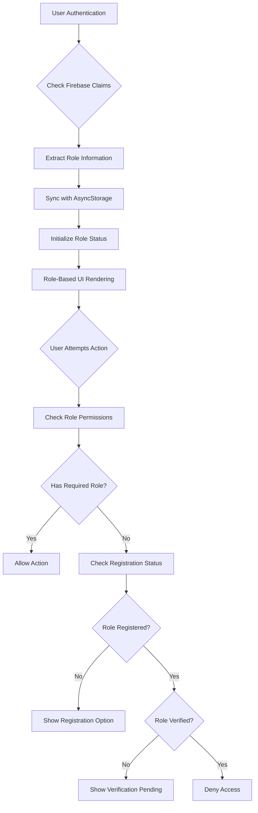
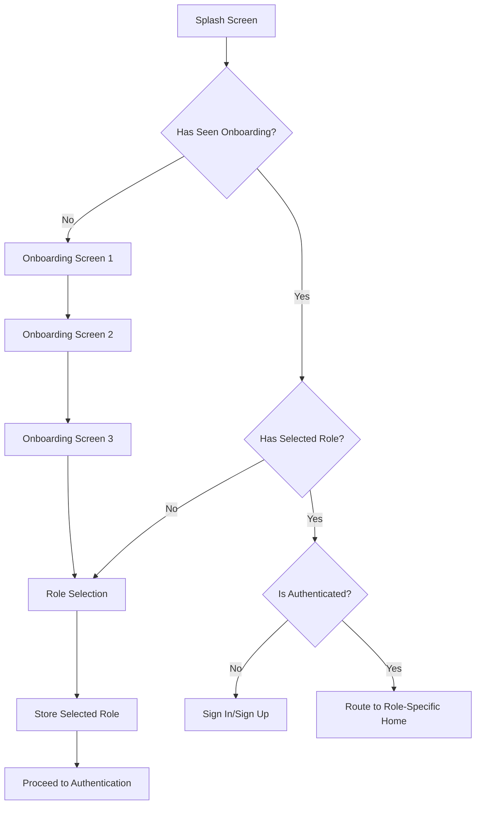
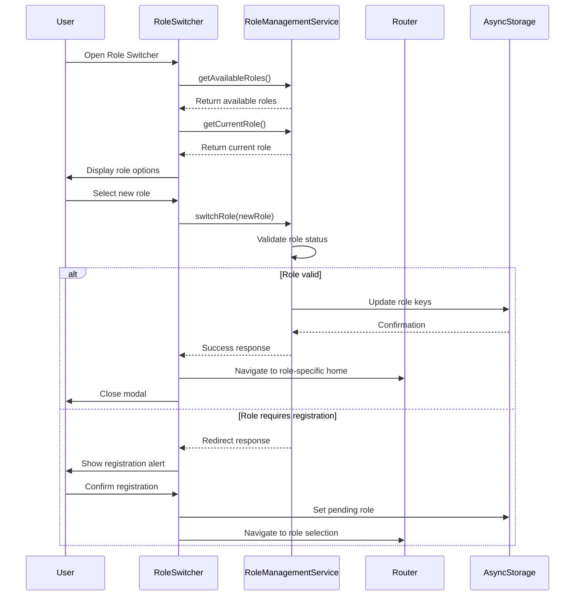
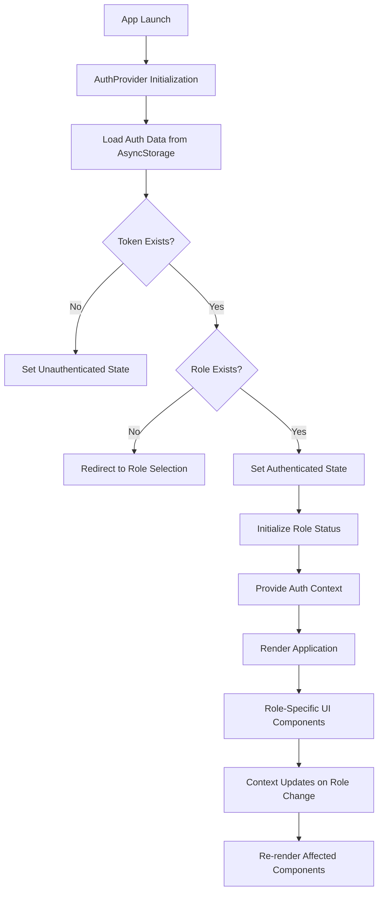

# User Roles Overview

<cite>
**Referenced Files in This Document**   
- [app/auth/role-selection.tsx](file://app/auth/role-selection.tsx)
- [hooks/useAuth.ts](file://hooks/useAuth.ts)
- [services/roleManagementService.ts](file://services/roleManagementService.ts)
- [components/RoleSwitcher.tsx](file://components/RoleSwitcher.tsx)
- [contexts/AuthContext.tsx](file://contexts/AuthContext.tsx)
- [services/authService.ts](file://services/authService.ts)
- [config/firebase.ts](file://config/firebase.ts)
- [components/withRoleAccess.tsx](file://components/withRoleAccess.tsx)
- [services/types.ts](file://services/types.ts)
- [components/RoleHeader.tsx](file://components/RoleHeader.tsx)
- [app/_layout.tsx](file://app/_layout.tsx)
</cite>

## Table of Contents
1. [Introduction](#introduction)
2. [Core User Roles](#core-user-roles)
3. [Role-Based Access Control Implementation](#role-based-access-control-implementation)
4. [Role Selection and Onboarding](#role-selection-and-onboarding)
5. [Role Switching Mechanism](#role-switching-mechanism)
6. [Security Considerations](#security-considerations)
7. [Role Initialization and Context Flow](#role-initialization-and-context-flow)

## Introduction
The Brillprime-expo application implements a sophisticated role-based architecture that enables users to operate within three distinct roles: Consumer, Merchant, and Driver. This architecture provides tailored experiences, workflows, and access levels for each role while maintaining a unified application interface. The system leverages Firebase authentication claims combined with client-side context checks to enforce role-based access control (RBAC), ensuring that users can only access features and data appropriate to their current role. This document provides a comprehensive overview of the user role architecture, detailing the implementation of role selection, switching, access control, and security mechanisms that form the foundation of the application's multi-role functionality.

## Core User Roles
The Brillprime-expo platform supports three primary user roles, each with distinct access levels, workflows, and responsibilities within the ecosystem. The Consumer role represents end-users who browse and purchase commodities from merchants, with access to features like product browsing, cart management, order placement, and delivery tracking. Consumers have the most basic access level and can use the platform immediately after registration without additional verification requirements.

The Merchant role is designed for business owners and vendors who list and sell products on the platform. Merchants have access to specialized features including inventory management, order processing, sales analytics, customer communication tools, and store settings configuration. Unlike consumers, merchants must complete a registration and verification process that includes submitting business documentation, which is reviewed by the platform's moderation team before full access is granted.

The Driver role serves delivery personnel responsible for transporting orders from merchants to consumers. Drivers have access to features such as earnings tracking, vehicle management, order assignment, and real-time navigation. Similar to merchants, drivers must undergo a verification process that includes submitting their driver's license and vehicle documentation before they can accept delivery assignments. Each role maintains its own data context, navigation paths, and UI components, creating specialized experiences while sharing the same underlying authentication and security infrastructure.

**Section sources**
- [app/auth/role-selection.tsx](file://app/auth/role-selection.tsx)
- [services/types.ts](file://services/types.ts)
- [services/roleManagementService.ts](file://services/roleManagementService.ts)

## Role-Based Access Control Implementation
The Brillprime-expo application implements role-based access control (RBAC) through a combination of Firebase authentication claims and client-side context checks. When a user authenticates, Firebase ID tokens contain role information that is synchronized with the application's state management system. The `roleManagementService` maintains a comprehensive role status object in AsyncStorage that tracks whether a user is registered and verified for each possible role (consumer, merchant, driver), with consumer status being automatically approved upon registration.

Client-side access checks are performed through the `useAuth` hook and `roleManagementService`, which provide methods to verify role permissions before rendering components or allowing navigation. The `withRoleAccess` higher-order component wraps protected routes and automatically redirects users who lack the required role permissions, displaying appropriate messaging about registration or verification requirements. This component performs asynchronous checks against the role status stored in AsyncStorage, providing immediate feedback to users about their access rights.

The RBAC system distinguishes between three states for non-consumer roles: unregistered, registered but pending verification, and verified. Only verified users can access role-specific features, with the system providing clear guidance when users attempt to access features for roles they haven't fully activated. The `checkRoleAccess` method in `roleManagementService` returns detailed information about access denials, including whether registration or verification is required, enabling the UI to present context-specific instructions to guide users through the activation process.

**Diagram sources **
- [hooks/useAuth.ts](file://hooks/useAuth.ts#L26-L113)
- [services/roleManagementService.ts](file://services/roleManagementService.ts#L122-L167)
- [components/withRoleAccess.tsx](file://components/withRoleAccess.tsx#L31-L53)

**Section sources**
- [hooks/useAuth.ts](file://hooks/useAuth.ts)
- [services/roleManagementService.ts](file://services/roleManagementService.ts)
- [components/withRoleAccess.tsx](file://components/withRoleAccess.tsx)
- [contexts/AuthContext.tsx](file://contexts/AuthContext.tsx)

## Role Selection and Onboarding
The role selection process occurs during the initial onboarding flow, guiding new users through a structured sequence that begins with the onboarding screens and culminates in role selection. After completing the three onboarding screens that introduce the application's features, users are directed to the role selection screen where they can choose between Consumer, Merchant, or Driver roles. This selection is stored in AsyncStorage under the 'selectedRole' key and persists throughout the user's session, serving as the foundation for subsequent authentication and navigation decisions.

The role selection interface presents three clearly labeled buttons for each role, with responsive styling that adapts to different screen sizes and platforms. When a user selects a role, the application stores this preference and proceeds to the authentication flow, directing users to either sign-in or sign-up based on whether an email address has been previously stored. For merchant and driver roles, the selection triggers additional registration requirements, with the system tracking these roles as "pending" until the user completes the verification process.

The onboarding flow is controlled by the `AuthStateHandler` component in the root layout, which checks the 'hasSeenOnboarding' flag in AsyncStorage to determine whether to display the onboarding sequence or proceed directly to role selection. This ensures that users only experience the onboarding process once, while still requiring role selection on subsequent visits if no role has been previously chosen. The role selection process is also triggered when users attempt to access role-specific features without an active role, creating a seamless transition from feature discovery to role activation.

**Diagram sources **
- [app/auth/role-selection.tsx](file://app/auth/role-selection.tsx)
- [app/_layout.tsx](file://app/_layout.tsx#L120-L169)
- [hooks/useAuth.ts](file://hooks/useAuth.ts#L90-L103)

**Section sources**
- [app/auth/role-selection.tsx](file://app/auth/role-selection.tsx)
- [app/_layout.tsx](file://app/_layout.tsx)
- [hooks/useAuth.ts](file://hooks/useAuth.ts)

## Role Switching Mechanism
The role switching mechanism in Brillprime-expo is centered around the RoleSwitcher component, which provides users with a modal interface to change their active role when multiple roles are available. This component retrieves the user's available roles from the roleManagementService and displays them as selectable cards, indicating the current role and verification status. When a user selects a different role, the switchRole method validates that the target role is both registered and verified before proceeding with the switch.

The role switching process involves updating multiple AsyncStorage keys simultaneously, including 'currentRole', 'userRole', and 'selectedRole', ensuring consistency across the application's state management system. Upon successful role switch, the application navigates to the appropriate home screen for the new role (/home/consumer, /home/merchant, or /home/driver) and triggers a UI refresh to reflect the changed context. The RoleHeader component displays the current role and provides access to the RoleSwitcher when multiple roles are available, creating a persistent visual indicator of the user's active role.

For users who have registered for additional roles but haven't completed verification, the RoleSwitcher displays these roles as disabled with appropriate messaging about the verification status. If a user attempts to switch to a role they haven't registered for, the system redirects them to the role selection flow with the target role pre-selected, creating a seamless transition from role switching to role registration. This mechanism ensures that users can fluidly move between roles they've qualified for while maintaining appropriate access controls for roles still in the verification process.

**Diagram sources **
- [components/RoleSwitcher.tsx](file://components/RoleSwitcher.tsx)
- [services/roleManagementService.ts](file://services/roleManagementService.ts#L74-L120)
- [components/RoleHeader.tsx](file://components/RoleHeader.tsx)

**Section sources**
- [components/RoleSwitcher.tsx](file://components/RoleSwitcher.tsx)
- [components/RoleHeader.tsx](file://components/RoleHeader.tsx)
- [services/roleManagementService.ts](file://services/roleManagementService.ts)

## Security Considerations
The Brillprime-expo application implements multiple security layers to protect role assignment and session management. Role verification is enforced through a combination of client-side validation and server-side checks, with the roleManagementService synchronizing role status with the backend API to prevent local storage tampering. The system validates role claims in Firebase tokens against the user's verified status in the database, ensuring that users cannot gain unauthorized access by manipulating local storage.

Session management follows secure practices by storing authentication tokens and role information in AsyncStorage with appropriate expiration handling. The authService implements token refresh mechanisms that validate the user's continued authentication status with Firebase, automatically logging out users when tokens expire or are revoked. Role switching requires re-validation of the user's authentication state, preventing unauthorized role changes during active sessions.

The application employs defense-in-depth strategies by implementing role checks at multiple levels: route-level protection through the withRoleAccess component, API-level authorization using Firebase claims, and database-level row-level security policies in Supabase. These policies restrict data access based on the authenticated user's role, ensuring that even if a user bypasses client-side checks, they cannot access unauthorized data through direct API calls. Additionally, sensitive operations like role registration require multi-step verification processes with administrative review, preventing automated or fraudulent role acquisition.

**Section sources**
- [services/authService.ts](file://services/authService.ts)
- [services/roleManagementService.ts](file://services/roleManagementService.ts)
- [supabase/rls-policies.sql](file://supabase/rls-policies.sql)
- [config/firebase.ts](file://config/firebase.ts)

## Role Initialization and Context Flow
The role initialization and context propagation system in Brillprime-expo follows a well-defined flow that begins with application startup and continues through user authentication. When the app launches, the AuthProvider initializes by loading stored authentication data from AsyncStorage, including the user token, role, and user profile information. If a role is present but the user is not authenticated, the system redirects to the role selection screen to ensure proper authentication flow.

During the authentication process, the authService synchronizes role information between Firebase authentication claims and the application's local storage, creating a consistent role context. For new users, the role selected during signup is immediately stored and used to initialize the role status, with consumer roles being automatically approved while merchant and driver roles enter a pending verification state. The roleManagementService's initializeRoleStatus method configures the default role permissions based on the primary role selected during registration.

Context propagation occurs through React's context API, with the AuthContext providing role information to all components in the application tree. Components that require specific roles use the useAuth hook or withRoleAccess higher-order component to subscribe to role changes and respond appropriately. When the active role changes, either through switching or re-authentication, the context updates trigger re-renders across the application, ensuring that the UI reflects the current role context. This centralized context management enables consistent role-based behavior throughout the application while minimizing redundant role checks.

**Diagram sources **
- [contexts/AuthContext.tsx](file://contexts/AuthContext.tsx)
- [services/roleManagementService.ts](file://services/roleManagementService.ts#L225-L256)
- [app/_layout.tsx](file://app/_layout.tsx)

**Section sources**
- [contexts/AuthContext.tsx](file://contexts/AuthContext.tsx)
- [services/roleManagementService.ts](file://services/roleManagementService.ts)
- [app/_layout.tsx](file://app/_layout.tsx)