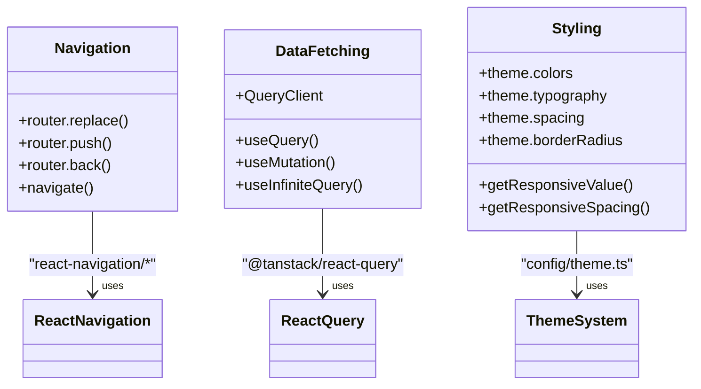
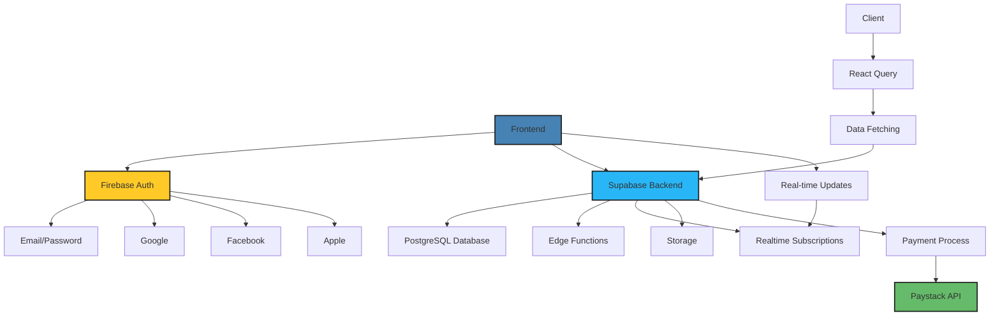
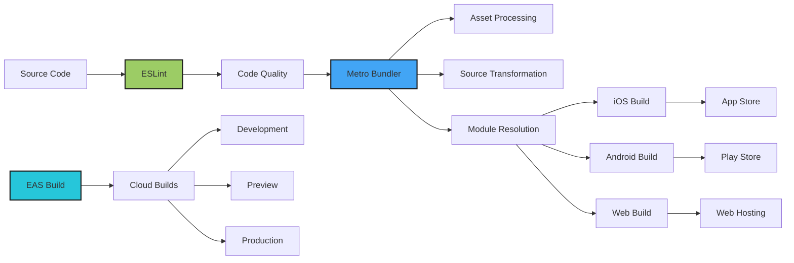
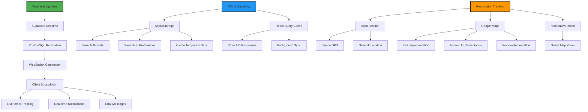

# Technology Stack

<cite>
**Referenced Files in This Document**   
- [package.json](file://package.json)
- [tsconfig.json](file://tsconfig.json)
- [metro.config.js](file://metro.config.js)
- [eas.json](file://eas.json)
- [eslint.config.js](file://eslint.config.js)
- [config/supabase.ts](file://config/supabase.ts)
- [config/firebase.ts](file://config/firebase.ts)
- [config/environment.ts](file://config/environment.ts)
- [config/theme.ts](file://config/theme.ts)
- [app.config.js](file://app.config.js)
- [ARCHITECTURE.md](file://ARCHITECTURE.md)
- [ROUTING_VERIFICATION.md](file://ROUTING_VERIFICATION.md)
- [GOOGLE_MAPS_SETUP.md](file://GOOGLE_MAPS_SETUP.md)
- [SUPABASE_ARCHITECTURE.md](file://SUPABASE_ARCHITECTURE.md)
- [supabase/functions](file://supabase/functions)
- [services/authService.ts](file://services/authService.ts)
- [services/api.ts](file://services/api.ts)
- [app/_layout.tsx](file://app/_layout.tsx)
- [app/auth](file://app/auth)
- [app/home](file://app/home)
</cite>

## Table of Contents
1. [Core Frameworks](#core-frameworks)
2. [Supporting Libraries](#supporting-libraries)
3. [Backend Technologies](#backend-technologies)
4. [Development Tools](#development-tools)
5. [Feature Implementation](#feature-implementation)
6. [Version Compatibility and Setup](#version-compatibility-and-setup)

## Core Frameworks

The Brillprime-expo application leverages a modern technology stack centered around React Native, Expo Router, and TypeScript to enable robust cross-platform development. The framework selection provides a solid foundation for building native iOS, Android, and web applications from a single codebase.

### React Native
React Native serves as the core framework for native mobile development, enabling the creation of high-performance applications with native-like user experiences. The project uses React Native 0.81.5, which provides stable performance and compatibility with the Expo ecosystem. React Native components are used throughout the application for UI elements, navigation, and platform-specific functionality.

### Expo Router
Expo Router (version 6.0.15) implements file-based routing that maps the app's file structure directly to navigable routes. This convention-based approach simplifies navigation by automatically generating routes from the directory structure in the `app/` folder. The router supports nested layouts, dynamic routes (e.g., `[id].tsx`), and deep linking with the custom scheme `brillprime://`. The root layout at `app/_layout.tsx` configures the stack navigation and wraps the application with essential context providers.

### TypeScript
TypeScript (version 5.9.2) provides static typing across the codebase, enhancing code quality and developer experience. The configuration in `tsconfig.json` extends Expo's base TypeScript configuration while adding custom paths (`@/*` alias) and including all relevant source directories. TypeScript is used for type definitions in services, components, and API interactions, reducing runtime errors and improving code maintainability.

```mermaid
graph TD
A[React Native] --> B[Expo Router]
B --> C[File-based Routing]
C --> D[app/index.tsx]
C --> E[app/auth/signin.tsx]
C --> F[app/home/consumer.tsx]
C --> G[app/merchant/[id].tsx]
H[TypeScript] --> I[Static Typing]
I --> J[Type Safety]
J --> K[Improved Developer Experience]
A --> L[Native Performance]
M[Expo] --> N[Cross-Platform Build]
N --> O[iOS]
N --> P[Android]
N --> Q[Web]
```

**Diagram sources**
- [package.json](file://package.json)
- [tsconfig.json](file://tsconfig.json)
- [app/_layout.tsx](file://app/_layout.tsx)

**Section sources**
- [package.json](file://package.json#L64-L67)
- [tsconfig.json](file://tsconfig.json)
- [app/_layout.tsx](file://app/_layout.tsx)

## Supporting Libraries

The application utilizes several key supporting libraries to enhance functionality in routing, data management, and styling.

### React Navigation
React Navigation (version 7.1.6) provides the navigation infrastructure for the application, working in conjunction with Expo Router. The stack navigator manages screen transitions and history, while the bottom tabs package could be used for tab-based navigation (though currently referenced but not implemented). Navigation methods like `router.replace()`, `router.push()`, and `router.back()` are used consistently throughout the app to manage user flow.

### React Query
React Query (version 5.90.2) handles data fetching, caching, and synchronization with the backend. It simplifies data management by providing hooks for fetching, caching, and updating data from Supabase and other APIs. The library automatically handles loading states, error states, and data refetching, reducing the complexity of data management in the application.

### Tailwind CSS
While not explicitly listed in package.json, the application uses a Tailwind CSS-inspired styling approach through component styling and the theme configuration. The `theme.ts` file defines a comprehensive design system with colors, typography, spacing, and breakpoints that enable consistent styling across the application. This utility-first approach allows for rapid UI development with consistent design tokens.



**Diagram sources**
- [package.json](file://package.json#L22-L25)
- [config/theme.ts](file://config/theme.ts)
- [services/api.ts](file://services/api.ts)

**Section sources**
- [package.json](file://package.json#L22-L25)
- [config/theme.ts](file://config/theme.ts)
- [services/api.ts](file://services/api.ts)

## Backend Technologies

The backend architecture employs a hybrid approach using Supabase for database operations and serverless functions, Firebase for authentication, and Paystack for payment processing.

### Supabase
Supabase (version 2.84.0) serves as the primary backend, providing PostgreSQL database storage, real-time capabilities, and edge functions. The application connects to Supabase using the `@supabase/supabase-js` client library, with configuration managed through environment variables. Supabase handles all data operations including user profiles, merchants, orders, and real-time updates. Row-level security (RLS) policies ensure data protection, while real-time subscriptions enable live updates for order tracking and notifications.

### Firebase
Firebase (version 12.3.0) is used exclusively for authentication, supporting multiple providers including email/password, Google, Facebook, and Apple. This separation of concerns allows Firebase to handle complex authentication flows while Supabase manages application data. The Firebase configuration is loaded from environment variables and initialized conditionally based on the presence of required credentials.

### Paystack Integration
Paystack is integrated for payment processing, with serverless functions in Supabase handling the payment workflow. The `payment-process` function in `supabase/functions` manages the interaction with Paystack's API, processing payments securely on the server side. This approach keeps sensitive payment information out of the client application while providing a seamless payment experience.



**Diagram sources**
- [config/supabase.ts](file://config/supabase.ts)
- [config/firebase.ts](file://config/firebase.ts)
- [supabase/functions/payment-process/index.ts](file://supabase/functions/payment-process/index.ts)
- [services/authService.ts](file://services/authService.ts)

**Section sources**
- [config/supabase.ts](file://config/supabase.ts)
- [config/firebase.ts](file://config/firebase.ts)
- [supabase/functions](file://supabase/functions)

## Development Tools

The development environment is supported by a suite of tools that enhance code quality, build processes, and debugging capabilities.

### ESLint
ESLint (version 9.25.0) provides code linting with the `eslint-config-expo` configuration, ensuring code quality and consistency across the codebase. The configuration extends Expo's recommended rules while adding project-specific ignores for the build directory. This helps maintain code standards and catch potential issues during development.

### Metro
Metro (configured in `metro.config.js`) is the JavaScript bundler for React Native, responsible for transforming and bundling the application code. The configuration includes support for various asset types (fonts, images) and source extensions (TS, TSX, JS). It also configures CORS headers for development and handles platform-specific module resolution, such as blocking `react-native-maps` from being bundled on web.

### EAS Build
EAS Build (configured in `eas.json`) enables cloud-based building of the application for all platforms. The configuration defines build profiles for development, preview, and production environments, with auto-incrementing version numbers for production builds. This streamlines the build and deployment process, allowing for consistent builds across different environments.



**Diagram sources**
- [eslint.config.js](file://eslint.config.js)
- [metro.config.js](file://metro.config.js)
- [eas.json](file://eas.json)

**Section sources**
- [eslint.config.js](file://eslint.config.js)
- [metro.config.js](file://metro.config.js)
- [eas.json](file://eas.json)

## Feature Implementation

The technology stack enables key features including real-time updates, offline capability, and geolocation tracking through the integration of various technologies.

### Real-time Updates
Real-time functionality is implemented using Supabase's real-time subscriptions, which leverage PostgreSQL's replication functionality to push updates to clients. The application subscribes to changes in critical tables such as orders, merchants, and chat messages, enabling live updates without requiring manual refreshes. This is particularly important for features like order tracking and live chat.

### Offline Capability
Offline functionality is supported through a combination of AsyncStorage for local data persistence and React Query's caching mechanisms. The `@react-native-async-storage/async-storage` library (version 2.2.0) stores user authentication state, preferences, and temporary data, allowing the application to maintain state even when disconnected from the network. React Query caches API responses and can update them when connectivity is restored.

### Geolocation Tracking
Geolocation features are implemented using Google Maps across all platforms, with platform-specific configurations managed through Expo. The `expo-location` library (version 19.0.7) provides access to device location services, while `react-native-maps` renders maps on native platforms. For web, the application uses Google Maps JavaScript API loaded through environment variables. This unified approach ensures consistent map functionality across iOS, Android, and web.



**Diagram sources**
- [config/supabase.ts](file://config/supabase.ts)
- [services/api.ts](file://services/api.ts)
- [config/environment.ts](file://config/environment.ts)
- [app.config.js](file://app.config.js)
- [hooks/useOfflineMode.ts](file://hooks/useOfflineMode.ts)

**Section sources**
- [config/supabase.ts](file://config/supabase.ts)
- [services/api.ts](file://services/api.ts)
- [config/environment.ts](file://config/environment.ts)
- [app.config.js](file://app.config.js)

## Version Compatibility and Setup

The technology stack has specific version requirements and setup procedures to ensure proper functionality across all development environments.

### Version Compatibility
The application requires specific versions of key dependencies to ensure compatibility:
- React: 19.1.0
- React Native: 0.81.5
- Expo: 54.0.0
- TypeScript: 5.9.2
- React Navigation: 7.1.6
- React Query: 5.90.2
- Supabase JS: 2.84.0
- Firebase: 12.3.0

These versions are specified in the `package.json` file and should be maintained to avoid compatibility issues. The Expo SDK version (54) determines the compatible versions of React Native and other Expo-managed dependencies.

### Setup Requirements
Local development requires the following setup:
1. Copy `.env.example` to `.env` and populate with required environment variables
2. Install dependencies with `npm install`
3. Set up Firebase project and add credentials to `.env`
4. Set up Supabase project and add credentials to `.env`
5. Obtain Google Maps API key and add to `.env`
6. Run the application with `npm run dev`

The environment variables must include Firebase authentication credentials, Supabase URL and anon key, and Google Maps API key for full functionality. The `config/environment.ts` file loads these variables and provides fallbacks for development purposes.

**Section sources**
- [package.json](file://package.json)
- [.env.example](file://.env.example)
- [config/environment.ts](file://config/environment.ts)
- [app.config.js](file://app.config.js)