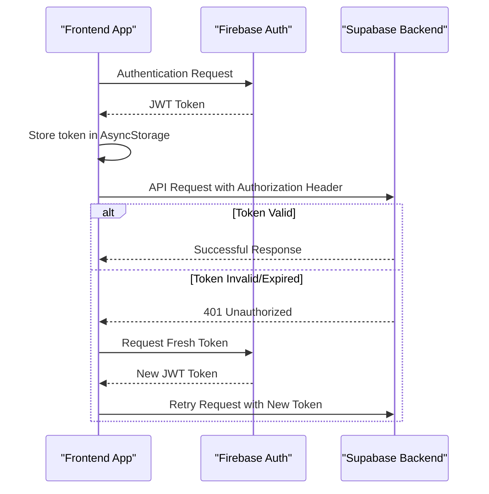
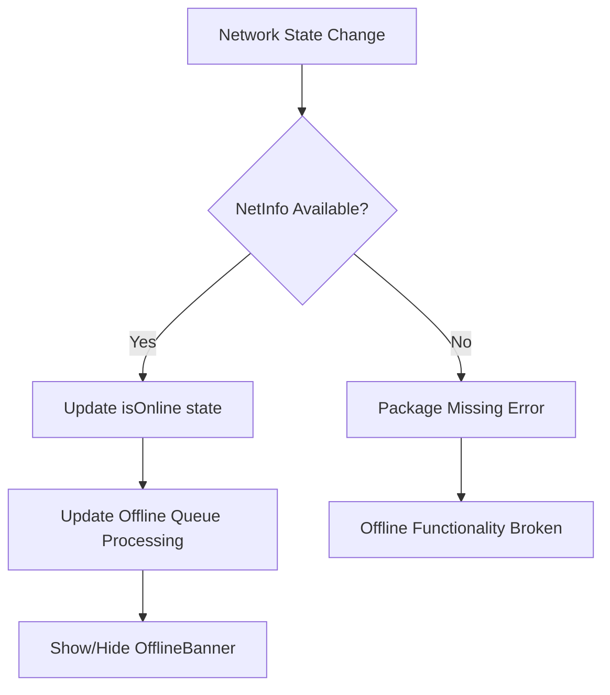
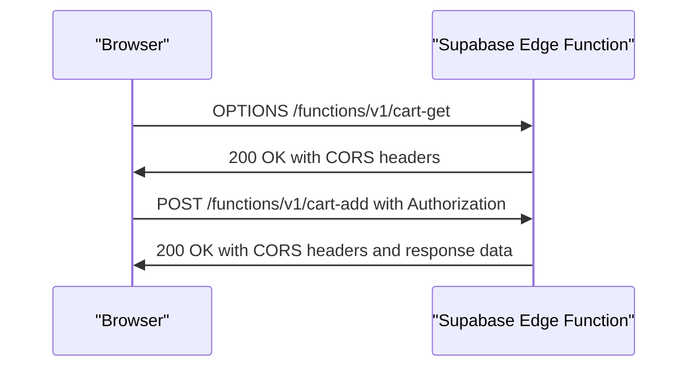
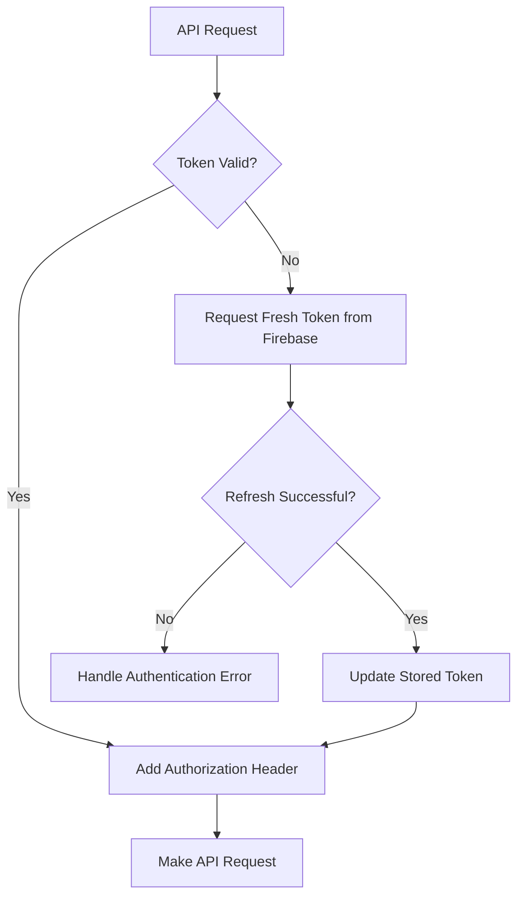
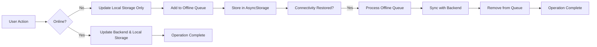

# Connectivity Issues

<cite>
**Referenced Files in This Document**   
- [app/_layout.tsx](file://app/_layout.tsx)
- [contexts/AuthContext.tsx](file://contexts/AuthContext.tsx)
- [services/api.ts](file://services/api.ts)
- [services/apiEndpoints.ts](file://services/apiEndpoints.ts)
- [config/environment.ts](file://config/environment.ts)
- [services/cartService.ts](file://services/cartService.ts)
- [services/authService.ts](file://services/authService.ts)
- [hooks/useOfflineMode.ts](file://hooks/useOfflineMode.ts)
- [components/OfflineBanner.tsx](file://components/OfflineBanner.tsx)
- [components/RealtimeNotificationBanner.tsx](file://components/RealtimeNotificationBanner.tsx)
- [supabase/functions/_shared/cors.ts](file://supabase/functions/_shared/cors.ts)
- [supabase/functions/cart-get/index.ts](file://supabase/functions/cart-get/index.ts)
- [supabase/functions/cart-add/index.ts](file://supabase/functions/cart-add/index.ts)
- [supabase/functions/create-order/index.ts](file://supabase/functions/create-order/index.ts)
</cite>

## Table of Contents
1. [Authentication and Token Handling Issues](#authentication-and-token-handling-issues)
2. [Missing Network Connectivity Package](#missing-network-connectivity-package)
3. [API Endpoint Mismatches](#api-endpoint-mismatches)
4. [Environment Configuration Requirements](#environment-configuration-requirements)
5. [Network Request Failure Troubleshooting](#network-request-failure-troubleshooting)
6. [CORS Issues in Supabase Functions](#cors-issues-in-supabase-functions)
7. [Real-time Subscription Problems](#real-time-subscription-problems)
8. [Token Refresh Mechanisms](#token-refresh-mechanisms)
9. [Authorization Header Setup](#authorization-header-setup)
10. [Offline Data Persistence Strategies](#offline-data-persistence-strategies)

## Authentication and Token Handling Issues

The Brillprime-expo application implements a hybrid authentication system using Firebase for authentication and Supabase for backend logic. Authentication failures occur due to incorrect HTTP methods and token handling issues, particularly on protected endpoints like `/api/cart`.

The application uses Firebase Auth to manage user sessions and generate JWT tokens, which are then used to authenticate requests to Supabase Edge Functions. The `authService.ts` handles the authentication flow, storing tokens in AsyncStorage and using them to authenticate API requests. However, there are several issues with the current implementation:

1. **HTTP Method Mismatch**: The cart endpoints in `apiEndpoints.ts` are defined with RESTful patterns using `/api/cart` for GET and POST requests, but the actual implementation uses Supabase Edge Functions accessed via `/functions/v1/cart-get` and `/functions/v1/cart-add`. This mismatch causes 404 errors when the frontend attempts to use the expected REST endpoints.

2. **Token Handling**: The application stores Firebase JWT tokens in AsyncStorage but doesn't consistently refresh them before expiration. The `getFreshToken()` method in `cartService.ts` attempts to refresh the token, but this logic is not uniformly applied across all services.

3. **401 Errors on Protected Endpoints**: When accessing protected endpoints like `/api/cart`, users frequently encounter 401 Unauthorized errors due to token expiration or incorrect token transmission. The `apiClient` in `api.ts` includes the token in the Authorization header, but the timing of token refresh operations is not synchronized with API requests.



**Diagram sources**
- [services/authService.ts](file://services/authService.ts#L63-L800)
- [services/api.ts](file://services/api.ts#L43-L218)
- [services/cartService.ts](file://services/cartService.ts#L35-L81)

**Section sources**
- [services/authService.ts](file://services/authService.ts#L63-L800)
- [services/api.ts](file://services/api.ts#L43-L218)
- [services/cartService.ts](file://services/cartService.ts#L35-L81)

## Missing Network Connectivity Package

The application is missing the `@react-native-community/netinfo` package, which is required for proper offline mode functionality. This package is imported in `useOfflineMode.ts` but is not listed in the project dependencies, causing runtime errors when attempting to detect network connectivity.

The `useOfflineMode.ts` hook implements offline functionality by listening to network state changes and managing an offline queue for deferred operations. However, without the `@react-native-community/netinfo` package, the `NetInfo.addEventListener` call fails, preventing the application from detecting when the device is offline.

The `OfflineBanner.tsx` component displays a visual indicator when the app is in offline mode, but it relies on AsyncStorage to determine offline status rather than real-time network detection. This creates a disconnect between the actual network state and the displayed offline status.



**Diagram sources**
- [hooks/useOfflineMode.ts](file://hooks/useOfflineMode.ts#L1-L65)
- [components/OfflineBanner.tsx](file://components/OfflineBanner.tsx#L1-L42)

**Section sources**
- [hooks/useOfflineMode.ts](file://hooks/useOfflineMode.ts#L1-L65)
- [components/OfflineBanner.tsx](file://components/OfflineBanner.tsx#L1-L42)

## API Endpoint Mismatches

There is a significant mismatch between the frontend's expected API endpoints and the actual backend implementation. The frontend code in `apiEndpoints.ts` defines a RESTful API structure, but the backend uses Supabase Edge Functions with a different URL pattern.

The `API_ENDPOINTS.CART` configuration defines endpoints like `/api/cart` for GET and POST requests, but the actual implementation in `cartService.ts` calls Supabase Edge Functions at `/functions/v1/cart-get` and `/functions/v1/cart-add`. This discrepancy causes connectivity issues when developers or automated tools attempt to use the documented REST endpoints.

Additionally, the application is missing critical endpoints for cart management and order creation. While the `create-order` Edge Function exists, there is no corresponding endpoint in the `API_ENDPOINTS.ORDERS` configuration for order creation, leading to implementation inconsistencies.

```mermaid
classDiagram
class FrontendAPI {
+GET /api/cart
+POST /api/cart
+PUT /api/cart/{itemId}
+DELETE /api/cart/{itemId}
+POST /api/orders
}
class BackendEdgeFunctions {
+GET /functions/v1/cart-get
+POST /functions/v1/cart-add
+POST /functions/v1/cart-update
+POST /functions/v1/cart-delete
+POST /functions/v1/create-order
}
FrontendAPI --> BackendEdgeFunctions : "Endpoint Mismatch"
```

**Diagram sources**
- [services/apiEndpoints.ts](file://services/apiEndpoints.ts#L79-L96)
- [services/cartService.ts](file://services/cartService.ts#L84-L136)
- [supabase/functions/cart-get/index.ts](file://supabase/functions/cart-get/index.ts)
- [supabase/functions/cart-add/index.ts](file://supabase/functions/cart-add/index.ts)
- [supabase/functions/create-order/index.ts](file://supabase/functions/create-order/index.ts)

**Section sources**
- [services/apiEndpoints.ts](file://services/apiEndpoints.ts#L79-L96)
- [services/cartService.ts](file://services/cartService.ts#L84-L136)

## Environment Configuration Requirements

The application requires specific environment variables for Firebase, Supabase, and Google Maps API integration. These configurations are managed in `environment.ts` and must be properly set for the application to function correctly.

The key environment variables include:

- **Supabase Configuration**: `EXPO_PUBLIC_SUPABASE_URL` and `EXPO_PUBLIC_SUPABASE_ANON_KEY` are required for connecting to the Supabase backend. These values are used in both `environment.ts` and `api.ts` to configure the API client.

- **Firebase Configuration**: Multiple Firebase environment variables are required, including `EXPO_PUBLIC_FIREBASE_API_KEY`, `EXPO_PUBLIC_FIREBASE_AUTH_DOMAIN`, `EXPO_PUBLIC_FIREBASE_PROJECT_ID`, and others. These are used to initialize Firebase services for authentication.

- **Google Maps API**: The `EXPO_PUBLIC_GOOGLE_MAPS_API_KEY` is required for map functionality across all platforms (web, iOS, Android).

- **Analytics and Monitoring**: `EXPO_PUBLIC_SENTRY_DSN` for error tracking and `EXPO_PUBLIC_ENABLE_ANALYTICS` to control analytics collection.

The configuration fallback mechanism in `environment.ts` provides a default Supabase URL when the environment variable is not set, but this can lead to connectivity issues in production environments if not properly configured.

**Section sources**
- [config/environment.ts](file://config/environment.ts#L1-L52)

## Network Request Failure Troubleshooting

Network request failures in Brillprime-expo can be caused by several factors, including connectivity issues, authentication problems, and server-side errors. The application implements comprehensive error handling in `api.ts` to provide meaningful feedback for different types of failures.

Common network issues and their troubleshooting steps:

1. **Connection Timeout (AbortError)**: Occurs when the server takes too long to respond. The application sets a 30-second timeout for all requests. Solution: Check server status and ensure Supabase functions are properly deployed and responsive.

2. **Network Error (Failed to fetch)**: Indicates a connectivity issue between the client and server. Troubleshooting steps:
   - Verify internet connection
   - Check if the Supabase URL is correctly configured
   - Ensure CORS headers are properly set on the server

3. **401 Unauthorized**: Authentication token is missing, invalid, or expired. Solutions:
   - Ensure the user is properly authenticated
   - Implement token refresh before making API requests
   - Verify the Authorization header is correctly formatted

4. **403 Forbidden**: User does not have permission to access the resource. Check Supabase Row Level Security (RLS) policies and user roles.

5. **404 Not Found**: Endpoint does not exist. Verify the API endpoint URL matches the actual implementation.

6. **500 Internal Server Error**: Server-side issue. Check Supabase function logs for errors.

The `apiClient` in `api.ts` provides detailed error logging with stack traces and error types, which should be used to diagnose connectivity issues.

**Section sources**
- [services/api.ts](file://services/api.ts#L106-L147)

## CORS Issues in Supabase Functions

CORS (Cross-Origin Resource Sharing) issues are handled in the Supabase Edge Functions through the shared `cors.ts` configuration. The application implements proper CORS headers to allow requests from various origins.

The `corsHeaders` object in `cors.ts` defines the following CORS configuration:
- `Access-Control-Allow-Origin: *` - Allows requests from any origin
- `Access-Control-Allow-Headers` - Specifies allowed headers including authorization, x-client-info, apikey, and content-type
- `Access-Control-Allow-Methods` - Supports POST, GET, OPTIONS, PUT, and DELETE methods
- `Access-Control-Max-Age: 86400` - Caches preflight requests for 24 hours

The `handleCors` function processes OPTIONS preflight requests and returns appropriate responses, while the `withCors` function adds CORS headers to all responses. This implementation should prevent CORS-related connectivity issues.

However, if CORS issues persist, ensure that:
1. The Supabase Edge Functions are properly deployed
2. The environment variables are correctly set
3. The client is sending the required headers
4. There are no network intermediaries stripping headers



**Diagram sources**
- [supabase/functions/_shared/cors.ts](file://supabase/functions/_shared/cors.ts#L1-L45)
- [supabase/functions/cart-get/index.ts](file://supabase/functions/cart-get/index.ts#L6-L9)
- [supabase/functions/cart-add/index.ts](file://supabase/functions/cart-add/index.ts#L6-L9)

**Section sources**
- [supabase/functions/_shared/cors.ts](file://supabase/functions/_shared/cors.ts#L1-L45)

## Real-time Subscription Problems

The application includes real-time notification functionality through the `RealtimeNotificationBanner.tsx` component, but there are potential issues with real-time subscriptions. The component listens for notifications through the `NotificationContext` and displays them as sliding banners.

Potential real-time subscription issues include:
1. **Connection Stability**: WebSockets or similar real-time connections may disconnect due to network instability
2. **Reconnection Logic**: The application should implement automatic reconnection when the real-time connection drops
3. **Message Ordering**: Ensure notifications are displayed in the correct order
4. **Duplicate Messages**: Implement deduplication to prevent the same notification from appearing multiple times

The `RealtimeNotificationBanner` uses React Native's Animated API to create smooth transitions when notifications appear and disappear. However, the underlying subscription mechanism is not visible in the provided code, so issues with the real-time connection itself may not be immediately apparent.

**Section sources**
- [components/RealtimeNotificationBanner.tsx](file://components/RealtimeNotificationBanner.tsx#L1-L143)

## Token Refresh Mechanisms

The application implements token refresh mechanisms to maintain user sessions and prevent 401 errors due to token expiration. The token refresh strategy involves several components working together:

1. **Firebase Token Refresh**: The `getFreshToken()` method in `cartService.ts` calls `currentUser.getIdToken(true)` to force a token refresh from Firebase. This ensures the application has a valid JWT token before making API requests.

2. **Token Storage**: Tokens are stored in AsyncStorage with an expiration timestamp. The `storeAuthData()` method in `authService.ts` saves the token along with user data and role information.

3. **Automatic Refresh**: The `getToken()` method in `authService.ts` checks if the token is nearing expiration (within 5 minutes) and automatically refreshes it if necessary.

4. **Error-Driven Refresh**: When a 401 error occurs, the application should automatically attempt to refresh the token and retry the failed request.

The current implementation could be improved by:
- Centralizing the token refresh logic in a single service
- Implementing request queuing during token refresh
- Adding exponential backoff for failed refresh attempts
- Providing better user feedback during token refresh operations



**Diagram sources**
- [services/authService.ts](file://services/authService.ts#L777-L799)
- [services/cartService.ts](file://services/cartService.ts#L35-L58)

**Section sources**
- [services/authService.ts](file://services/authService.ts#L777-L799)
- [services/cartService.ts](file://services/cartService.ts#L35-L58)

## Authorization Header Setup

Proper authorization header setup is critical for accessing protected endpoints in the Brillprime-expo application. The authorization mechanism combines Firebase authentication with Supabase backend services.

The authorization header is set up in several places:

1. **Default Headers**: In `api.ts`, the `DEFAULT_HEADERS` object includes a basic Authorization header using the Supabase anon key:
```typescript
const DEFAULT_HEADERS = {
  'Content-Type': 'application/json',
  'Accept': 'application/json',
  'apikey': process.env.EXPO_PUBLIC_SUPABASE_ANON_KEY || '',
  'Authorization': `Bearer ${process.env.EXPO_PUBLIC_SUPABASE_ANON_KEY}`
};
```

2. **Request-Specific Headers**: When making API requests, the `makeRequest` method in `apiClient` merges default headers with request-specific headers, including the Firebase JWT token:
```typescript
const headers = new Headers({
  ...DEFAULT_HEADERS,
  ...(options.headers || {}),
  'x-firebase-uid': this.authToken
});
```

3. **Service-Level Headers**: Individual services like `cartService.ts` add authorization headers with the Firebase token when calling specific endpoints:
```typescript
const response = await apiClient.get<any>('/functions/v1/cart-get', { 
  Authorization: `Bearer ${token}` 
});
```

Key issues with the current authorization header setup:
- The default Authorization header uses the Supabase anon key, which may not be appropriate for user-specific requests
- The Firebase JWT token should be the primary authentication method for user endpoints
- The `x-firebase-uid` header is used but not consistently across all requests
- Header merging logic may result in conflicting authorization tokens

**Section sources**
- [services/api.ts](file://services/api.ts#L7-L12)
- [services/api.ts](file://services/api.ts#L56-L60)
- [services/cartService.ts](file://services/cartService.ts#L90-L92)

## Offline Data Persistence Strategies

The Brillprime-expo application implements offline data persistence using AsyncStorage to maintain functionality when network connectivity is unavailable. The offline strategy involves several components working together to provide a seamless user experience.

Key components of the offline data persistence strategy:

1. **AsyncStorage**: The primary storage mechanism for user data, authentication tokens, and application state. Used throughout the application to store:
   - Authentication tokens (`userToken`)
   - User profile data (`userData`)
   - User role (`userRole`)
   - Cart items (`cartItems`)
   - Offline action queue (`offlineQueue`)

2. **Offline Mode Detection**: The `useOfflineMode.ts` hook monitors network connectivity and manages the transition between online and offline states. When connectivity is lost, it sets the offline mode flag and queues pending operations.

3. **Offline Queue**: Actions performed while offline are stored in an `offlineQueue` in AsyncStorage. When connectivity is restored, the queue is processed and actions are synchronized with the backend.

4. **Local-First Approach**: Services like `cartService.ts` implement a local-first strategy, updating the local state immediately and attempting to sync with the backend asynchronously. This ensures responsive UI even when offline.

5. **Conflict Resolution**: The application uses a "last write wins" strategy for conflict resolution, with backend validation to ensure data integrity.

The current implementation could be improved by:
- Adding more sophisticated conflict resolution strategies
- Implementing data synchronization priorities
- Providing better user feedback about offline operations
- Adding encryption for sensitive data stored offline



**Diagram sources**
- [hooks/useOfflineMode.ts](file://hooks/useOfflineMode.ts#L1-L65)
- [services/cartService.ts](file://services/cartService.ts#L61-L81)
- [services/cartService.ts](file://services/cartService.ts#L149-L163)

**Section sources**
- [hooks/useOfflineMode.ts](file://hooks/useOfflineMode.ts#L1-L65)
- [services/cartService.ts](file://services/cartService.ts#L61-L81)
- [services/cartService.ts](file://services/cartService.ts#L149-L163)