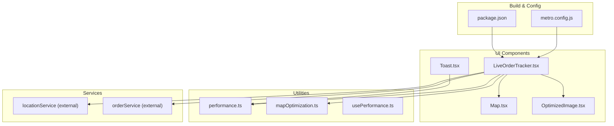
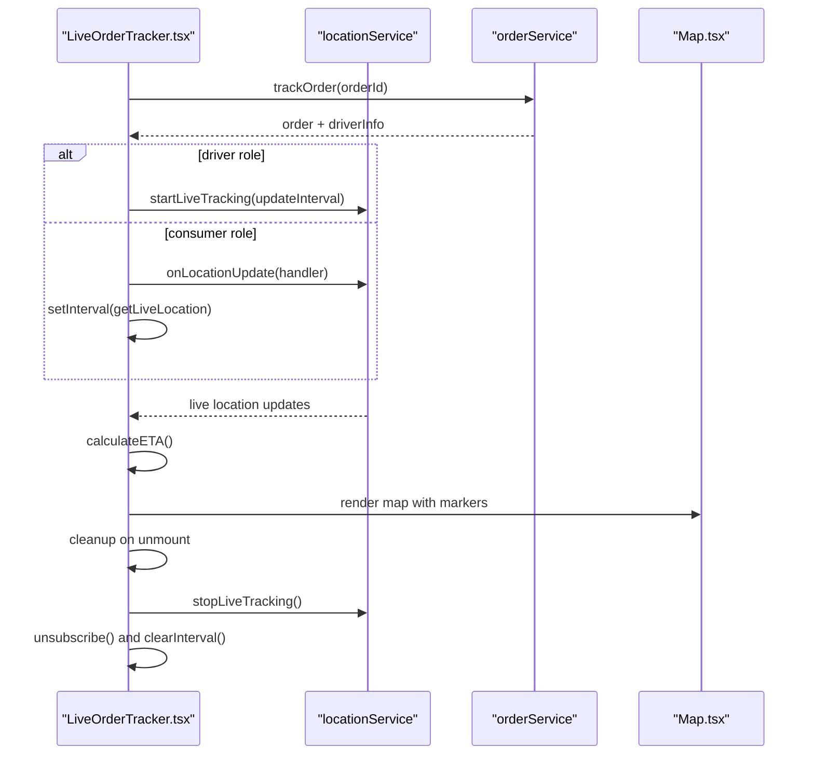
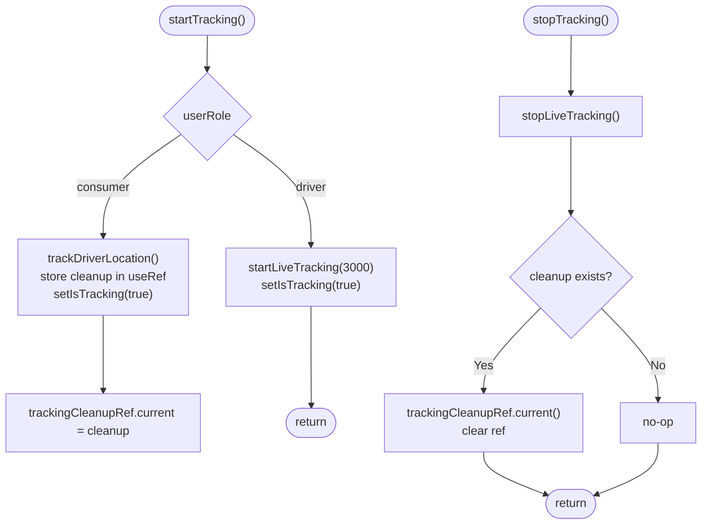
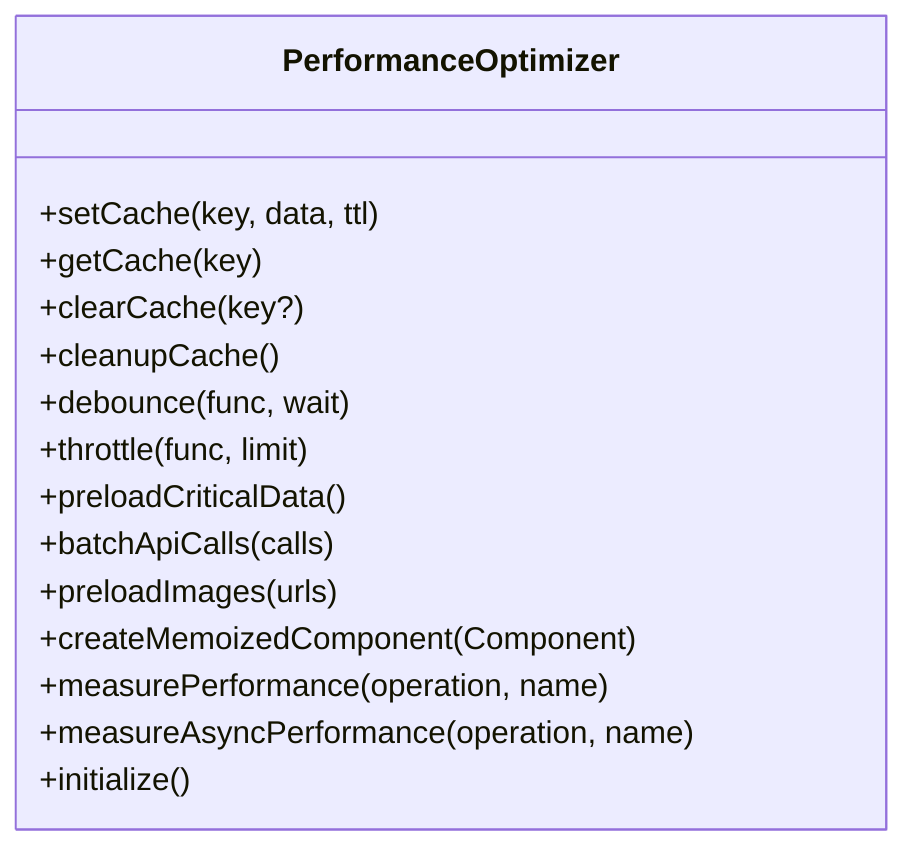
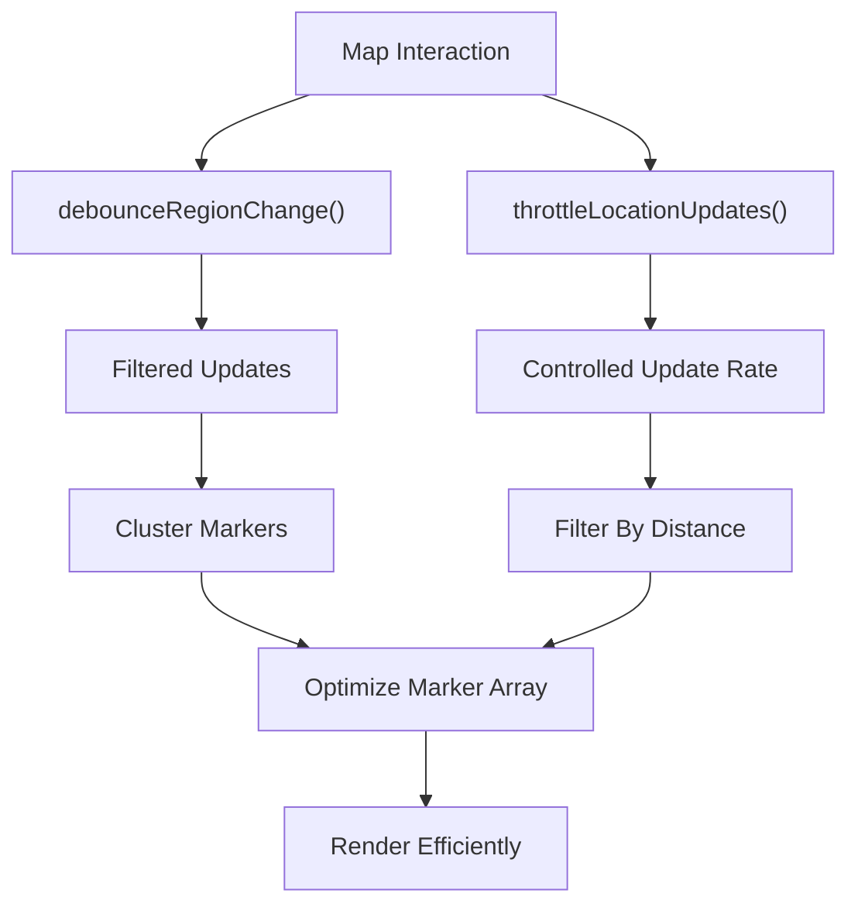
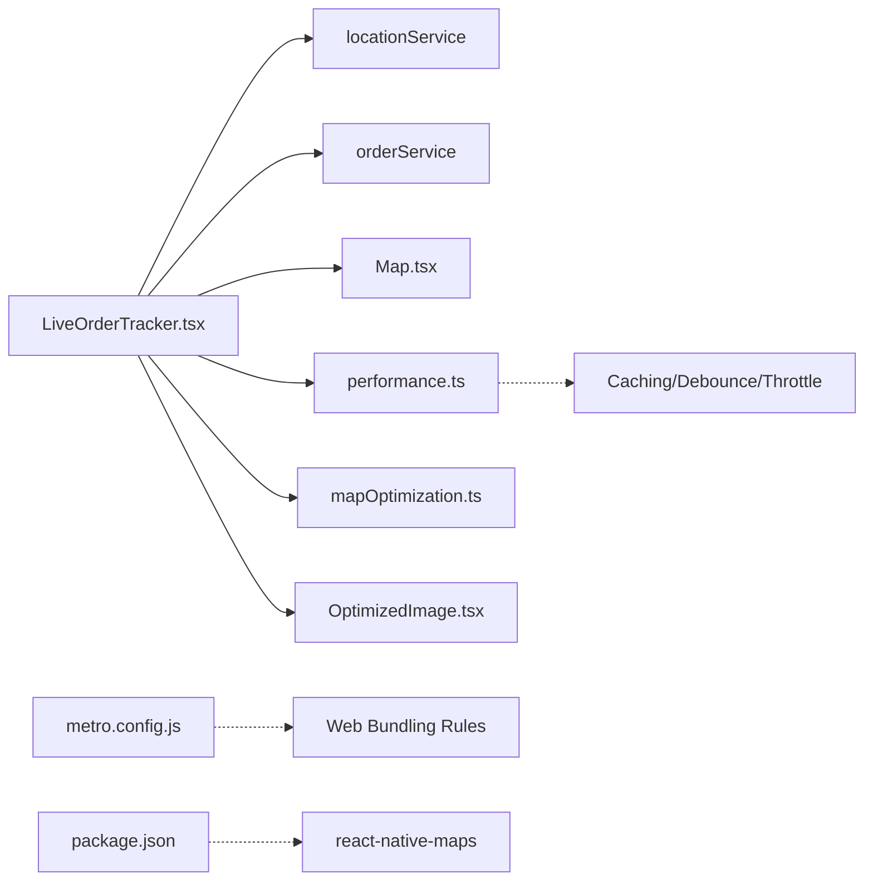

# Performance Issues

<cite>
**Referenced Files in This Document**
- [LiveOrderTracker.tsx](file://components/LiveOrderTracker.tsx)
- [bugfix-live-order-tracker-memory-leak.md](file://docs/bugfix-live-order-tracker-memory-leak.md)
- [LiveOrderTracker.test.tsx](file://components/__tests__/LiveOrderTracker.test.tsx)
- [performance.ts](file://utils/performance.ts)
- [mapOptimization.ts](file://utils/mapOptimization.ts)
- [OptimizedImage.tsx](file://components/OptimizedImage.tsx)
- [usePerformance.ts](file://hooks/usePerformance.ts)
- [Toast.tsx](file://components/Toast.tsx)
- [Map.tsx](file://components/Map.tsx)
- [metro.config.js](file://metro.config.js)
- [package.json](file://package.json)
</cite>

## Table of Contents
1. [Introduction](#introduction)
2. [Project Structure](#project-structure)
3. [Core Components](#core-components)
4. [Architecture Overview](#architecture-overview)
5. [Detailed Component Analysis](#detailed-component-analysis)
6. [Dependency Analysis](#dependency-analysis)
7. [Performance Considerations](#performance-considerations)
8. [Troubleshooting Guide](#troubleshooting-guide)
9. [Conclusion](#conclusion)

## Introduction
This document focuses on performance issues identified and resolved in the Brillprime-expo codebase, with a primary emphasis on the LiveOrderTracker component. It explains the memory leak caused by missing cleanup functions for subscriptions and intervals, the cross-platform rendering incompatibilities, and the solutions implemented using useRef to store cleanup functions and proper unmount handling. It also covers the broader performance implications of missing React.memo, useMemo, and useCallback, along with bundle size, image loading, and animation efficiency considerations. Finally, it provides diagnostic procedures using React DevTools, memory profiling, and performance monitoring, and outlines optimization strategies for list rendering, code splitting, and asset handling to ensure smooth user experiences across web, iOS, and Android.

## Project Structure
The performance-critical areas relevant to this document include:
- LiveOrderTracker component and its tests
- Utility modules for performance monitoring and map optimization
- Image optimization component
- Toast component animations
- Metro bundler configuration for platform-specific behavior
- Package dependencies impacting performance and platform behavior

**Diagram sources**
- [LiveOrderTracker.tsx](file://components/LiveOrderTracker.tsx#L1-L300)
- [Map.tsx](file://components/Map.tsx#L175-L293)
- [OptimizedImage.tsx](file://components/OptimizedImage.tsx#L1-L78)
- [Toast.tsx](file://components/Toast.tsx#L49-L115)
- [performance.ts](file://utils/performance.ts#L1-L240)
- [mapOptimization.ts](file://utils/mapOptimization.ts#L1-L203)
- [usePerformance.ts](file://hooks/usePerformance.ts#L1-L52)
- [metro.config.js](file://metro.config.js#L1-L52)
- [package.json](file://package.json#L1-L99)

**Section sources**
- [LiveOrderTracker.tsx](file://components/LiveOrderTracker.tsx#L1-L300)
- [performance.ts](file://utils/performance.ts#L1-L240)
- [mapOptimization.ts](file://utils/mapOptimization.ts#L1-L203)
- [OptimizedImage.tsx](file://components/OptimizedImage.tsx#L1-L78)
- [Toast.tsx](file://components/Toast.tsx#L49-L115)
- [metro.config.js](file://metro.config.js#L1-L52)
- [package.json](file://package.json#L1-L99)

## Core Components
- LiveOrderTracker: Real-time order tracking with driver/consumer roles, live location updates, ETA calculation, and platform-specific map rendering. It was previously vulnerable to memory leaks due to unmanaged subscriptions and intervals.
- Performance utilities: Caching, debouncing/throttling, image preloading, component memoization helper, and performance measurement helpers.
- Map optimization utilities: Debounce/throttle for map interactions, clustering, viewport bounds, batching, marker optimization, and distance filtering.
- OptimizedImage: Image loading with fallbacks and loaders.
- Toast: Animated notifications with platform-aware useNativeDriver behavior.
- Metro configuration: Platform-specific asset resolution and blocking of unsupported packages on web.

**Section sources**
- [LiveOrderTracker.tsx](file://components/LiveOrderTracker.tsx#L1-L300)
- [performance.ts](file://utils/performance.ts#L1-L240)
- [mapOptimization.ts](file://utils/mapOptimization.ts#L1-L203)
- [OptimizedImage.tsx](file://components/OptimizedImage.tsx#L1-L78)
- [Toast.tsx](file://components/Toast.tsx#L49-L115)
- [metro.config.js](file://metro.config.js#L1-L52)

## Architecture Overview
The LiveOrderTracker orchestrates real-time tracking by:
- Starting live tracking for drivers or subscribing to driver locations for consumers
- Polling driver location periodically as a fallback
- Calculating ETA based on driver and consumer positions
- Rendering a platform-specific map with markers

**Diagram sources**
- [LiveOrderTracker.tsx](file://components/LiveOrderTracker.tsx#L37-L110)
- [Map.tsx](file://components/Map.tsx#L175-L293)

**Section sources**
- [LiveOrderTracker.tsx](file://components/LiveOrderTracker.tsx#L37-L110)
- [Map.tsx](file://components/Map.tsx#L175-L293)

## Detailed Component Analysis

### LiveOrderTracker: Memory Leak and Cleanup
- Problem: The component created subscriptions and intervals for consumer tracking but did not store nor invoke the returned cleanup function, causing intervals and subscriptions to accumulate across mounts and unmounts.
- Solution: Store the cleanup function in a useRef and invoke it during stopTracking, which is called on unmount, when the orderId changes, and when tracking is manually stopped.
- Cross-platform fixes: Platform detection determines whether to pass markers as props (web) or use nested Marker children (native), preventing runtime errors and ensuring consistent rendering.

**Diagram sources**
- [LiveOrderTracker.tsx](file://components/LiveOrderTracker.tsx#L47-L110)
- [bugfix-live-order-tracker-memory-leak.md](file://docs/bugfix-live-order-tracker-memory-leak.md#L82-L111)

**Section sources**
- [LiveOrderTracker.tsx](file://components/LiveOrderTracker.tsx#L47-L110)
- [bugfix-live-order-tracker-memory-leak.md](file://docs/bugfix-live-order-tracker-memory-leak.md#L1-L202)
- [LiveOrderTracker.test.tsx](file://components/__tests__/LiveOrderTracker.test.tsx#L76-L200)

### Performance Utilities and Memoization
- Missing React.memo, useMemo, and useCallback: The LiveOrderTracker component uses state and effect hooks but does not memoize expensive computations or child components. Adding React.memo around child components and useMemo/useCallback for derived values and handlers would reduce unnecessary re-renders and improve responsiveness.
- PerformanceOptimizer: Provides caching, debouncing/throttling, image preloading, component memoization helper, and performance measurement utilities. These can be leveraged to optimize rendering and data fetching.

**Diagram sources**
- [performance.ts](file://utils/performance.ts#L1-L240)

**Section sources**
- [performance.ts](file://utils/performance.ts#L1-L240)

### Map Optimization Utilities
- Debounce/throttle for region changes and location updates to reduce frequent re-renders and API calls.
- Clustering and viewport filtering to manage large datasets efficiently.
- Batching and marker optimization to cap memory usage and maintain smooth panning/zooming.

**Diagram sources**
- [mapOptimization.ts](file://utils/mapOptimization.ts#L1-L203)

**Section sources**
- [mapOptimization.ts](file://utils/mapOptimization.ts#L1-L203)

### Image Loading Performance
- OptimizedImage provides a fallback UI and loader while images are loading, preventing layout shifts and improving perceived performance.
- PerformanceOptimizer.preloadImages can prefetch images to avoid runtime delays.

**Section sources**
- [OptimizedImage.tsx](file://components/OptimizedImage.tsx#L1-L78)
- [performance.ts](file://utils/performance.ts#L157-L174)

### Animation Efficiency with useNativeDriver
- Toast animations use useNativeDriver on non-web platforms to offload animation work to the native thread, reducing JS thread pressure and improving smoothness.
- For web, animations fall back to JS-driven transitions to ensure compatibility.

**Section sources**
- [Toast.tsx](file://components/Toast.tsx#L49-L115)

### Cross-Platform Rendering
- Platform detection in LiveOrderTracker ensures correct map rendering on web versus native platforms.
- Metro configuration blocks react-native-maps on web to avoid bundling unsupported packages.

**Section sources**
- [LiveOrderTracker.tsx](file://components/LiveOrderTracker.tsx#L185-L241)
- [Map.tsx](file://components/Map.tsx#L175-L293)
- [metro.config.js](file://metro.config.js#L36-L49)

## Dependency Analysis
- LiveOrderTracker depends on external services for location and order data, and on platform-specific map implementations.
- Performance utilities are reusable across components to centralize optimization logic.
- Metro configuration affects which modules are bundled on web, influencing bundle size and runtime behavior.

**Diagram sources**
- [LiveOrderTracker.tsx](file://components/LiveOrderTracker.tsx#L1-L300)
- [performance.ts](file://utils/performance.ts#L1-L240)
- [mapOptimization.ts](file://utils/mapOptimization.ts#L1-L203)
- [OptimizedImage.tsx](file://components/OptimizedImage.tsx#L1-L78)
- [Map.tsx](file://components/Map.tsx#L175-L293)
- [metro.config.js](file://metro.config.js#L1-L52)
- [package.json](file://package.json#L1-L99)

**Section sources**
- [LiveOrderTracker.tsx](file://components/LiveOrderTracker.tsx#L1-L300)
- [performance.ts](file://utils/performance.ts#L1-L240)
- [mapOptimization.ts](file://utils/mapOptimization.ts#L1-L203)
- [OptimizedImage.tsx](file://components/OptimizedImage.tsx#L1-L78)
- [Map.tsx](file://components/Map.tsx#L175-L293)
- [metro.config.js](file://metro.config.js#L1-L52)
- [package.json](file://package.json#L1-L99)

## Performance Considerations
- React.memo, useMemo, useCallback: Apply to expensive child components and derived values/handlers to minimize re-renders and stabilize references.
- Bundle size: Metro configuration blocks unsupported packages on web; leverage dynamic imports for heavy features to reduce initial bundle size.
- Image loading: Preload critical images and use OptimizedImage to avoid layout shifts and improve perceived performance.
- Animations: Prefer useNativeDriver on native platforms for smoother animations; ensure web-compatible fallbacks.
- List rendering: Use pagination hooks and virtualization to limit DOM nodes and keep scroll performance high.
- Asset handling: Optimize image formats and sizes; consider WebP support where appropriate.

[No sources needed since this section provides general guidance]

## Troubleshooting Guide
- Memory leaks in LiveOrderTracker:
  - Verify cleanup functions are stored in useRef and invoked on unmount and when switching orders.
  - Confirm that stopTracking calls locationService.stopLiveTracking and invokes the stored cleanup.
  - Validate tests cover unmount cleanup, interval accumulation prevention, and platform-specific rendering.

- Diagnostics:
  - React DevTools Profiler: Identify slow renders and long-lived components; use usePerformance hook to log slow renders and long lifetimes.
  - Memory profiling: Monitor memory growth over time during repeated mount/unmount cycles; ensure intervals are cleared post-unmount.
  - Performance monitoring: Use PerformanceOptimizer.measurePerformance and measureAsyncPerformance to quantify operation durations.

- Platform-specific checks:
  - Confirm web rendering uses markers prop; native rendering uses nested Marker children.
  - Ensure Metro configuration prevents bundling unsupported packages on web.

**Section sources**
- [LiveOrderTracker.test.tsx](file://components/__tests__/LiveOrderTracker.test.tsx#L76-L200)
- [usePerformance.ts](file://hooks/usePerformance.ts#L1-L52)
- [performance.ts](file://utils/performance.ts#L184-L239)
- [bugfix-live-order-tracker-memory-leak.md](file://docs/bugfix-live-order-tracker-memory-leak.md#L132-L171)

## Conclusion
The LiveOrderTracker memory leak was resolved by storing and invoking cleanup functions for subscriptions and intervals, and by implementing platform-specific rendering for web and native platforms. Broader performance improvements can be achieved by adding React.memo, useMemo, and useCallback, leveraging performance utilities for caching and throttling, optimizing image loading, and ensuring efficient animations. Diagnostic tools and tests confirm the fixes are effective and prevent regressions across web, iOS, and Android.