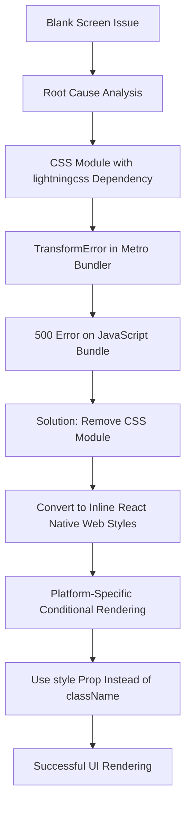
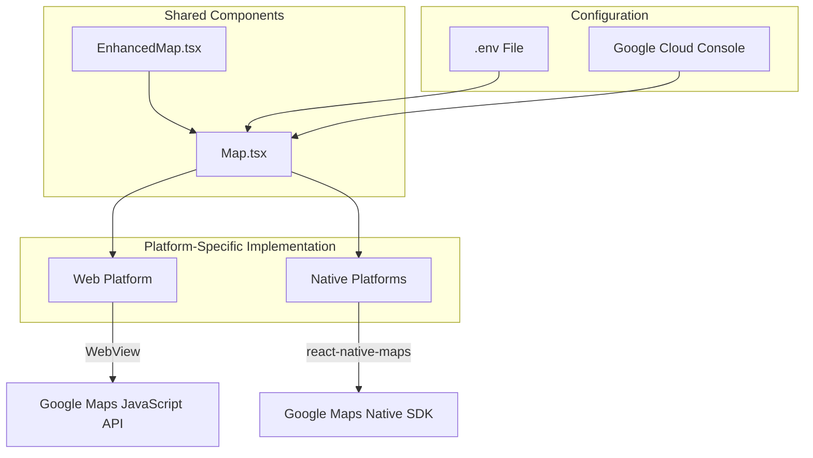
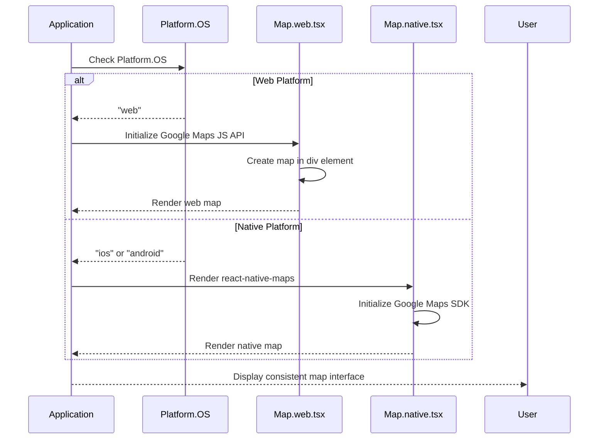
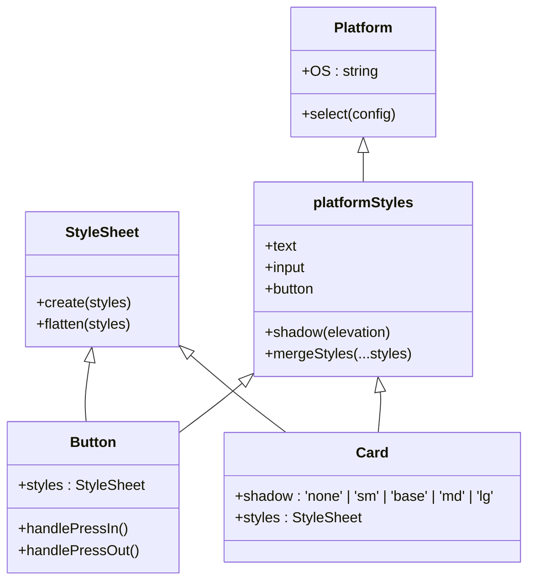
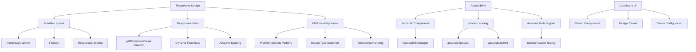
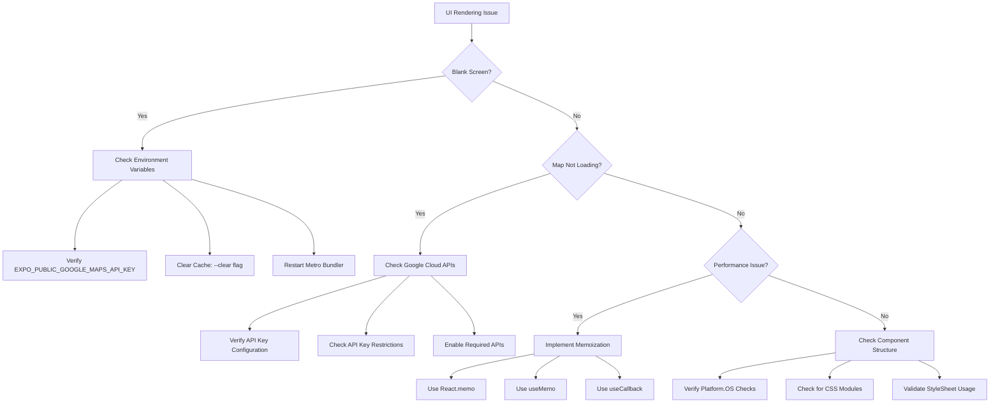

# UI Issues

<cite>
**Referenced Files in This Document**   
- [BLANK_SCREEN_FIX.md](file://BLANK_SCREEN_FIX.md)
- [GOOGLE_MAPS_SETUP.md](file://GOOGLE_MAPS_SETUP.md)
- [MAP_MIGRATION_SUMMARY.md](file://MAP_MIGRATION_SUMMARY.md)
- [ISSUES_FOUND.md](file://ISSUES_FOUND.md)
- [components/Map.tsx](file://components/Map.tsx)
- [components/Map.web.tsx](file://components/Map.web.tsx)
- [components/Map.native.tsx](file://components/Map.native.tsx)
- [components/EnhancedMap.tsx](file://components/EnhancedMap.tsx)
- [components/attachment-uploader.module.css](file://components/attachment-uploader.module.css)
- [components/Map.css](file://components/Map.css)
- [app/merchant/add-commodity.tsx](file://app/merchant/add-commodity.tsx)
- [utils/platformStyles.ts](file://utils/platformStyles.ts)
- [components/ui/button.tsx](file://components/ui/button.tsx)
- [components/ui/card.tsx](file://components/ui/card.tsx)
- [components/AccessibilityWrapper.tsx](file://components/AccessibilityWrapper.tsx)
</cite>

## Table of Contents
1. [Blank Screen Issue and CSS Module Resolution](#blank-screen-issue-and-css-module-resolution)
2. [Map Component Migration and Platform-Specific Rendering](#map-component-migration-and-platform-specific-rendering)
3. [Platform Detection with Platform.OS](#platform-detection-with-platformos)
4. [Deprecated Props Removal and Styling Patterns](#deprecated-props-removal-and-styling-patterns)
5. [Responsive Design and Accessibility](#responsive-design-and-accessibility)
6. [Troubleshooting UI Rendering Failures](#troubleshooting-ui-rendering-failures)

## Blank Screen Issue and CSS Module Resolution

The Brillprime-expo application experienced a critical blank screen issue when accessed via the Gitpod preview URL, where the UI failed to render and displayed only a white screen. This issue was traced to a CSS module dependency on the `lightningcss` package, which requires native Node.js modules that were not properly installed in the Gitpod environment.

The root cause was identified in the file `app/merchant/add-commodity.module.css`, which was the only CSS module in the project. This file was used exclusively for web-only hidden input styling in the merchant commodity upload feature. The Metro bundler failed to transform this CSS module due to the missing `lightningcss.linux-x64-gnu.node` native dependency, resulting in a 500 error when loading the JavaScript bundle.

The solution implemented was to remove the CSS module entirely and convert the styles to inline React Native Web styles using platform-specific conditional rendering. The CSS module was deleted, and the styles were reimplemented using inline JavaScript objects with `Platform.OS === 'web'` checks. This approach eliminated the native dependency requirement while maintaining the same visual functionality.

The web-only styles for visually hidden elements and hidden file inputs were defined as inline objects, using `as const` assertions for proper TypeScript typing. The `className` props were replaced with `style` props to ensure compatibility with React Native Web. This solution provides several benefits: no native dependencies, React Native compatibility, type safety, platform specificity, and co-located styles with the component.

**Diagram sources**
- [BLANK_SCREEN_FIX.md](file://BLANK_SCREEN_FIX.md)
- [app/merchant/add-commodity.tsx](file://app/merchant/add-commodity.tsx)

**Section sources**
- [BLANK_SCREEN_FIX.md](file://BLANK_SCREEN_FIX.md)
- [app/merchant/add-commodity.tsx](file://app/merchant/add-commodity.tsx)
- [app/merchant/add-commodity.module.css](file://app/merchant/add-commodity.module.css)

## Map Component Migration and Platform-Specific Rendering

The Brillprime-expo application has undergone a comprehensive migration from a mixed Leaflet/Google Maps implementation to a unified Google Maps solution across all platforms (Web, iOS, and Android). This migration was necessary to ensure consistent map rendering, improved performance, and access to the full Google Maps feature set.

Previously, the application used Leaflet for web platform rendering while utilizing Google Maps through `react-native-maps` for native platforms (iOS and Android). This hybrid approach created inconsistencies in map appearance, functionality, and user experience across different platforms. The migration involved removing all Leaflet dependencies (`leaflet`, `react-leaflet`, and `@types/leaflet`) and implementing Google Maps for all platforms.

For web platform rendering, the application now uses a WebView-based Google Maps implementation that integrates the Google Maps JavaScript API. The `components/Map.web.tsx` component handles web-specific rendering by loading the Google Maps script dynamically and creating a map instance within a div element. For native platforms, the existing `react-native-maps` implementation with Google Maps provider was retained in `components/Map.native.tsx`.

The migration required several configuration changes, including enabling the necessary Google Cloud APIs (Maps SDK for Android, Maps SDK for iOS, Maps JavaScript API, Places API, and Directions API) and configuring the Google Maps API key in environment variables with the `EXPO_PUBLIC_` prefix. The API key is automatically configured in platform-specific files through the app.config.js configuration.

**Diagram sources**
- [GOOGLE_MAPS_SETUP.md](file://GOOGLE_MAPS_SETUP.md)
- [MAP_MIGRATION_SUMMARY.md](file://MAP_MIGRATION_SUMMARY.md)
- [components/Map.tsx](file://components/Map.tsx)
- [components/Map.web.tsx](file://components/Map.web.tsx)
- [components/Map.native.tsx](file://components/Map.native.tsx)

**Section sources**
- [GOOGLE_MAPS_SETUP.md](file://GOOGLE_MAPS_SETUP.md)
- [MAP_MIGRATION_SUMMARY.md](file://MAP_MIGRATION_SUMMARY.md)
- [components/Map.tsx](file://components/Map.tsx)
- [components/Map.web.tsx](file://components/Map.web.tsx)
- [components/Map.native.tsx](file://components/Map.native.tsx)

## Platform Detection with Platform.OS

The Brillprime-expo application utilizes React Native's `Platform.OS` module for platform-specific rendering and behavior, ensuring optimal user experience across web, iOS, and Android platforms. This approach allows the application to adapt its UI and functionality based on the current platform while maintaining a shared codebase.

The `Platform.OS` module is used extensively throughout the application to conditionally apply styles, render components, and implement platform-specific logic. In the Map component implementation, `Platform.OS` is used to determine whether to render the native `react-native-maps` component or the web-specific WebView-based Google Maps implementation. When `Platform.OS === 'web'`, the component initializes the Google Maps JavaScript API and creates a map within a div element. For native platforms, it renders the `MapView` component from `react-native-maps`.

The application also uses `Platform.OS` for styling differences between platforms. For example, input field padding is adjusted based on the platform to account for differences in default styling between iOS and Android. Button press animations use `useNativeDriver: Platform.OS !== 'web'` to ensure compatibility, as the native driver is not supported on web platforms.

In addition to `Platform.OS`, the application uses `Platform.select()` for more complex platform-specific styling. This method allows developers to specify different style properties for iOS, Android, and web platforms, with a default option for any other platforms. This approach ensures that UI elements appear and behave according to platform conventions while maintaining consistency in the overall design language.

**Diagram sources**
- [components/Map.tsx](file://components/Map.tsx)
- [components/Map.web.tsx](file://components/Map.web.tsx)
- [components/Map.native.tsx](file://components/Map.native.tsx)

**Section sources**
- [components/Map.tsx](file://components/Map.tsx)
- [components/Map.web.tsx](file://components/Map.web.tsx)
- [components/Map.native.tsx](file://components/Map.native.tsx)
- [utils/platformStyles.ts](file://utils/platformStyles.ts)

## Deprecated Props Removal and Styling Patterns

The Brillprime-expo application has addressed several deprecated React Native props and established consistent styling patterns to ensure compatibility across platforms and maintain code quality. This includes the removal of deprecated props such as `shadow*`, `resizeMode`, and `pointerEvents`, and the adoption of standardized styling approaches using `StyleSheet`.

The application previously used CSS modules for web-specific styling, which caused compatibility issues with the Expo development environment. As documented in the blank screen fix, the CSS module `add-commodity.module.css` was removed and replaced with inline React Native Web styles. This change eliminated the dependency on `lightningcss` and ensured consistent styling across platforms.

For styling, the application follows React Native best practices by using `StyleSheet.create()` for component styles and inline styles for web-specific adaptations. The `utils/platformStyles.ts` file provides a centralized collection of platform-aware styles for common UI elements such as shadows, text, inputs, and buttons. This utility exports functions that return platform-appropriate style objects, ensuring consistent appearance across iOS, Android, and web platforms.

The application has also removed deprecated `shadow*` props in favor of platform-specific shadow implementations. On iOS, traditional shadow properties (`shadowColor`, `shadowOffset`, `shadowOpacity`, `shadowRadius`) are used, while on Android, the `elevation` property is applied. The `platformStyles` utility abstracts these differences, allowing developers to apply shadows consistently without platform-specific code in components.

**Diagram sources**
- [utils/platformStyles.ts](file://utils/platformStyles.ts)
- [components/ui/button.tsx](file://components/ui/button.tsx)
- [components/ui/card.tsx](file://components/ui/card.tsx)

**Section sources**
- [BLANK_SCREEN_FIX.md](file://BLANK_SCREEN_FIX.md)
- [utils/platformStyles.ts](file://utils/platformStyles.ts)
- [components/ui/button.tsx](file://components/ui/button.tsx)
- [components/ui/card.tsx](file://components/ui/card.tsx)
- [components/attachment-uploader.module.css](file://components/attachment-uploader.module.css)

## Responsive Design and Accessibility

The Brillprime-expo application implements comprehensive responsive design principles and accessibility features to ensure a consistent and inclusive user experience across consumer, merchant, and driver roles. The UI adapts to different screen sizes, orientations, and device capabilities while maintaining usability and visual coherence.

Responsive design is achieved through a combination of flexible layouts, responsive units, and platform-specific adaptations. The application uses percentage-based widths, flexbox layouts, and responsive scaling functions to ensure UI elements resize appropriately on different devices. The `getResponsiveValue` function in the Card component calculates scaled values based on screen width, ensuring consistent proportions across devices of varying sizes.

Accessibility is prioritized through the use of semantic components, proper labeling, and assistive technology support. The `AccessibilityWrapper` component provides a consistent interface for adding accessibility properties to UI elements, including `accessibilityLabel`, `accessibilityHint`, and `accessibilityRole`. These properties ensure that screen readers and other assistive technologies can properly interpret and navigate the application.

The application maintains consistent UI patterns across consumer, merchant, and driver roles through shared component libraries and design tokens. The `theme.ts` configuration file defines a unified design system with consistent colors, typography, spacing, and border radii. This ensures that regardless of the user role, the application presents a cohesive visual language and interaction model.

**Diagram sources**
- [components/ui/card.tsx](file://components/ui/card.tsx)
- [components/AccessibilityWrapper.tsx](file://components/AccessibilityWrapper.tsx)
- [config/theme.ts](file://config/theme.ts)

**Section sources**
- [components/ui/card.tsx](file://components/ui/card.tsx)
- [components/AccessibilityWrapper.tsx](file://components/AccessibilityWrapper.tsx)
- [config/theme.ts](file://config/theme.ts)

## Troubleshooting UI Rendering Failures

This section provides guidance for troubleshooting common UI rendering failures and performance bottlenecks in the Brillprime-expo application. These issues typically stem from configuration problems, missing dependencies, or platform-specific rendering challenges.

For blank screen issues, verify that all required environment variables are properly configured, particularly `EXPO_PUBLIC_GOOGLE_MAPS_API_KEY`. Missing API keys can cause component initialization failures that result in blank screens. Clear the development cache and restart the Metro bundler with the `--clear` flag to ensure a clean build environment.

Map rendering failures are often related to Google Maps API configuration. Verify that the API key is correctly set in the `.env` file with the `EXPO_PUBLIC_` prefix. Check that the required APIs (Maps SDK for Android, Maps SDK for iOS, and Maps JavaScript API) are enabled in the Google Cloud Console. Ensure that API key restrictions match the application's package name (Android), bundle identifier (iOS), or domain (web).

Performance bottlenecks can occur with complex components or excessive re-renders. The EnhancedMap component, for example, makes multiple service calls for places and routes. Implement memoization with `React.memo`, `useMemo`, and `useCallback` to optimize rendering performance. Consider implementing virtualized lists for long lists of items to improve scroll performance.

For web-specific issues, ensure that CSS modules are not being used, as they can cause bundling errors with native dependencies. Convert any CSS modules to inline React Native Web styles or use `StyleSheet.create()`. Verify that all web-specific code is properly gated with `Platform.OS === 'web'` checks to prevent native module imports on the web platform.

**Diagram sources**
- [ISSUES_FOUND.md](file://ISSUES_FOUND.md)
- [BLANK_SCREEN_FIX.md](file://BLANK_SCREEN_FIX.md)
- [GOOGLE_MAPS_SETUP.md](file://GOOGLE_MAPS_SETUP.md)

**Section sources**
- [ISSUES_FOUND.md](file://ISSUES_FOUND.md)
- [BLANK_SCREEN_FIX.md](file://BLANK_SCREEN_FIX.md)
- [GOOGLE_MAPS_SETUP.md](file://GOOGLE_MAPS_SETUP.md)
- [MAP_MIGRATION_SUMMARY.md](file://MAP_MIGRATION_SUMMARY.md)