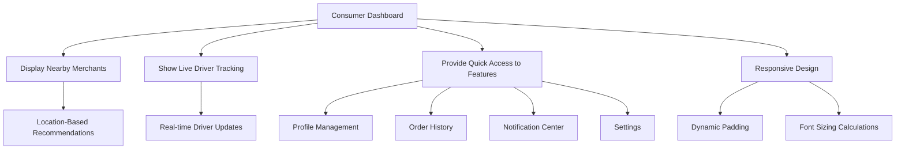
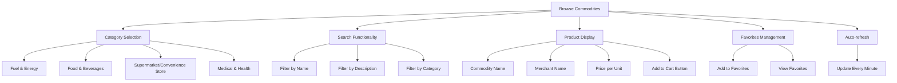
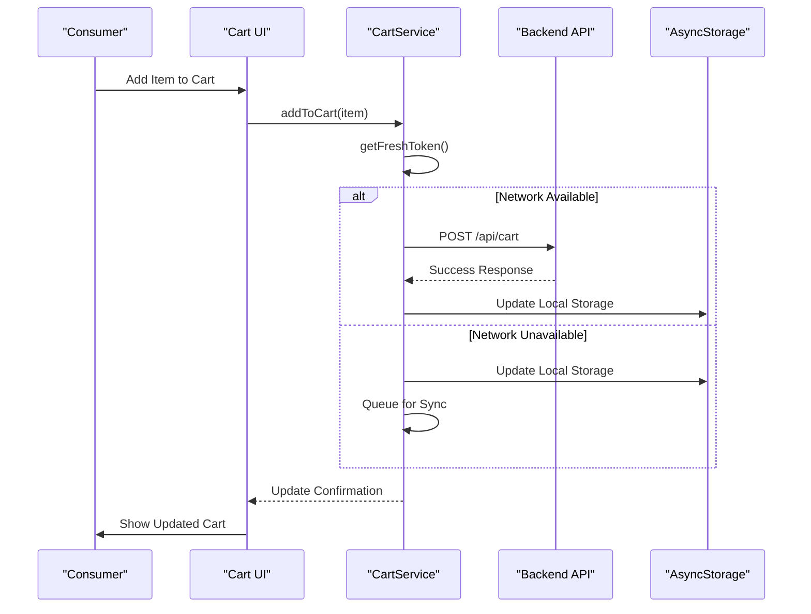
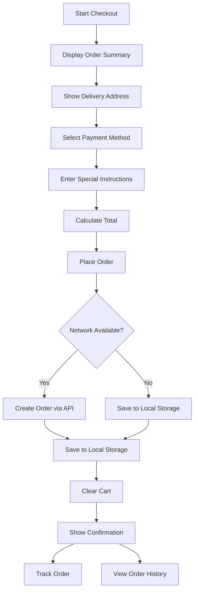
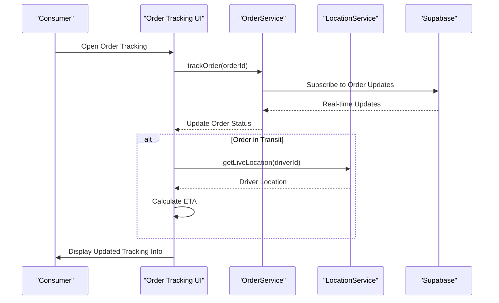
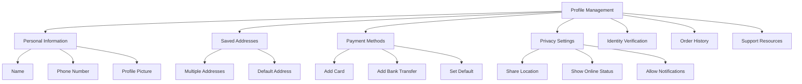
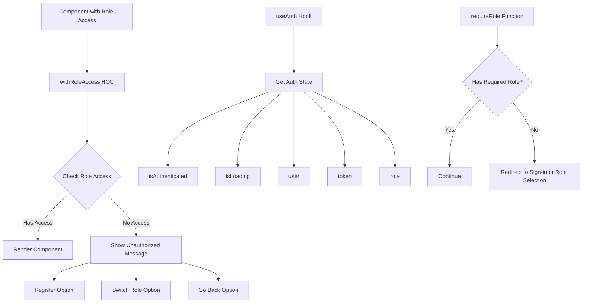
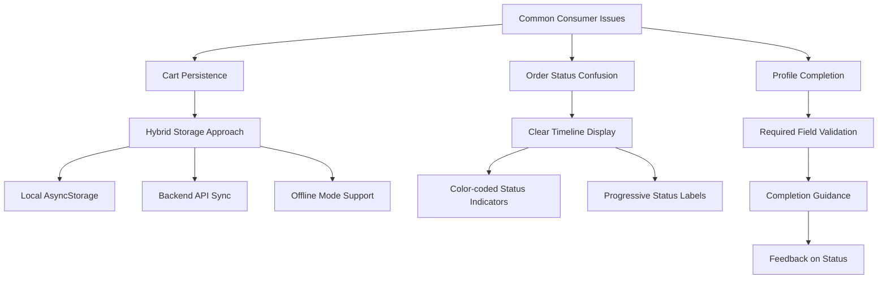

# Consumer Role Features

<cite>
**Referenced Files in This Document**   
- [consumer.tsx](file://app/home/consumer.tsx)
- [cartService.ts](file://services/cartService.ts)
- [orderService.ts](file://services/orderService.ts)
- [profileService.ts](file://services/profileService.ts)
- [withRoleAccess.tsx](file://components/withRoleAccess.tsx)
- [useAuth.ts](file://hooks/useAuth.ts)
- [index.tsx](file://app/cart/index.tsx)
- [checkout/index.tsx](file://app/checkout/index.tsx)
- [confirmation.tsx](file://app/checkout/confirmation.tsx)
- [commodities.tsx](file://app/commodity/commodities.tsx)
- [consumer-orders.tsx](file://app/orders/consumer-orders.tsx)
- [index.tsx](file://app/profile/index.tsx)
- [order-tracking.tsx](file://app/orders/order-tracking.tsx)
- [LiveOrderTracker.tsx](file://components/LiveOrderTracker.tsx)
</cite>

## Table of Contents
1. [Introduction](#introduction)
2. [Consumer Dashboard and Navigation](#consumer-dashboard-and-navigation)
3. [Browsing Commodities](#browsing-commodities)
4. [Cart Management and Synchronization](#cart-management-and-synchronization)
5. [Checkout Flow and Order Confirmation](#checkout-flow-and-order-confirmation)
6. [Order Tracking and Real-time Updates](#order-tracking-and-real-time-updates)
7. [Profile Management](#profile-management)
8. [Role-based Access Control](#role-based-access-control)
9. [Common Consumer Issues](#common-consumer-issues)
10. [Conclusion](#conclusion)

## Introduction
The Consumer role in Brillprime-expo provides users with a comprehensive shopping experience, enabling them to browse commodities, manage cart items, initiate checkout, track active orders, and manage their personal profile. The consumer interface is centered around the dashboard in `app/home/consumer.tsx`, which serves as the primary entry point to key features. This documentation details the consumer's capabilities, integration points, and user experience flow, with a focus on real-time synchronization, state management, and role-based access control.

**Section sources**
- [consumer.tsx](file://app/home/consumer.tsx)

## Consumer Dashboard and Navigation
The consumer dashboard in `app/home/consumer.tsx` serves as the central hub for consumer activities, providing access to all key features through a responsive interface. The dashboard displays nearby merchants, live driver tracking, and quick access to essential functions like profile management and order history.

The interface is built with responsive design principles, adapting to different screen sizes through dynamic padding and font sizing calculations. The map component uses a custom blue theme inspired by Bolt, enhancing visual appeal while maintaining functionality. Location services are integrated to provide personalized merchant recommendations based on the user's current position.

Navigation is facilitated through a sidebar menu that includes options for profile, notifications, settings, and role switching. The dashboard also features real-time updates for notifications and order status, ensuring consumers stay informed about their transactions and account activity.

**Diagram sources**
- [consumer.tsx](file://app/home/consumer.tsx)

**Section sources**
- [consumer.tsx](file://app/home/consumer.tsx)

## Browsing Commodities
Consumers can browse commodities through the `app/commodity/commodities.tsx` interface, which presents products organized by category. The browsing experience begins with a category selection screen featuring 19 distinct categories including Fuel & Energy, Food & Beverages, Supermarket/Convenience Store, and Medical & Health.

The interface supports both category-based and search-based navigation, allowing users to filter products by name, description, or category. Each product card displays essential information including the commodity name, merchant name, price per unit, and an "Add to Cart" button. Users can also add products to their favorites for quick access later.

The commodities screen implements real-time auto-refresh functionality, updating the product list every minute to ensure consumers see the most current inventory and pricing information. Error handling is robust, with fallback to mock data when API calls fail, ensuring a seamless user experience even during connectivity issues.

**Diagram sources**
- [commodities.tsx](file://app/commodity/commodities.tsx)

**Section sources**
- [commodities.tsx](file://app/commodity/commodities.tsx)

## Cart Management and Synchronization
The cart management system in Brillprime-expo is powered by `services/cartService.ts`, which handles all aspects of cart operations including adding, updating, and removing items. The service implements a hybrid storage approach, synchronizing data between local AsyncStorage and a backend API to ensure persistence across sessions and devices.

The `cartService` class provides methods for CRUD operations on cart items, with automatic token refresh for authentication. When adding items to the cart, the service first attempts to sync with the backend using a fresh Firebase token, falling back to local storage if the network is unavailable. This ensures that users can continue shopping even in offline mode.

Real-time synchronization is achieved through the integration of `cartService.ts` with UI components. The cart screen (`app/cart/index.tsx`) subscribes to cart changes and updates the display immediately when items are added, removed, or quantities are modified. The service also calculates the cart total and item count, providing consumers with up-to-date pricing information.

**Diagram sources**
- [cartService.ts](file://services/cartService.ts)
- [index.tsx](file://app/cart/index.tsx)

**Section sources**
- [cartService.ts](file://services/cartService.ts)
- [index.tsx](file://app/cart/index.tsx)

## Checkout Flow and Order Confirmation
The checkout process in Brillprime-expo follows a structured flow from cart to order confirmation, implemented across multiple components including `app/checkout/index.tsx` and `app/checkout/confirmation.tsx`. The flow begins when the consumer selects "Make Payment" from the cart screen, which navigates to the checkout interface.

The checkout screen displays the order summary, delivery address, payment method options, and special instructions. Consumers can choose from multiple payment methods including credit/debit card, bank transfer, and cash on delivery. The interface calculates and displays the total amount, including delivery and service fees.

Upon placing an order, the system creates the order via the backend API and saves it to local storage for offline access. The confirmation screen (`confirmation.tsx`) then displays order details and provides options to track the order or view order history. The flow includes robust error handling, with alerts for issues like empty carts or missing delivery addresses.

**Diagram sources**
- [index.tsx](file://app/checkout/index.tsx)
- [confirmation.tsx](file://app/checkout/confirmation.tsx)

**Section sources**
- [index.tsx](file://app/checkout/index.tsx)
- [confirmation.tsx](file://app/checkout/confirmation.tsx)

## Order Tracking and Real-time Updates
Consumers can track their active orders through the `app/orders/order-tracking.tsx` interface, which provides real-time updates on order status and driver location. The tracking system uses a combination of Supabase real-time subscriptions and polling to ensure consumers receive timely updates.

The order tracking screen displays a timeline of order progress, showing status changes from "Order Placed" to "Delivered." For orders in transit, the interface shows the driver's current location on a map and calculates the estimated time of arrival based on distance and average speed. Consumers can also refresh the location manually to get the most current driver position.

The `LiveOrderTracker.tsx` component enhances the tracking experience by providing a dedicated interface for monitoring order progress. This component integrates with the location service to calculate ETAs and displays a live status indicator showing whether tracking is active. The interface also includes communication options, allowing consumers to contact drivers directly.

**Diagram sources**
- [order-tracking.tsx](file://app/orders/order-tracking.tsx)
- [LiveOrderTracker.tsx](file://components/LiveOrderTracker.tsx)

**Section sources**
- [order-tracking.tsx](file://app/orders/order-tracking.tsx)
- [LiveOrderTracker.tsx](file://components/LiveOrderTracker.tsx)

## Profile Management
The consumer profile management system, implemented in `app/profile/index.tsx` and `services/profileService.ts`, allows users to manage their personal information, saved addresses, payment methods, and privacy settings. The profile interface is organized into sections for Account, Preferences, and Support & Legal.

Consumers can update their personal information, including name, phone number, and profile picture. The address management system supports multiple saved addresses with a default address designation. Payment methods can be added, updated, or removed, with support for both cards and bank transfers.

Privacy settings allow consumers to control data sharing, online status visibility, and notification preferences. The interface also provides access to identity verification (KYC), order history, and support resources. All profile changes are synchronized with the backend API and cached locally for quick access.

**Diagram sources**
- [index.tsx](file://app/profile/index.tsx)
- [profileService.ts](file://services/profileService.ts)

**Section sources**
- [index.tsx](file://app/profile/index.tsx)
- [profileService.ts](file://services/profileService.ts)

## Role-based Access Control
Role-based access control in Brillprime-expo is implemented through the `withRoleAccess.tsx` higher-order component and the `useAuth.ts` hook. This system ensures that consumers can only access features appropriate to their role, with proper redirection and error handling for unauthorized access attempts.

The `withRoleAccess` function wraps components that require specific role permissions, checking access when the component mounts. If a consumer lacks the required role, they are redirected to a fallback route or shown an unauthorized access message with options to register or switch roles.

The `useAuth` hook provides authentication state and role information, enabling components to conditionally render content based on the user's role. The `requireRole` function can be used to enforce role requirements programmatically, redirecting users to appropriate screens if they don't have the necessary permissions.

**Diagram sources**
- [withRoleAccess.tsx](file://components/withRoleAccess.tsx)
- [useAuth.ts](file://hooks/useAuth.ts)

**Section sources**
- [withRoleAccess.tsx](file://components/withRoleAccess.tsx)
- [useAuth.ts](file://hooks/useAuth.ts)

## Common Consumer Issues
Several common issues have been identified in the consumer experience, with specific solutions implemented in the codebase. These include cart persistence, order status confusion, and profile completion requirements.

Cart persistence is addressed through the hybrid storage approach in `cartService.ts`, which synchronizes data between local storage and the backend API. This ensures that cart items are preserved across app restarts and device changes, with automatic sync when connectivity is restored.

Order status confusion is mitigated through the clear timeline display in `order-tracking.tsx`, which shows the progression of an order from placement to delivery. The interface uses color-coded status indicators and clear labels to help consumers understand their order's current state.

Profile completion requirements are enforced through the role management system, which checks for required profile information before allowing access to certain features. The profile interface guides consumers through the completion process, highlighting required fields and providing feedback on completion status.

**Diagram sources**
- [cartService.ts](file://services/cartService.ts)
- [order-tracking.tsx](file://app/orders/order-tracking.tsx)
- [profileService.ts](file://services/profileService.ts)

**Section sources**
- [cartService.ts](file://services/cartService.ts)
- [order-tracking.tsx](file://app/orders/order-tracking.tsx)
- [profileService.ts](file://services/profileService.ts)

## Conclusion
The Consumer role in Brillprime-expo provides a comprehensive and user-friendly shopping experience, with robust features for browsing commodities, managing cart items, initiating checkout, tracking orders, and managing personal profiles. The system is built on a solid architecture with proper separation of concerns, real-time synchronization, and role-based access control.

Key strengths include the hybrid storage approach for cart persistence, real-time order tracking with driver location updates, and a well-organized profile management system. The interface is responsive and accessible, with clear navigation and intuitive workflows.

The implementation demonstrates best practices in mobile application development, including proper error handling, offline support, and security considerations. Future enhancements could include more advanced filtering options for commodities, enhanced order tracking with route visualization, and improved personalization based on consumer preferences and purchase history.

**Section sources**
- [consumer.tsx](file://app/home/consumer.tsx)
- [cartService.ts](file://services/cartService.ts)
- [orderService.ts](file://services/orderService.ts)
- [profileService.ts](file://services/profileService.ts)