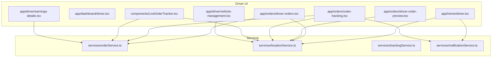
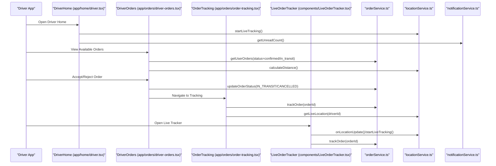
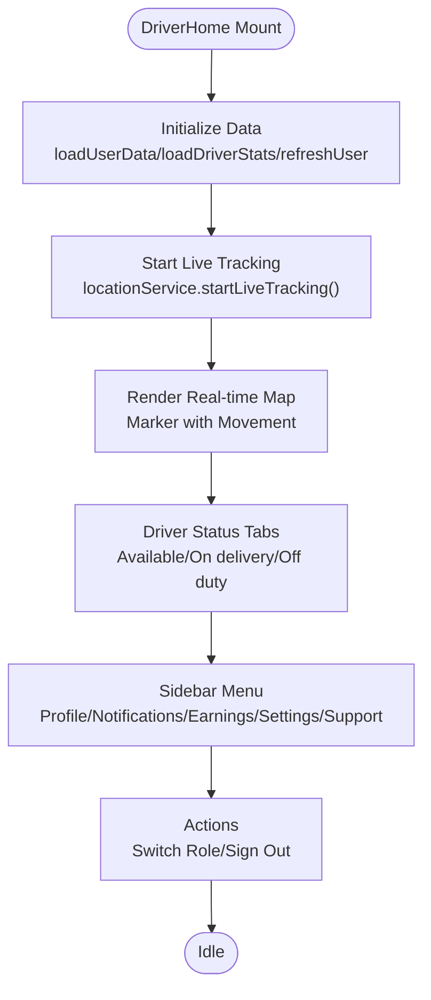
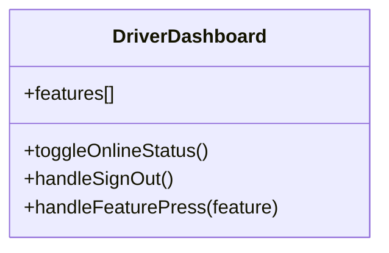
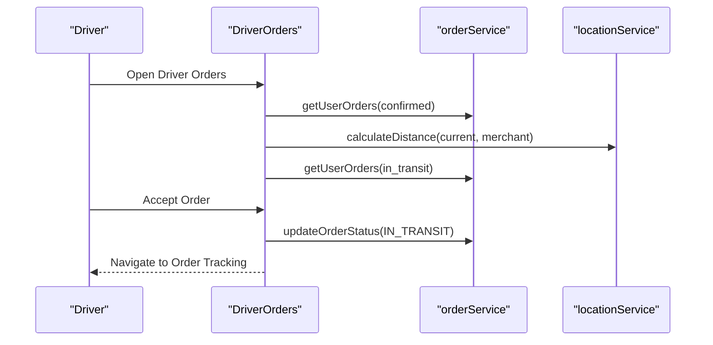
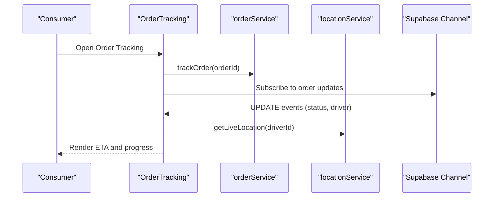
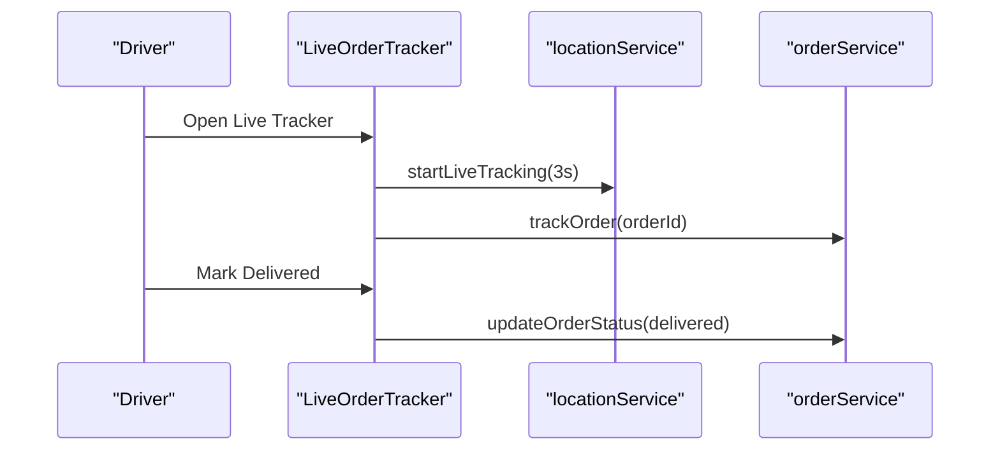
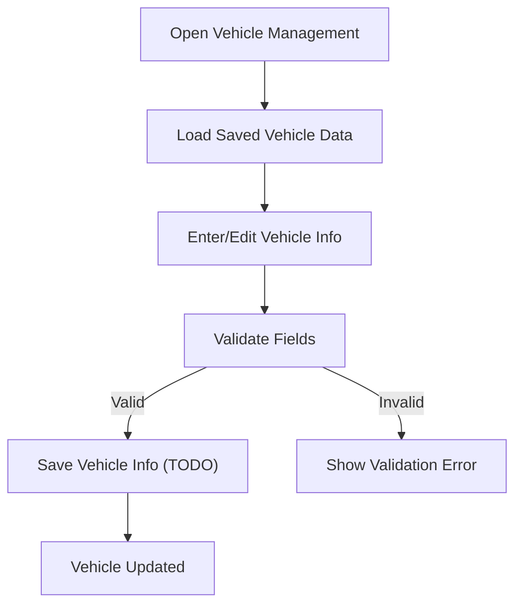
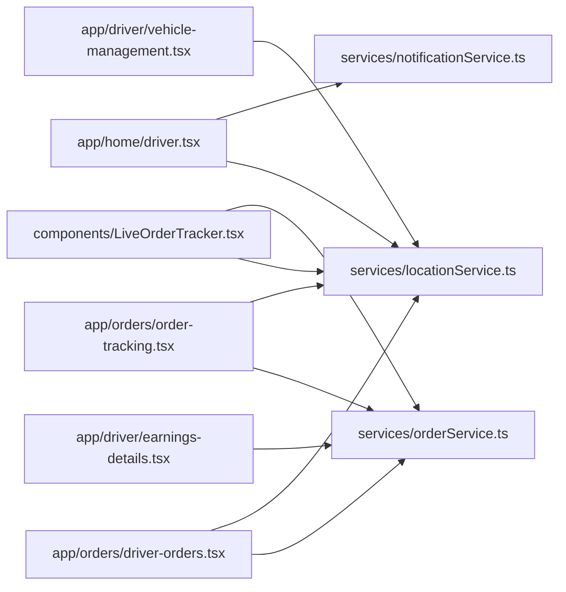

# Driver Role Features

<cite>
**Referenced Files in This Document**
- [app/home/driver.tsx](file://app/home/driver.tsx)
- [app/dashboard/driver.tsx](file://app/dashboard/driver.tsx)
- [app/orders/driver-orders.tsx](file://app/orders/driver-orders.tsx)
- [app/orders/driver-order-preview.tsx](file://app/orders/driver-order-preview.tsx)
- [app/orders/order-tracking.tsx](file://app/orders/order-tracking.tsx)
- [components/LiveOrderTracker.tsx](file://components/LiveOrderTracker.tsx)
- [services/orderService.ts](file://services/orderService.ts)
- [services/locationService.ts](file://services/locationService.ts)
- [services/trackingService.ts](file://services/trackingService.ts)
- [services/notificationService.ts](file://services/notificationService.ts)
- [app/driver/vehicle-management.tsx](file://app/driver/vehicle-management.tsx)
- [app/driver/earnings-details.tsx](file://app/driver/earnings-details.tsx)
</cite>

## Table of Contents
1. [Introduction](#introduction)
2. [Project Structure](#project-structure)
3. [Core Components](#core-components)
4. [Architecture Overview](#architecture-overview)
5. [Detailed Component Analysis](#detailed-component-analysis)
6. [Dependency Analysis](#dependency-analysis)
7. [Performance Considerations](#performance-considerations)
8. [Troubleshooting Guide](#troubleshooting-guide)
9. [Conclusion](#conclusion)

## Introduction
This document explains the Driver role features in Brillprime-expo. It covers how drivers view available orders, accept deliveries, manage vehicle information, track delivery progress, and view earnings. It also describes how app/home/driver.tsx acts as the central hub with real-time order availability and navigation controls, how the driver order lifecycle works through orderService.ts, and how LiveOrderTracker provides real-time location updates and delivery status. Finally, it outlines how locationService.ts and trackingService.ts enable geolocation tracking and route optimization, and includes examples of push notifications for new orders and time-sensitive delivery alerts.

## Project Structure
The driver role spans several screens and services:
- Home and dashboard: app/home/driver.tsx and app/dashboard/driver.tsx
- Order management: app/orders/driver-orders.tsx, app/orders/driver-order-preview.tsx, app/orders/order-tracking.tsx
- Real-time tracking: components/LiveOrderTracker.tsx
- Services: services/orderService.ts, services/locationService.ts, services/trackingService.ts, services/notificationService.ts
- Driver resources: app/driver/vehicle-management.tsx, app/driver/earnings-details.tsx

**Diagram sources**
- [app/home/driver.tsx](file://app/home/driver.tsx#L1-L200)
- [app/dashboard/driver.tsx](file://app/dashboard/driver.tsx#L1-L190)
- [app/orders/driver-orders.tsx](file://app/orders/driver-orders.tsx#L1-L120)
- [app/orders/driver-order-preview.tsx](file://app/orders/driver-order-preview.tsx#L1-L120)
- [app/orders/order-tracking.tsx](file://app/orders/order-tracking.tsx#L1-L120)
- [components/LiveOrderTracker.tsx](file://components/LiveOrderTracker.tsx#L1-L120)
- [services/orderService.ts](file://services/orderService.ts#L1-L120)
- [services/locationService.ts](file://services/locationService.ts#L1-L120)
- [services/trackingService.ts](file://services/trackingService.ts#L1-L58)
- [services/notificationService.ts](file://services/notificationService.ts#L1-L120)
- [app/driver/vehicle-management.tsx](file://app/driver/vehicle-management.tsx#L1-L120)
- [app/driver/earnings-details.tsx](file://app/driver/earnings-details.tsx#L1-L120)

**Section sources**
- [app/home/driver.tsx](file://app/home/driver.tsx#L1-L200)
- [app/dashboard/driver.tsx](file://app/dashboard/driver.tsx#L1-L190)
- [services/orderService.ts](file://services/orderService.ts#L1-L120)
- [services/locationService.ts](file://services/locationService.ts#L1-L120)
- [services/notificationService.ts](file://services/notificationService.ts#L1-L120)

## Core Components
- Driver Home Hub (app/home/driver.tsx): Real-time map, driver status tabs, live location tracking, and navigation controls.
- Driver Dashboard (app/dashboard/driver.tsx): Driver status toggle, quick links to orders, earnings, navigation, vehicle info, and support.
- Driver Orders (app/orders/driver-orders.tsx): Lists available and active orders, distance calculation, accept/reject actions, and navigation to tracking.
- Driver Order Preview (app/orders/driver-order-preview.tsx): Detailed route preview with map, distance/time stats, and quick contact actions.
- Order Tracking (app/orders/order-tracking.tsx): Real-time order progress timeline, driver location updates, ETA calculation, and actions.
- Live Order Tracker (components/LiveOrderTracker.tsx): Real-time map and ETA for driver/consumer, driver location sharing, and delivery completion.
- Services:
  - orderService.ts: Order creation, retrieval, status updates, cancellation, tracking, and summaries.
  - locationService.ts: Geolocation, live tracking, movement detection, distance/heading calculations, route optimization, and Supabase broadcasting.
  - trackingService.ts: Order tracking and driver location updates.
  - notificationService.ts: Push/email notifications, unread counts, preferences, scheduling, and real-time subscriptions.

**Section sources**
- [app/home/driver.tsx](file://app/home/driver.tsx#L1-L200)
- [app/dashboard/driver.tsx](file://app/dashboard/driver.tsx#L1-L190)
- [app/orders/driver-orders.tsx](file://app/orders/driver-orders.tsx#L1-L120)
- [app/orders/driver-order-preview.tsx](file://app/orders/driver-order-preview.tsx#L1-L120)
- [app/orders/order-tracking.tsx](file://app/orders/order-tracking.tsx#L1-L120)
- [components/LiveOrderTracker.tsx](file://components/LiveOrderTracker.tsx#L1-L120)
- [services/orderService.ts](file://services/orderService.ts#L1-L120)
- [services/locationService.ts](file://services/locationService.ts#L1-L120)
- [services/trackingService.ts](file://services/trackingService.ts#L1-L58)
- [services/notificationService.ts](file://services/notificationService.ts#L1-L120)

## Architecture Overview
The driver role integrates UI screens with services for real-time order and location management. The home screen initializes driver data, starts live location tracking, and exposes navigation controls. Order screens rely on orderService for backend interactions and locationService for geolocation and ETA. LiveOrderTracker encapsulates real-time tracking for both drivers and consumers.

**Diagram sources**
- [app/home/driver.tsx](file://app/home/driver.tsx#L270-L360)
- [app/orders/driver-orders.tsx](file://app/orders/driver-orders.tsx#L120-L210)
- [app/orders/order-tracking.tsx](file://app/orders/order-tracking.tsx#L100-L180)
- [components/LiveOrderTracker.tsx](file://components/LiveOrderTracker.tsx#L1-L120)
- [services/orderService.ts](file://services/orderService.ts#L120-L203)
- [services/locationService.ts](file://services/locationService.ts#L368-L471)
- [services/notificationService.ts](file://services/notificationService.ts#L333-L414)

## Detailed Component Analysis

### Driver Home Hub (app/home/driver.tsx)
- Real-time map with driver marker and movement indicator.
- Driver status tabs: Available, On delivery, Off duty with animated energy indicator.
- Live location tracking: startLiveTracking() and stopLiveTracking() lifecycle.
- Navigation controls: back to dashboard, open menu, view orders.
- Notification integration: unread count via notificationService.getUnreadCount().
- Performance: memoized map component, responsive sizing, and caching via PerformanceOptimizer.

**Diagram sources**
- [app/home/driver.tsx](file://app/home/driver.tsx#L128-L200)
- [app/home/driver.tsx](file://app/home/driver.tsx#L274-L360)
- [app/home/driver.tsx](file://app/home/driver.tsx#L360-L420)
- [services/locationService.ts](file://services/locationService.ts#L368-L471)
- [services/notificationService.ts](file://services/notificationService.ts#L333-L414)

**Section sources**
- [app/home/driver.tsx](file://app/home/driver.tsx#L128-L200)
- [app/home/driver.tsx](file://app/home/driver.tsx#L274-L360)
- [app/home/driver.tsx](file://app/home/driver.tsx#L360-L420)
- [services/locationService.ts](file://services/locationService.ts#L368-L471)
- [services/notificationService.ts](file://services/notificationService.ts#L333-L414)

### Driver Dashboard (app/dashboard/driver.tsx)
- Driver status toggle: online/offline with confirmation alert.
- Feature grid: Available Jobs, My Deliveries, Earnings, Route Planner, Vehicle Info, Help & Support.
- Today’s summary: deliveries, earnings, rating.
- Navigation: routes to orders, transactions, store locator, vehicle management, support.

**Diagram sources**
- [app/dashboard/driver.tsx](file://app/dashboard/driver.tsx#L1-L190)

**Section sources**
- [app/dashboard/driver.tsx](file://app/dashboard/driver.tsx#L1-L190)

### Driver Orders (app/orders/driver-orders.tsx)
- Loads confirmed orders as available and in-transit orders as active.
- Calculates distance to merchant using locationService.calculateDistance().
- Accept/Reject actions update order status via orderService.updateOrderStatus().
- Navigates to order tracking after acceptance.

**Diagram sources**
- [app/orders/driver-orders.tsx](file://app/orders/driver-orders.tsx#L60-L120)
- [app/orders/driver-orders.tsx](file://app/orders/driver-orders.tsx#L120-L210)
- [services/orderService.ts](file://services/orderService.ts#L120-L160)
- [services/locationService.ts](file://services/locationService.ts#L273-L309)

**Section sources**
- [app/orders/driver-orders.tsx](file://app/orders/driver-orders.tsx#L60-L120)
- [app/orders/driver-orders.tsx](file://app/orders/driver-orders.tsx#L120-L210)
- [services/orderService.ts](file://services/orderService.ts#L120-L160)
- [services/locationService.ts](file://services/locationService.ts#L273-L309)

### Driver Order Preview (app/orders/driver-order-preview.tsx)
- Displays earnings highlight, order items, total amount, route info, distance, and estimated duration.
- Toggle to view route on map with markers for pickup and delivery.
- Quick contact buttons for merchant/customer.

**Section sources**
- [app/orders/driver-order-preview.tsx](file://app/orders/driver-order-preview.tsx#L1-L200)

### Order Tracking (app/orders/order-tracking.tsx)
- Real-time order progress timeline with status steps.
- Driver location polling and Supabase subscription for live updates.
- ETA calculation using locationService.calculateDistance() and driver location.
- Actions: view full details, get help.

**Diagram sources**
- [app/orders/order-tracking.tsx](file://app/orders/order-tracking.tsx#L100-L180)
- [app/orders/order-tracking.tsx](file://app/orders/order-tracking.tsx#L180-L260)
- [services/orderService.ts](file://services/orderService.ts#L156-L182)
- [services/locationService.ts](file://services/locationService.ts#L625-L670)

**Section sources**
- [app/orders/order-tracking.tsx](file://app/orders/order-tracking.tsx#L100-L180)
- [app/orders/order-tracking.tsx](file://app/orders/order-tracking.tsx#L180-L260)
- [services/orderService.ts](file://services/orderService.ts#L156-L182)
- [services/locationService.ts](file://services/locationService.ts#L625-L670)

### Live Order Tracker (components/LiveOrderTracker.tsx)
- Driver and consumer views share the same component with role-based differences.
- Driver shares live location via locationService.startLiveTracking().
- Consumer subscribes to driver location via onLocationUpdate() and polls via getLiveLocation().
- ETA computed from driver and consumer coordinates.

**Diagram sources**
- [components/LiveOrderTracker.tsx](file://components/LiveOrderTracker.tsx#L1-L120)
- [components/LiveOrderTracker.tsx](file://components/LiveOrderTracker.tsx#L120-L210)
- [services/orderService.ts](file://services/orderService.ts#L132-L142)
- [services/locationService.ts](file://services/locationService.ts#L368-L471)

**Section sources**
- [components/LiveOrderTracker.tsx](file://components/LiveOrderTracker.tsx#L1-L120)
- [components/LiveOrderTracker.tsx](file://components/LiveOrderTracker.tsx#L120-L210)
- [services/orderService.ts](file://services/orderService.ts#L132-L142)
- [services/locationService.ts](file://services/locationService.ts#L368-L471)

### Vehicle Management (app/driver/vehicle-management.tsx)
- Vehicle information form: make, model, year, color, plate number, registration number, insurance number, expiry dates.
- Document management: registration, insurance, roadworthiness with upload and status indicators.
- Validation: form validation and year range checks.
- Notes: API calls are currently TODO and will be implemented to persist data.

**Diagram sources**
- [app/driver/vehicle-management.tsx](file://app/driver/vehicle-management.tsx#L1-L120)
- [app/driver/vehicle-management.tsx](file://app/driver/vehicle-management.tsx#L120-L220)

**Section sources**
- [app/driver/vehicle-management.tsx](file://app/driver/vehicle-management.tsx#L1-L120)
- [app/driver/vehicle-management.tsx](file://app/driver/vehicle-management.tsx#L120-L220)

### Earnings Details (app/driver/earnings-details.tsx)
- Earnings summary: total, today, week, month, completed deliveries, average per delivery, pending payout.
- Earnings breakdown: delivery fees, tips, bonuses, fuel/toll reimbursements.
- Transaction history: recent entries with status badges and navigation to order details.
- Payout request action.

**Section sources**
- [app/driver/earnings-details.tsx](file://app/driver/earnings-details.tsx#L1-L120)
- [app/driver/earnings-details.tsx](file://app/driver/earnings-details.tsx#L120-L220)

## Dependency Analysis
- Driver Home depends on:
  - locationService for live tracking and movement detection.
  - notificationService for unread notifications.
- Driver Orders depends on:
  - orderService for retrieving orders and updating statuses.
  - locationService for distance calculations.
- Order Tracking depends on:
  - orderService for order tracking and status updates.
  - locationService for driver location and ETA.
  - Supabase for real-time order updates.
- Live Order Tracker depends on:
  - locationService for live location and movement.
  - orderService for order tracking.
- Vehicle Management and Earnings Details currently have TODO API integrations.

**Diagram sources**
- [app/home/driver.tsx](file://app/home/driver.tsx#L270-L360)
- [app/orders/driver-orders.tsx](file://app/orders/driver-orders.tsx#L120-L210)
- [app/orders/order-tracking.tsx](file://app/orders/order-tracking.tsx#L100-L180)
- [components/LiveOrderTracker.tsx](file://components/LiveOrderTracker.tsx#L1-L120)
- [services/orderService.ts](file://services/orderService.ts#L120-L203)
- [services/locationService.ts](file://services/locationService.ts#L368-L471)
- [services/notificationService.ts](file://services/notificationService.ts#L333-L414)
- [app/driver/vehicle-management.tsx](file://app/driver/vehicle-management.tsx#L1-L120)
- [app/driver/earnings-details.tsx](file://app/driver/earnings-details.tsx#L1-L120)

**Section sources**
- [app/home/driver.tsx](file://app/home/driver.tsx#L270-L360)
- [app/orders/driver-orders.tsx](file://app/orders/driver-orders.tsx#L120-L210)
- [app/orders/order-tracking.tsx](file://app/orders/order-tracking.tsx#L100-L180)
- [components/LiveOrderTracker.tsx](file://components/LiveOrderTracker.tsx#L1-L120)
- [services/orderService.ts](file://services/orderService.ts#L120-L203)
- [services/locationService.ts](file://services/locationService.ts#L368-L471)
- [services/notificationService.ts](file://services/notificationService.ts#L333-L414)
- [app/driver/vehicle-management.tsx](file://app/driver/vehicle-management.tsx#L1-L120)
- [app/driver/earnings-details.tsx](file://app/driver/earnings-details.tsx#L1-L120)

## Performance Considerations
- Live tracking intervals: locationService.startLiveTracking() uses configurable intervals; adjust for battery life vs. accuracy.
- Movement detection: thresholds for distance and speed smooth updates and reduce unnecessary broadcasts.
- Caching: locationService.getCachedLocation() and notificationService.getUnreadCount() leverage caching and retry logic to minimize network overhead.
- Map rendering: RealTimeMapComponent uses React.memo to prevent re-renders; ensure region updates are minimal.
- ETA computation: distance calculation is O(n) per polling cycle; keep polling intervals reasonable.

[No sources needed since this section provides general guidance]

## Troubleshooting Guide
Common issues and resolutions:
- GPS accuracy and location permission:
  - Ensure location permissions are granted; locationService handles permission prompts and fallbacks.
  - On web, use high-accuracy mode with timeouts and fallbacks; on native, use BestForNavigation accuracy.
- Order acceptance conflicts:
  - Verify order status is confirmed before accepting; after acceptance, status becomes IN_TRANSIT.
  - If multiple drivers accept the same order, implement backend conflict resolution and notify via Supabase channels.
- Earnings calculation discrepancies:
  - Confirm earnings are derived from orderService.getOrderSummary() and transaction history in earnings details.
  - Discrepancies may arise from pending reimbursements or unprocessed payouts; reconcile via transaction history.
- Real-time tracking not updating:
  - Confirm locationService.startLiveTracking() is running and onLocationUpdate() subscribers are active.
  - For consumers, ensure Supabase subscription is established and polling is functioning.

**Section sources**
- [services/locationService.ts](file://services/locationService.ts#L69-L120)
- [services/locationService.ts](file://services/locationService.ts#L180-L210)
- [services/orderService.ts](file://services/orderService.ts#L120-L160)
- [app/orders/order-tracking.tsx](file://app/orders/order-tracking.tsx#L100-L180)
- [components/LiveOrderTracker.tsx](file://components/LiveOrderTracker.tsx#L1-L120)

## Conclusion
The Driver role in Brillprime-expo provides a comprehensive set of features centered around real-time order availability, acceptance, delivery tracking, and earnings visibility. The driver hub app/home/driver.tsx orchestrates live location tracking and navigation, while services orderService.ts, locationService.ts, trackingService.ts, and notificationService.ts deliver robust backend integration. The driver order lifecycle is managed through orderService, and LiveOrderTracker ensures transparency for both drivers and consumers. Vehicle management and earnings details offer practical tools for operational efficiency, with TODOs for API integrations to be implemented.