# Merchant Role Features

<cite>
**Referenced Files in This Document**
- [app/home/merchant.tsx](file://app/home/merchant.tsx)
- [app/dashboard/merchant.tsx](file://app/dashboard/merchant.tsx)
- [app/merchant/add-commodity.tsx](file://app/merchant/add-commodity.tsx)
- [app/merchant/order-management.tsx](file://app/merchant/order-management.tsx)
- [app/merchant/analytics.tsx](file://app/merchant/analytics.tsx)
- [app/merchant/driver-assignment.tsx](file://app/merchant/driver-assignment.tsx)
- [app/merchant/customer-communication.tsx](file://app/merchant/customer-communication.tsx)
- [app/merchant/inventory.tsx](file://app/merchant/inventory.tsx)
- [services/merchantService.ts](file://services/merchantService.ts)
- [services/merchantOrderService.ts](file://services/merchantOrderService.ts)
- [services/merchantAnalyticsService.ts](file://services/merchantAnalyticsService.ts)
- [services/commodityService.ts](file://services/commodityService.ts)
- [services/roleManagementService.ts](file://services/roleManagementService.ts)
- [components/withRoleAccess.tsx](file://components/withRoleAccess.tsx)
- [contexts/MerchantContext.tsx](file://contexts/MerchantContext.tsx)
- [contexts/AuthContext.tsx](file://contexts/AuthContext.tsx)
- [utils/commodityUtils.ts](file://utils/commodityUtils.ts)
</cite>

## Table of Contents
1. [Introduction](#introduction)
2. [Project Structure](#project-structure)
3. [Core Components](#core-components)
4. [Architecture Overview](#architecture-overview)
5. [Detailed Component Analysis](#detailed-component-analysis)
6. [Dependency Analysis](#dependency-analysis)
7. [Performance Considerations](#performance-considerations)
8. [Troubleshooting Guide](#troubleshooting-guide)
9. [Conclusion](#conclusion)

## Introduction
This document explains the Merchant role in Brillprime-expo, detailing capabilities such as managing commodity listings, processing incoming orders, assigning drivers for delivery, communicating with customers, and viewing business analytics. It also describes how the merchant dashboards provide a business overview, how to add a new commodity, how order management integrates with merchantOrderService, how driver assignment works, and how analytics visualizes sales data. Role-based access enforcement and data isolation between roles are addressed, along with common operational issues like inventory synchronization, order fulfillment delays, and KYC verification requirements.

## Project Structure
The Merchant role spans UI screens under the merchant namespace, backed by services that integrate with Supabase and the backend API. Key areas:
- Dashboard and Home: Merchant overview and quick actions
- Product Management: Add/edit commodities and manage inventory
- Orders: View, update, and assign drivers to orders
- Analytics: Sales metrics, category breakdown, top products, customer insights
- Communication: Broadcast messages and templates
- Access Control: Role gating and merchant identity

```mermaid
graph TB
subgraph "Merchant UI"
MH["app/home/merchant.tsx"]
MD["app/dashboard/merchant.tsx"]
AMC["app/merchant/add-commodity.tsx"]
OM["app/merchant/order-management.tsx"]
AN["app/merchant/analytics.tsx"]
DA["app/merchant/driver-assignment.tsx"]
CC["app/merchant/customer-communication.tsx"]
INV["app/merchant/inventory.tsx"]
end
subgraph "Services"
MS["services/merchantService.ts"]
MOS["services/merchantOrderService.ts"]
MAS["services/merchantAnalyticsService.ts"]
CS["services/commodityService.ts"]
RMS["services/roleManagementService.ts"]
end
subgraph "Access Control"
WRA["components/withRoleAccess.tsx"]
MC["contexts/MerchantContext.tsx"]
AC["contexts/AuthContext.tsx"]
end
subgraph "Utilities"
CU["utils/commodityUtils.ts"]
end
MH --> MD
AMC --> CS
OM --> MOS
AN --> MAS
DA --> MOS
CC --> MS
INV --> CS
WRA --> RMS
MC --> AC
AMC --> CU
```

**Diagram sources**
- [app/home/merchant.tsx](file://app/home/merchant.tsx#L1-L780)
- [app/dashboard/merchant.tsx](file://app/dashboard/merchant.tsx#L1-L515)
- [app/merchant/add-commodity.tsx](file://app/merchant/add-commodity.tsx#L1-L718)
- [app/merchant/order-management.tsx](file://app/merchant/order-management.tsx#L1-L842)
- [app/merchant/analytics.tsx](file://app/merchant/analytics.tsx#L1-L745)
- [app/merchant/driver-assignment.tsx](file://app/merchant/driver-assignment.tsx#L1-L751)
- [app/merchant/customer-communication.tsx](file://app/merchant/customer-communication.tsx#L1-L1004)
- [app/merchant/inventory.tsx](file://app/merchant/inventory.tsx#L1-L807)
- [services/merchantService.ts](file://services/merchantService.ts#L1-L401)
- [services/merchantOrderService.ts](file://services/merchantOrderService.ts#L1-L468)
- [services/merchantAnalyticsService.ts](file://services/merchantAnalyticsService.ts#L1-L371)
- [services/commodityService.ts](file://services/commodityService.ts#L1-L387)
- [services/roleManagementService.ts](file://services/roleManagementService.ts#L1-L302)
- [components/withRoleAccess.tsx](file://components/withRoleAccess.tsx#L1-L195)
- [contexts/MerchantContext.tsx](file://contexts/MerchantContext.tsx#L1-L63)
- [contexts/AuthContext.tsx](file://contexts/AuthContext.tsx#L1-L149)
- [utils/commodityUtils.ts](file://utils/commodityUtils.ts#L1-L178)

**Section sources**
- [app/home/merchant.tsx](file://app/home/merchant.tsx#L1-L780)
- [app/dashboard/merchant.tsx](file://app/dashboard/merchant.tsx#L1-L515)
- [services/merchantService.ts](file://services/merchantService.ts#L1-L401)
- [services/merchantOrderService.ts](file://services/merchantOrderService.ts#L1-L468)
- [services/merchantAnalyticsService.ts](file://services/merchantAnalyticsService.ts#L1-L371)
- [services/commodityService.ts](file://services/commodityService.ts#L1-L387)
- [services/roleManagementService.ts](file://services/roleManagementService.ts#L1-L302)
- [components/withRoleAccess.tsx](file://components/withRoleAccess.tsx#L1-L195)
- [contexts/MerchantContext.tsx](file://contexts/MerchantContext.tsx#L1-L63)
- [contexts/AuthContext.tsx](file://contexts/AuthContext.tsx#L1-L149)
- [utils/commodityUtils.ts](file://utils/commodityUtils.ts#L1-L178)

## Core Components
- Merchant Dashboard and Home: Provide a business overview, quick actions, and navigation to merchant features.
- Commodity Management: Add, edit, and manage product listings with validation and image handling.
- Order Management: View orders, update status, reject orders, prepare items, mark ready, and assign drivers.
- Driver Assignment: Auto-assign or manually select drivers with performance metrics.
- Analytics: Sales metrics, category breakdown, top products, customer insights, and time-series charts.
- Customer Communication: Broadcast messages, templates, and customer lists.
- Inventory: Track stock levels, low-stock alerts, and adjust quantities.
- Access Control: Role-based gating and merchant identity management.

**Section sources**
- [app/dashboard/merchant.tsx](file://app/dashboard/merchant.tsx#L1-L515)
- [app/home/merchant.tsx](file://app/home/merchant.tsx#L1-L780)
- [app/merchant/add-commodity.tsx](file://app/merchant/add-commodity.tsx#L1-L718)
- [app/merchant/order-management.tsx](file://app/merchant/order-management.tsx#L1-L842)
- [app/merchant/driver-assignment.tsx](file://app/merchant/driver-assignment.tsx#L1-L751)
- [app/merchant/analytics.tsx](file://app/merchant/analytics.tsx#L1-L745)
- [app/merchant/customer-communication.tsx](file://app/merchant/customer-communication.tsx#L1-L1004)
- [app/merchant/inventory.tsx](file://app/merchant/inventory.tsx#L1-L807)
- [services/merchantService.ts](file://services/merchantService.ts#L1-L401)
- [services/merchantOrderService.ts](file://services/merchantOrderService.ts#L1-L468)
- [services/merchantAnalyticsService.ts](file://services/merchantAnalyticsService.ts#L1-L371)
- [services/commodityService.ts](file://services/commodityService.ts#L1-L387)
- [services/roleManagementService.ts](file://services/roleManagementService.ts#L1-L302)
- [components/withRoleAccess.tsx](file://components/withRoleAccess.tsx#L1-L195)
- [contexts/MerchantContext.tsx](file://contexts/MerchantContext.tsx#L1-L63)
- [contexts/AuthContext.tsx](file://contexts/AuthContext.tsx#L1-L149)
- [utils/commodityUtils.ts](file://utils/commodityUtils.ts#L1-L178)

## Architecture Overview
The Merchant role relies on:
- UI screens under the merchant namespace
- Services for merchant, orders, analytics, and commodities
- Supabase for real-time order updates and data persistence
- Role management and authentication contexts for access control
- Utility modules for commodity form validation and constants

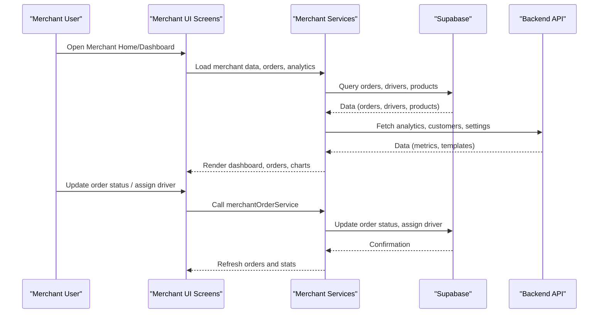

**Diagram sources**
- [app/home/merchant.tsx](file://app/home/merchant.tsx#L1-L780)
- [app/dashboard/merchant.tsx](file://app/dashboard/merchant.tsx#L1-L515)
- [app/merchant/order-management.tsx](file://app/merchant/order-management.tsx#L1-L842)
- [services/merchantOrderService.ts](file://services/merchantOrderService.ts#L1-L468)
- [services/merchantAnalyticsService.ts](file://services/merchantAnalyticsService.ts#L1-L371)
- [services/merchantService.ts](file://services/merchantService.ts#L1-L401)

## Detailed Component Analysis

### Merchant Dashboard Overview (app/dashboard/merchant.tsx)
- Provides a business overview with key metrics and recent orders.
- Offers quick actions to add products, view orders, manage commodities, inventory, and communicate with customers.
- Integrates with AsyncStorage for user session data and navigation to merchant features.

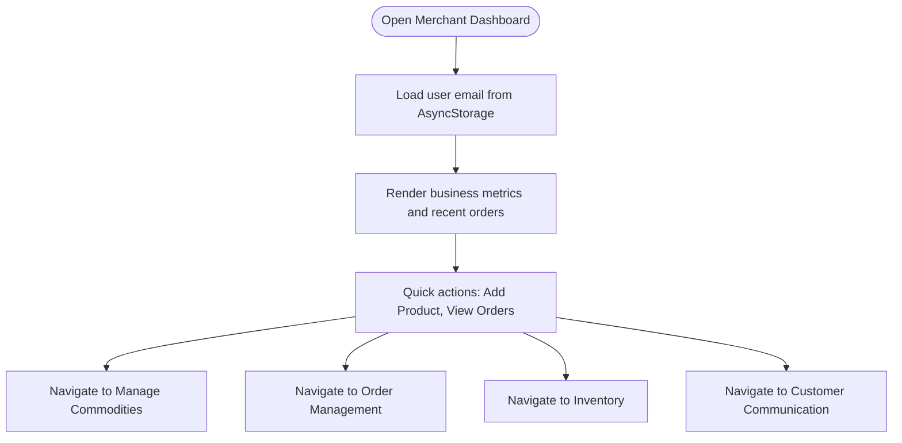

**Diagram sources**
- [app/dashboard/merchant.tsx](file://app/dashboard/merchant.tsx#L1-L515)

**Section sources**
- [app/dashboard/merchant.tsx](file://app/dashboard/merchant.tsx#L1-L515)

### Merchant Home Screen (app/home/merchant.tsx)
- Displays merchant info, active orders, today’s sales, rating, and recent orders.
- Provides floating action button to add a new commodity and bottom navigation to key sections.
- Integrates with notification service and location data.

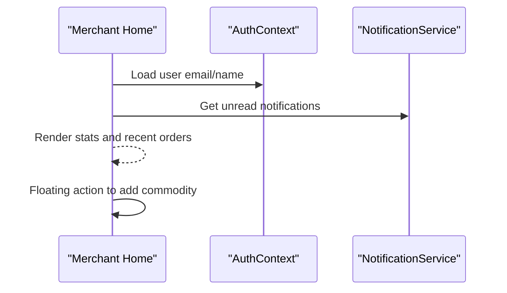

**Diagram sources**
- [app/home/merchant.tsx](file://app/home/merchant.tsx#L1-L780)
- [contexts/AuthContext.tsx](file://contexts/AuthContext.tsx#L1-L149)

**Section sources**
- [app/home/merchant.tsx](file://app/home/merchant.tsx#L1-L780)
- [contexts/AuthContext.tsx](file://contexts/AuthContext.tsx#L1-L149)

### Adding a New Commodity (app/merchant/add-commodity.tsx)
- Validates commodity form using commodityUtils.
- Handles image selection (gallery/camera/web), uploads to Supabase Storage, and creates product records.
- Supports editing existing commodities and resetting form after save.

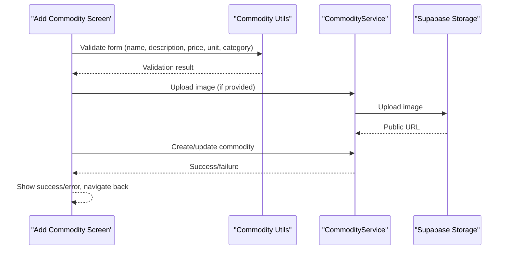

**Diagram sources**
- [app/merchant/add-commodity.tsx](file://app/merchant/add-commodity.tsx#L1-L718)
- [utils/commodityUtils.ts](file://utils/commodityUtils.ts#L1-L178)
- [services/commodityService.ts](file://services/commodityService.ts#L1-L387)

**Section sources**
- [app/merchant/add-commodity.tsx](file://app/merchant/add-commodity.tsx#L1-L718)
- [utils/commodityUtils.ts](file://utils/commodityUtils.ts#L1-L178)
- [services/commodityService.ts](file://services/commodityService.ts#L1-L387)

### Order Management (app/merchant/order-management.tsx)
- Loads orders with optional status filtering and real-time updates via Supabase channels.
- Updates order status through merchantOrderService and sends notifications to consumers and drivers.
- Allows rejecting orders with reasons, preparing items, marking ready, and assigning drivers.

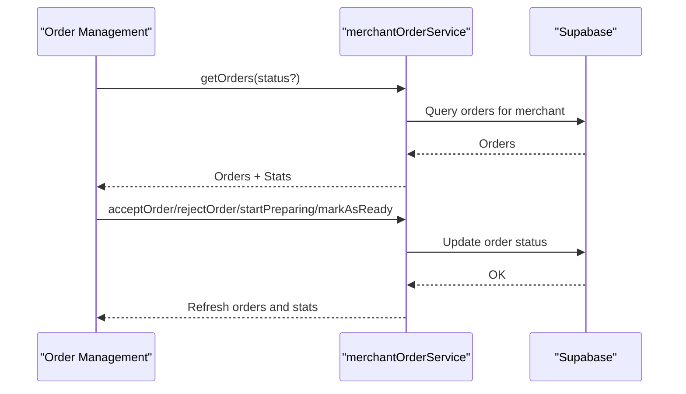

**Diagram sources**
- [app/merchant/order-management.tsx](file://app/merchant/order-management.tsx#L1-L842)
- [services/merchantOrderService.ts](file://services/merchantOrderService.ts#L1-L468)

**Section sources**
- [app/merchant/order-management.tsx](file://app/merchant/order-management.tsx#L1-L842)
- [services/merchantOrderService.ts](file://services/merchantOrderService.ts#L1-L468)

### Driver Assignment (app/merchant/driver-assignment.tsx)
- Presents available drivers with performance metrics (rating, completion rate, average delivery time).
- Supports auto-assign based on proximity and rating, or manual selection.
- Stores assignments locally and navigates back after confirmation.

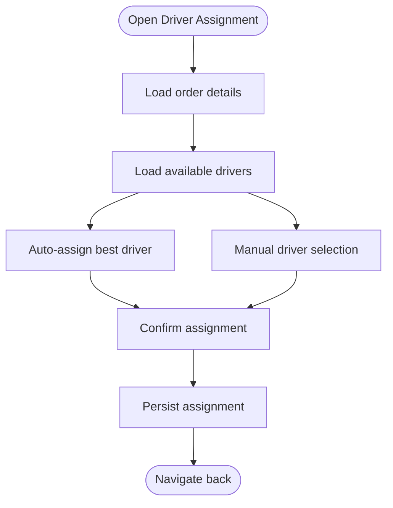

**Diagram sources**
- [app/merchant/driver-assignment.tsx](file://app/merchant/driver-assignment.tsx#L1-L751)

**Section sources**
- [app/merchant/driver-assignment.tsx](file://app/merchant/driver-assignment.tsx#L1-L751)

### Analytics (app/merchant/analytics.tsx)
- Uses MerchantAnalyticsService to compute sales metrics, category breakdown, top products, customer insights, and time-series data.
- Provides period selection and refresh controls.
- Wrapped with withRoleAccess to enforce merchant role.

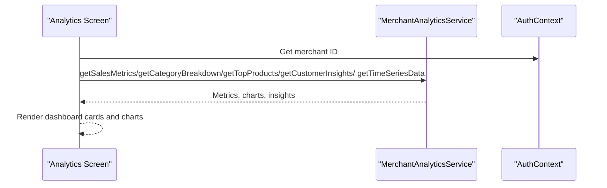

**Diagram sources**
- [app/merchant/analytics.tsx](file://app/merchant/analytics.tsx#L1-L745)
- [services/merchantAnalyticsService.ts](file://services/merchantAnalyticsService.ts#L1-L371)
- [contexts/AuthContext.tsx](file://contexts/AuthContext.tsx#L1-L149)

**Section sources**
- [app/merchant/analytics.tsx](file://app/merchant/analytics.tsx#L1-L745)
- [services/merchantAnalyticsService.ts](file://services/merchantAnalyticsService.ts#L1-L371)
- [contexts/AuthContext.tsx](file://contexts/AuthContext.tsx#L1-L149)

### Customer Communication (app/merchant/customer-communication.tsx)
- Lists customers, supports search and bulk selection.
- Sends broadcast messages via communicationService and manages templates.
- Integrates with merchantService to fetch customer data.

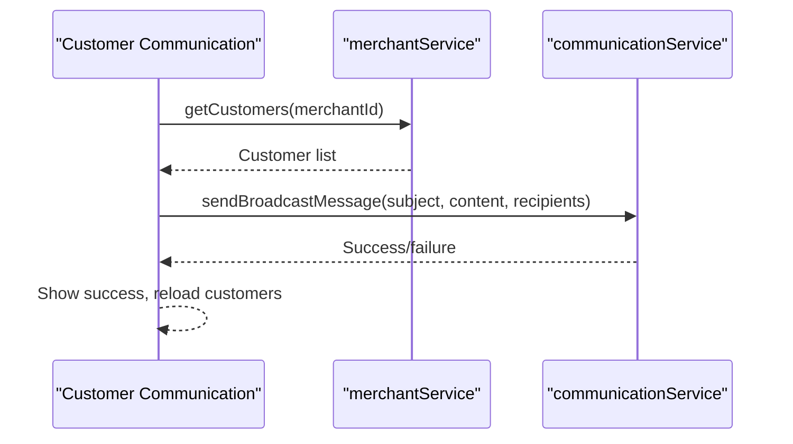

**Diagram sources**
- [app/merchant/customer-communication.tsx](file://app/merchant/customer-communication.tsx#L1-L1004)
- [services/merchantService.ts](file://services/merchantService.ts#L1-L401)

**Section sources**
- [app/merchant/customer-communication.tsx](file://app/merchant/customer-communication.tsx#L1-L1004)
- [services/merchantService.ts](file://services/merchantService.ts#L1-L401)

### Inventory (app/merchant/inventory.tsx)
- Manages inventory items with search, category/status filters, sorting, and low-stock alerts.
- Supports restocking and adjusting stock quantities, persisting to AsyncStorage.

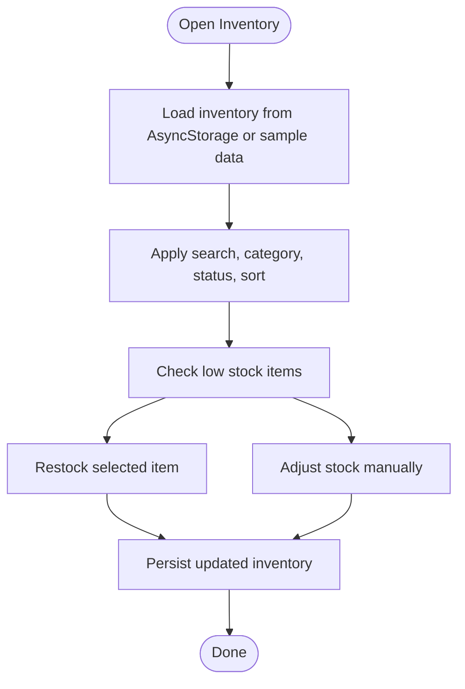

**Diagram sources**
- [app/merchant/inventory.tsx](file://app/merchant/inventory.tsx#L1-L807)

**Section sources**
- [app/merchant/inventory.tsx](file://app/merchant/inventory.tsx#L1-L807)

### Role-Based Access and Data Isolation
- withRoleAccess enforces merchant role access and redirects unauthorized users.
- roleManagementService tracks role registration and verification status.
- MerchantContext and AuthContext provide merchant identity and authentication state.

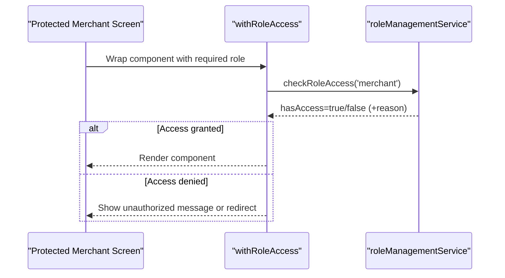

**Diagram sources**
- [components/withRoleAccess.tsx](file://components/withRoleAccess.tsx#L1-L195)
- [services/roleManagementService.ts](file://services/roleManagementService.ts#L1-L302)

**Section sources**
- [components/withRoleAccess.tsx](file://components/withRoleAccess.tsx#L1-L195)
- [services/roleManagementService.ts](file://services/roleManagementService.ts#L1-L302)
- [contexts/MerchantContext.tsx](file://contexts/MerchantContext.tsx#L1-L63)
- [contexts/AuthContext.tsx](file://contexts/AuthContext.tsx#L1-L149)

## Dependency Analysis
Key dependencies and interactions:
- UI screens depend on services for data operations.
- merchantOrderService uses Supabase for real-time order updates and notifications.
- merchantAnalyticsService aggregates data from Supabase tables.
- commodityService handles image uploads and product CRUD.
- roleManagementService and contexts govern access and identity.

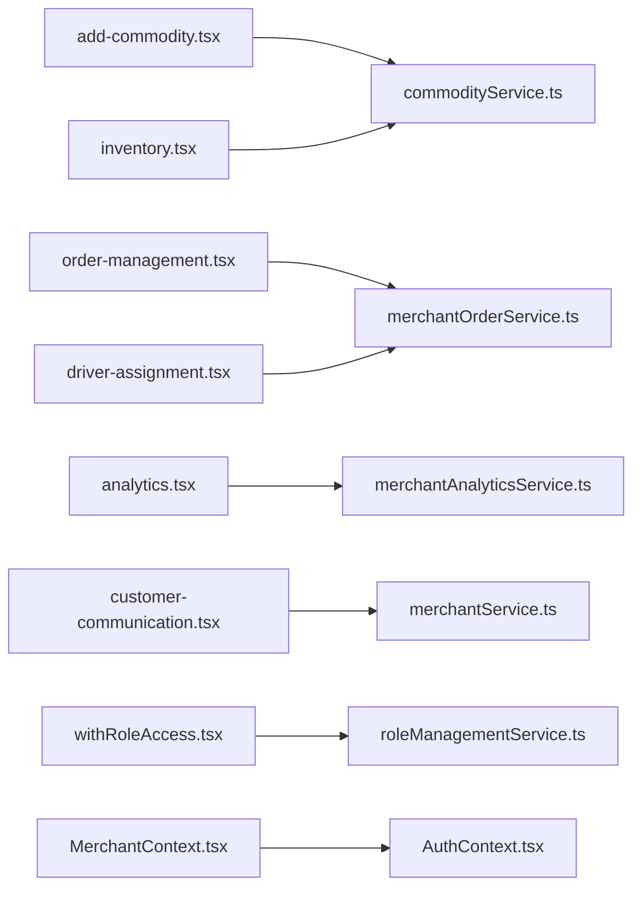

**Diagram sources**
- [app/merchant/add-commodity.tsx](file://app/merchant/add-commodity.tsx#L1-L718)
- [services/commodityService.ts](file://services/commodityService.ts#L1-L387)
- [app/merchant/order-management.tsx](file://app/merchant/order-management.tsx#L1-L842)
- [services/merchantOrderService.ts](file://services/merchantOrderService.ts#L1-L468)
- [app/merchant/analytics.tsx](file://app/merchant/analytics.tsx#L1-L745)
- [services/merchantAnalyticsService.ts](file://services/merchantAnalyticsService.ts#L1-L371)
- [app/merchant/customer-communication.tsx](file://app/merchant/customer-communication.tsx#L1-L1004)
- [services/merchantService.ts](file://services/merchantService.ts#L1-L401)
- [app/merchant/inventory.tsx](file://app/merchant/inventory.tsx#L1-L807)
- [app/merchant/driver-assignment.tsx](file://app/merchant/driver-assignment.tsx#L1-L751)
- [components/withRoleAccess.tsx](file://components/withRoleAccess.tsx#L1-L195)
- [services/roleManagementService.ts](file://services/roleManagementService.ts#L1-L302)
- [contexts/MerchantContext.tsx](file://contexts/MerchantContext.tsx#L1-L63)
- [contexts/AuthContext.tsx](file://contexts/AuthContext.tsx#L1-L149)

**Section sources**
- [services/merchantOrderService.ts](file://services/merchantOrderService.ts#L1-L468)
- [services/merchantAnalyticsService.ts](file://services/merchantAnalyticsService.ts#L1-L371)
- [services/commodityService.ts](file://services/commodityService.ts#L1-L387)
- [services/roleManagementService.ts](file://services/roleManagementService.ts#L1-L302)
- [contexts/MerchantContext.tsx](file://contexts/MerchantContext.tsx#L1-L63)
- [contexts/AuthContext.tsx](file://contexts/AuthContext.tsx#L1-L149)

## Performance Considerations
- Real-time order updates: Subscribing to Supabase channels keeps order lists fresh; ensure unsubscription on component unmount to prevent memory leaks.
- Image uploads: Compress and limit image size to reduce upload time and storage costs.
- Analytics queries: Aggregate data server-side or cache results to minimize repeated heavy queries.
- Filtering and sorting: Apply client-side filters efficiently; consider pagination for large datasets.
- Notifications: Batch or debounce notifications to avoid flooding consumers and drivers.

[No sources needed since this section provides general guidance]

## Troubleshooting Guide
Common issues and resolutions:
- Inventory synchronization
  - Symptom: Discrepancies between UI and backend.
  - Resolution: Use Supabase-backed inventory instead of AsyncStorage for production, or implement periodic sync and reconciliation.
  - Reference: [app/merchant/inventory.tsx](file://app/merchant/inventory.tsx#L1-L807)

- Order fulfillment delays
  - Symptom: Orders stuck in “preparing” or “ready”.
  - Resolution: Use order management actions to mark as ready and assign drivers promptly; monitor driver availability.
  - Reference: [app/merchant/order-management.tsx](file://app/merchant/order-management.tsx#L1-L842), [app/merchant/driver-assignment.tsx](file://app/merchant/driver-assignment.tsx#L1-L751)

- KYC verification requirements
  - Symptom: Merchant features inaccessible until verification.
  - Resolution: Enforce role access checks; guide users to complete verification steps.
  - References: [services/roleManagementService.ts](file://services/roleManagementService.ts#L1-L302), [components/withRoleAccess.tsx](file://components/withRoleAccess.tsx#L1-L195)

- Network connectivity errors
  - Symptom: Failures loading orders or analytics.
  - Resolution: Implement retry logic and user-friendly error messages; check device connectivity.
  - References: [app/merchant/order-management.tsx](file://app/merchant/order-management.tsx#L1-L842), [app/merchant/analytics.tsx](file://app/merchant/analytics.tsx#L1-L745)

- Image upload failures
  - Symptom: Product creation/update fails due to image upload.
  - Resolution: Validate file size/type and handle upload errors gracefully; keep existing image if new upload fails.
  - References: [services/commodityService.ts](file://services/commodityService.ts#L1-L387), [app/merchant/add-commodity.tsx](file://app/merchant/add-commodity.tsx#L1-L718)

**Section sources**
- [app/merchant/inventory.tsx](file://app/merchant/inventory.tsx#L1-L807)
- [app/merchant/order-management.tsx](file://app/merchant/order-management.tsx#L1-L842)
- [app/merchant/driver-assignment.tsx](file://app/merchant/driver-assignment.tsx#L1-L751)
- [services/roleManagementService.ts](file://services/roleManagementService.ts#L1-L302)
- [components/withRoleAccess.tsx](file://components/withRoleAccess.tsx#L1-L195)
- [services/commodityService.ts](file://services/commodityService.ts#L1-L387)
- [app/merchant/add-commodity.tsx](file://app/merchant/add-commodity.tsx#L1-L718)

## Conclusion
The Merchant role in Brillprime-expo encompasses robust capabilities for managing products, orders, drivers, communications, and analytics. The UI provides intuitive dashboards and workflows, while services and Supabase enable real-time updates and reliable data operations. Role-based access ensures appropriate permissions and data isolation. By addressing common issues and optimizing performance, merchants can operate efficiently and deliver excellent customer experiences.

[No sources needed since this section summarizes without analyzing specific files]