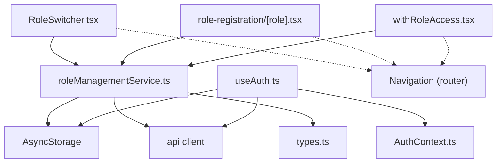
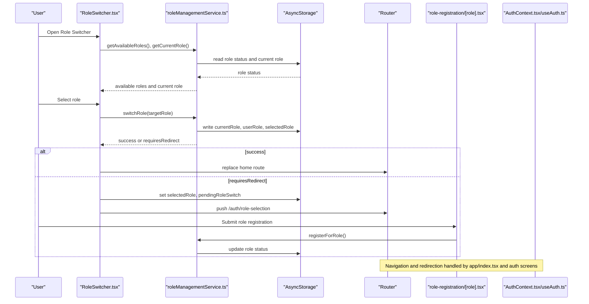
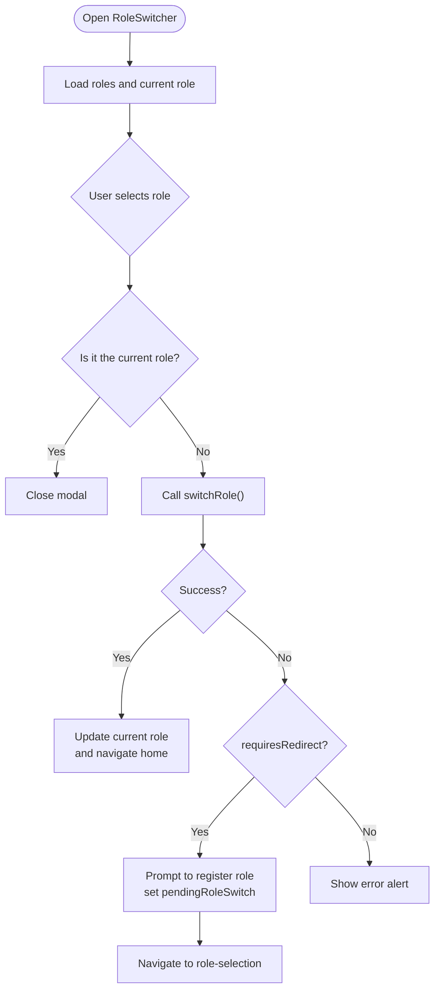
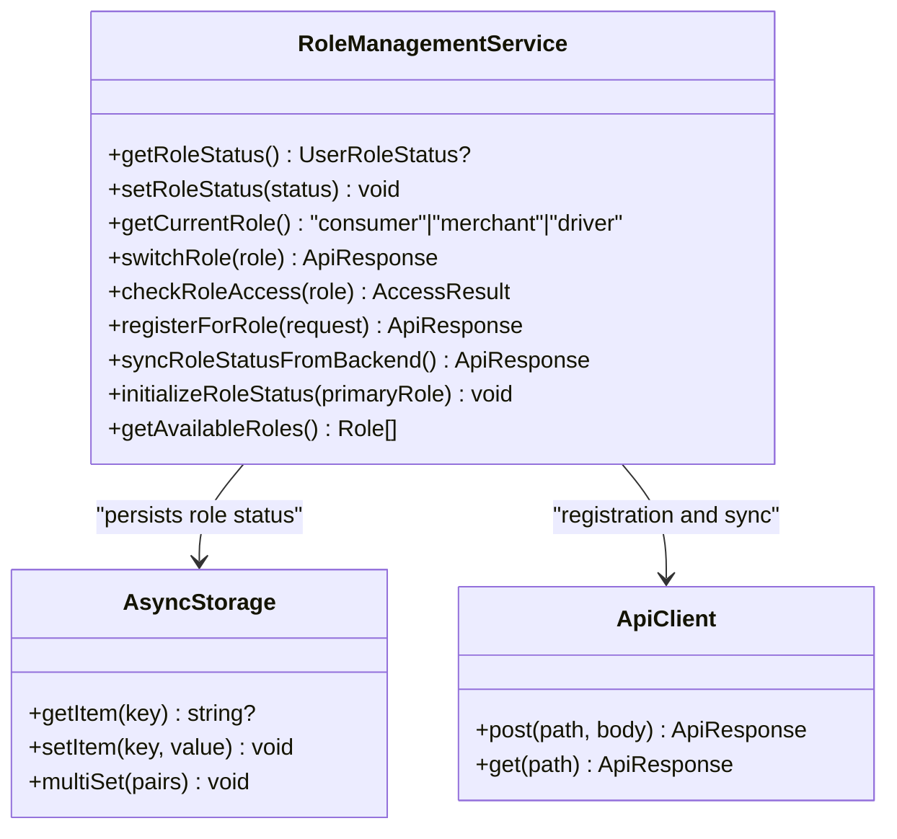
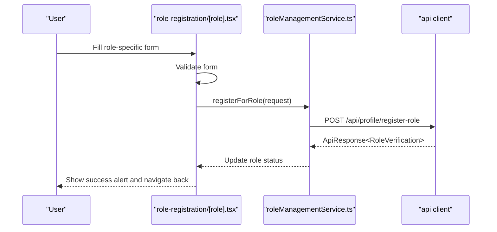
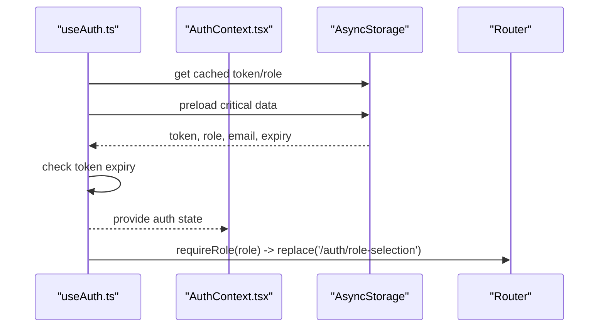
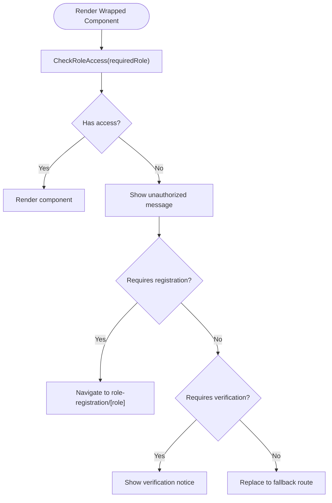
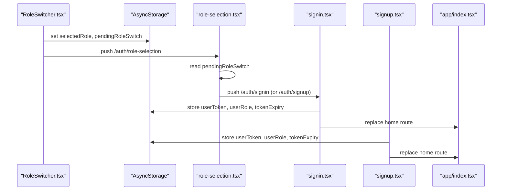
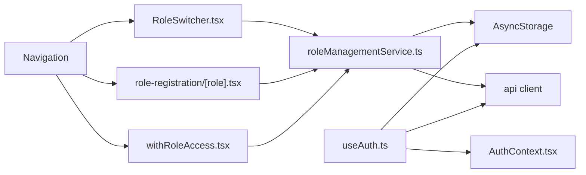

# Role Switching Mechanism

<cite>
**Referenced Files in This Document**
- [RoleSwitcher.tsx](file://components/RoleSwitcher.tsx)
- [roleManagementService.ts](file://services/roleManagementService.ts)
- [role-registration/[role].tsx](file://app/role-registration/[role].tsx)
- [useAuth.ts](file://hooks/useAuth.ts)
- [AuthContext.tsx](file://contexts/AuthContext.tsx)
- [withRoleAccess.tsx](file://components/withRoleAccess.tsx)
- [role-selection.tsx](file://app/auth/role-selection.tsx)
- [signin.tsx](file://app/auth/signin.tsx)
- [signup.tsx](file://app/auth/signup.tsx)
- [index.tsx](file://app/index.tsx)
- [types.ts](file://services/types.ts)
- [performance.ts](file://utils/performance.ts)
</cite>

## Table of Contents
1. [Introduction](#introduction)
2. [Project Structure](#project-structure)
3. [Core Components](#core-components)
4. [Architecture Overview](#architecture-overview)
5. [Detailed Component Analysis](#detailed-component-analysis)
6. [Dependency Analysis](#dependency-analysis)
7. [Performance Considerations](#performance-considerations)
8. [Troubleshooting Guide](#troubleshooting-guide)
9. [Conclusion](#conclusion)

## Introduction
This document explains the Role Switching functionality in Brillprime-expo. It covers how users switch between consumer, merchant, and driver roles using the RoleSwitcher component, how role validation and switching are performed via roleManagementService.ts, how role registration works in app/role-registration/[role].tsx, how useAuth.ts and AuthContext.ts maintain the current role context, and how navigation redirection and pending role switches are handled with AsyncStorage. It also details the security model preventing unauthorized role access and outlines edge cases such as unverified roles, incomplete registrations, and session persistence across role switches.

## Project Structure
The role switching feature spans several modules:
- UI component for switching roles
- Service layer for role validation and switching
- Registration flow for merchant and driver
- Authentication and role context providers
- Access control wrapper for protected routes
- Navigation and redirection logic

**Diagram sources**
- [RoleSwitcher.tsx](file://components/RoleSwitcher.tsx#L1-L126)
- [roleManagementService.ts](file://services/roleManagementService.ts#L1-L120)
- [role-registration/[role].tsx](file://app/role-registration/[role].tsx#L1-L130)
- [withRoleAccess.tsx](file://components/withRoleAccess.tsx#L1-L110)
- [useAuth.ts](file://hooks/useAuth.ts#L1-L116)
- [AuthContext.tsx](file://contexts/AuthContext.tsx#L1-L140)

**Section sources**
- [RoleSwitcher.tsx](file://components/RoleSwitcher.tsx#L1-L126)
- [roleManagementService.ts](file://services/roleManagementService.ts#L1-L120)
- [role-registration/[role].tsx](file://app/role-registration/[role].tsx#L1-L130)
- [withRoleAccess.tsx](file://components/withRoleAccess.tsx#L1-L110)
- [useAuth.ts](file://hooks/useAuth.ts#L1-L116)
- [AuthContext.tsx](file://contexts/AuthContext.tsx#L1-L140)

## Core Components
- RoleSwitcher: Presents available roles, handles role switching, and redirects to appropriate home pages.
- roleManagementService: Centralizes role status, validation, switching, and registration.
- role-registration/[role]: Collects role-specific information and submits registration requests.
- useAuth and AuthContext: Provide authentication state and role context, and enforce role-based access.
- withRoleAccess: Higher-order component to protect routes based on role access checks.
- role-selection, signin, signup, and app/index: Manage navigation and redirection for role selection and authentication flows.

**Section sources**
- [RoleSwitcher.tsx](file://components/RoleSwitcher.tsx#L1-L126)
- [roleManagementService.ts](file://services/roleManagementService.ts#L1-L120)
- [role-registration/[role].tsx](file://app/role-registration/[role].tsx#L1-L130)
- [useAuth.ts](file://hooks/useAuth.ts#L1-L116)
- [AuthContext.tsx](file://contexts/AuthContext.tsx#L1-L140)
- [withRoleAccess.tsx](file://components/withRoleAccess.tsx#L1-L110)
- [role-selection.tsx](file://app/auth/role-selection.tsx#L1-L97)
- [signin.tsx](file://app/auth/signin.tsx#L48-L120)
- [signup.tsx](file://app/auth/signup.tsx#L33-L64)
- [index.tsx](file://app/index.tsx#L77-L143)

## Architecture Overview
The role switching architecture integrates UI, service, and navigation layers with AsyncStorage for persistence and API for backend synchronization.

**Diagram sources**
- [RoleSwitcher.tsx](file://components/RoleSwitcher.tsx#L41-L126)
- [roleManagementService.ts](file://services/roleManagementService.ts#L74-L120)
- [role-registration/[role].tsx](file://app/role-registration/[role].tsx#L71-L130)
- [role-selection.tsx](file://app/auth/role-selection.tsx#L44-L82)
- [index.tsx](file://app/index.tsx#L77-L143)

## Detailed Component Analysis

### RoleSwitcher Component
- Loads available roles and current role using roleManagementService.
- Validates role switching against role status (registered and verified).
- Handles two outcomes:
  - Success: updates current role and navigates to the appropriate home page.
  - Requires redirect: prompts the user to register for the desired role and sets pendingRoleSwitch and selectedRole in AsyncStorage before navigating to role selection.
- UI/UX:
  - Modal layout with role cards, icons, verification badges, and disabled states for unverified roles.
  - Loading indicator while fetching roles.
  - Close button and register buttons for adding new roles.

**Diagram sources**
- [RoleSwitcher.tsx](file://components/RoleSwitcher.tsx#L41-L126)
- [roleManagementService.ts](file://services/roleManagementService.ts#L74-L120)

**Section sources**
- [RoleSwitcher.tsx](file://components/RoleSwitcher.tsx#L1-L126)
- [roleManagementService.ts](file://services/roleManagementService.ts#L74-L120)

### roleManagementService
- Role status persistence:
  - Stores role status in AsyncStorage under a dedicated key.
  - Provides default role status with consumer pre-approved and merchant/driver pending.
- Role switching:
  - Validates registration and verification status before allowing a switch.
  - Persists current role and selected role upon successful switch.
- Role access checks:
  - Determines whether a given role can access a feature based on registration and verification.
- Role registration:
  - Submits role registration requests to the backend and updates local role status.
- Available roles:
  - Filters roles that are registered and returns verification status for UI.

**Diagram sources**
- [roleManagementService.ts](file://services/roleManagementService.ts#L1-L301)

**Section sources**
- [roleManagementService.ts](file://services/roleManagementService.ts#L1-L301)
- [types.ts](file://services/types.ts#L1-L60)

### Role Registration Flow (app/role-registration/[role].tsx)
- Collects role-specific information:
  - Merchant: business name/type/address/license.
  - Driver: license number, vehicle make/model/year, license plate, insurance.
- Validation:
  - Enforces required fields for merchant and driver forms.
- Submission:
  - Builds a RoleRegistrationRequest payload and calls roleManagementService.registerForRole().
  - On success, shows a confirmation and navigates back; on failure, shows an error alert.
- Backend integration:
  - Uses api client to post to the role registration endpoint.

**Diagram sources**
- [role-registration/[role].tsx](file://app/role-registration/[role].tsx#L71-L130)
- [roleManagementService.ts](file://services/roleManagementService.ts#L170-L196)

**Section sources**
- [role-registration/[role].tsx](file://app/role-registration/[role].tsx#L1-L130)
- [roleManagementService.ts](file://services/roleManagementService.ts#L170-L196)
- [types.ts](file://services/types.ts#L44-L58)

### Role Context and Conditional Rendering (useAuth.ts, AuthContext.tsx)
- useAuth:
  - Loads cached and persisted authentication data.
  - Provides requireRole to enforce role-based access and redirect to role selection when needed.
- AuthContext:
  - Manages user, authentication state, and role in memory and AsyncStorage.
  - Loads user data on startup and exposes signOut and refreshUser.

**Diagram sources**
- [useAuth.ts](file://hooks/useAuth.ts#L1-L116)
- [AuthContext.tsx](file://contexts/AuthContext.tsx#L1-L140)

**Section sources**
- [useAuth.ts](file://hooks/useAuth.ts#L1-L116)
- [AuthContext.tsx](file://contexts/AuthContext.tsx#L1-L140)

### Access Control Wrapper (withRoleAccess.tsx)
- Wraps protected components to check role access before rendering.
- If access is denied, displays an unauthorized message and either:
  - Prompts the user to register for the required role.
  - Shows a verification notice indicating pending verification.
- Redirects to a fallback route if configured.

**Diagram sources**
- [withRoleAccess.tsx](file://components/withRoleAccess.tsx#L1-L110)
- [roleManagementService.ts](file://services/roleManagementService.ts#L122-L168)

**Section sources**
- [withRoleAccess.tsx](file://components/withRoleAccess.tsx#L1-L110)
- [roleManagementService.ts](file://services/roleManagementService.ts#L122-L168)

### Navigation Redirection Logic and Pending Role Switches
- Pending role switches:
  - When switching to an unregistered role, RoleSwitcher sets selectedRole and pendingRoleSwitch in AsyncStorage and navigates to role-selection.
  - role-selection reads pendingRoleSwitch on load and proceeds to authentication.
- Authentication flows:
  - role-selection sets selectedRole and routes to sign-in or sign-up depending on stored email.
  - sign-in and sign-up screens persist authentication data and remove pendingRoleSwitch, then route to the appropriate home page based on user role.
- Initial routing:
  - app/index.tsx orchestrates onboarding, role selection, authentication, and home routing based on AsyncStorage state.

**Diagram sources**
- [RoleSwitcher.tsx](file://components/RoleSwitcher.tsx#L97-L116)
- [role-selection.tsx](file://app/auth/role-selection.tsx#L44-L82)
- [signin.tsx](file://app/auth/signin.tsx#L48-L120)
- [signup.tsx](file://app/auth/signup.tsx#L33-L64)
- [index.tsx](file://app/index.tsx#L77-L143)

**Section sources**
- [RoleSwitcher.tsx](file://components/RoleSwitcher.tsx#L97-L116)
- [role-selection.tsx](file://app/auth/role-selection.tsx#L44-L82)
- [signin.tsx](file://app/auth/signin.tsx#L48-L120)
- [signup.tsx](file://app/auth/signup.tsx#L33-L64)
- [index.tsx](file://app/index.tsx#L77-L143)

## Dependency Analysis
- RoleSwitcher depends on roleManagementService for role validation and switching.
- roleManagementService depends on AsyncStorage for persistence and api client for backend operations.
- role-registration/[role].tsx depends on roleManagementService and types for request payloads.
- useAuth and AuthContext manage authentication state and integrate with AsyncStorage and the API.
- withRoleAccess wraps components to enforce role-based access checks via roleManagementService.
- Navigation relies on Expo Router and AsyncStorage flags to orchestrate role selection and authentication flows.

**Diagram sources**
- [RoleSwitcher.tsx](file://components/RoleSwitcher.tsx#L1-L126)
- [roleManagementService.ts](file://services/roleManagementService.ts#L1-L120)
- [role-registration/[role].tsx](file://app/role-registration/[role].tsx#L1-L130)
- [withRoleAccess.tsx](file://components/withRoleAccess.tsx#L1-L110)
- [useAuth.ts](file://hooks/useAuth.ts#L1-L116)
- [AuthContext.tsx](file://contexts/AuthContext.tsx#L1-L140)

**Section sources**
- [RoleSwitcher.tsx](file://components/RoleSwitcher.tsx#L1-L126)
- [roleManagementService.ts](file://services/roleManagementService.ts#L1-L120)
- [role-registration/[role].tsx](file://app/role-registration/[role].tsx#L1-L130)
- [withRoleAccess.tsx](file://components/withRoleAccess.tsx#L1-L110)
- [useAuth.ts](file://hooks/useAuth.ts#L1-L116)
- [AuthContext.tsx](file://contexts/AuthContext.tsx#L1-L140)

## Performance Considerations
- Asynchronous role status retrieval and current role resolution are performed concurrently to reduce latency.
- RoleSwitcher uses concurrent loading for available roles and current role.
- useAuth employs a performance optimizer to cache critical user data and preload AsyncStorage values to minimize blocking on startup.
- withRoleAccess performs a single access check on mount and avoids unnecessary re-renders.

**Section sources**
- [RoleSwitcher.tsx](file://components/RoleSwitcher.tsx#L41-L55)
- [useAuth.ts](file://hooks/useAuth.ts#L1-L87)
- [performance.ts](file://utils/performance.ts#L97-L140)

## Troubleshooting Guide
Common issues and resolutions:
- Role switching fails with “requiresRedirect”:
  - Cause: Target role is not registered.
  - Resolution: Use the prompt to register for the role; ensure pendingRoleSwitch is cleared after authentication.
- Role switching fails with verification error:
  - Cause: Target role is pending verification.
  - Resolution: Inform the user that verification is pending; they will be notified upon approval.
- Unverified roles in UI:
  - Cause: roleManagementService.getAvailableRoles filters only registered roles.
  - Resolution: Ensure registration completes and role status syncs from backend.
- Session persistence across role switches:
  - Ensure AsyncStorage keys for userRole, selectedRole, and tokenExpiry are updated consistently after role switches and authentication.
- Role mismatch during social login:
  - Cause: Selected role differs from the authenticated user’s role.
  - Resolution: Redirect to role-selection to reconcile roles.

**Section sources**
- [roleManagementService.ts](file://services/roleManagementService.ts#L74-L120)
- [role-management-service.ts](file://services/roleManagementService.ts#L122-L168)
- [role-selection.tsx](file://app/auth/role-selection.tsx#L44-L82)
- [signin.tsx](file://app/auth/signin.tsx#L210-L242)
- [index.tsx](file://app/index.tsx#L77-L143)

## Security Model
- Role validation:
  - roleManagementService.checkRoleAccess enforces that roles must be both registered and verified before granting access.
- Access enforcement:
  - withRoleAccess blocks unauthorized access and redirects to role registration or role-selection as needed.
- Authentication state:
  - useAuth and AuthContext manage token and role state, and signOut clears sensitive data from AsyncStorage.
- Navigation safety:
  - requireRole redirects unauthenticated or unauthorized users to role-selection or sign-in.

**Section sources**
- [roleManagementService.ts](file://services/roleManagementService.ts#L122-L168)
- [withRoleAccess.tsx](file://components/withRoleAccess.tsx#L1-L110)
- [useAuth.ts](file://hooks/useAuth.ts#L89-L113)
- [AuthContext.tsx](file://contexts/AuthContext.tsx#L107-L139)

## Edge Cases
- Unverified roles:
  - UI disables switching to unverified roles; roleManagementService prevents switching until verification is complete.
- Incomplete registrations:
  - role-registration/[role].tsx validates required fields; submission updates role status and notifies the user.
- Session persistence:
  - useAuth.refreshes user data and updates AsyncStorage; token expiry is checked and cleared when expired.
- Role mismatch:
  - sign-in/sign-up screens validate that the authenticated role matches the selected role and redirect to role-selection if mismatched.

**Section sources**
- [RoleSwitcher.tsx](file://components/RoleSwitcher.tsx#L170-L210)
- [role-management-service.ts](file://services/roleManagementService.ts#L74-L120)
- [role-registration/[role].tsx](file://app/role-registration/[role].tsx#L39-L69)
- [useAuth.ts](file://hooks/useAuth.ts#L1-L87)
- [signin.tsx](file://app/auth/signin.tsx#L210-L242)

## Conclusion
The Role Switching mechanism in Brillprime-expo combines a user-friendly UI with robust service-layer validation, secure authentication state management, and clear navigation flows. RoleSwitcher coordinates role selection, roleManagementService enforces verification and registration rules, and withRoleAccess ensures protected access. Pending role switches are persisted with AsyncStorage and resolved through role-selection and authentication flows. The system’s design balances usability with strong security guarantees, handling edge cases such as unverified roles and session persistence effectively.