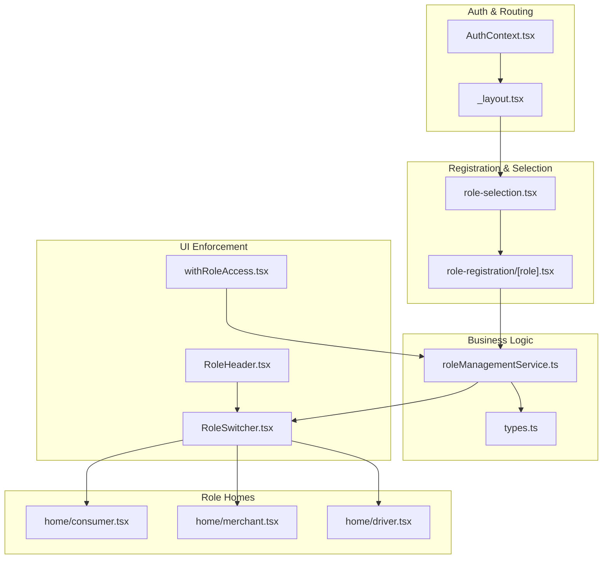
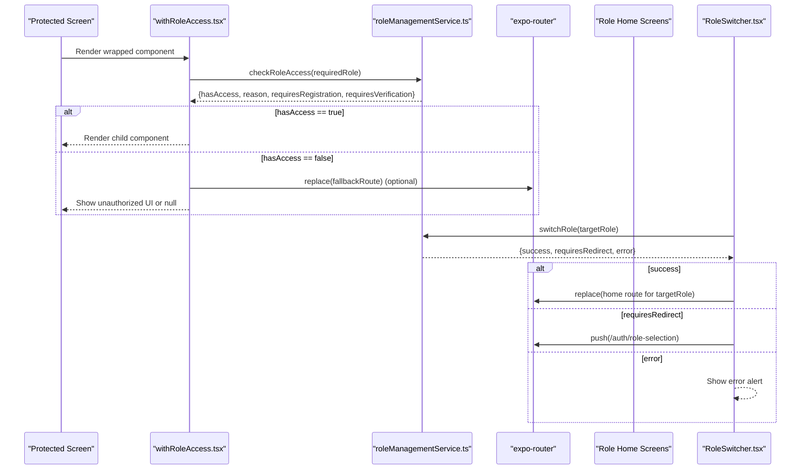
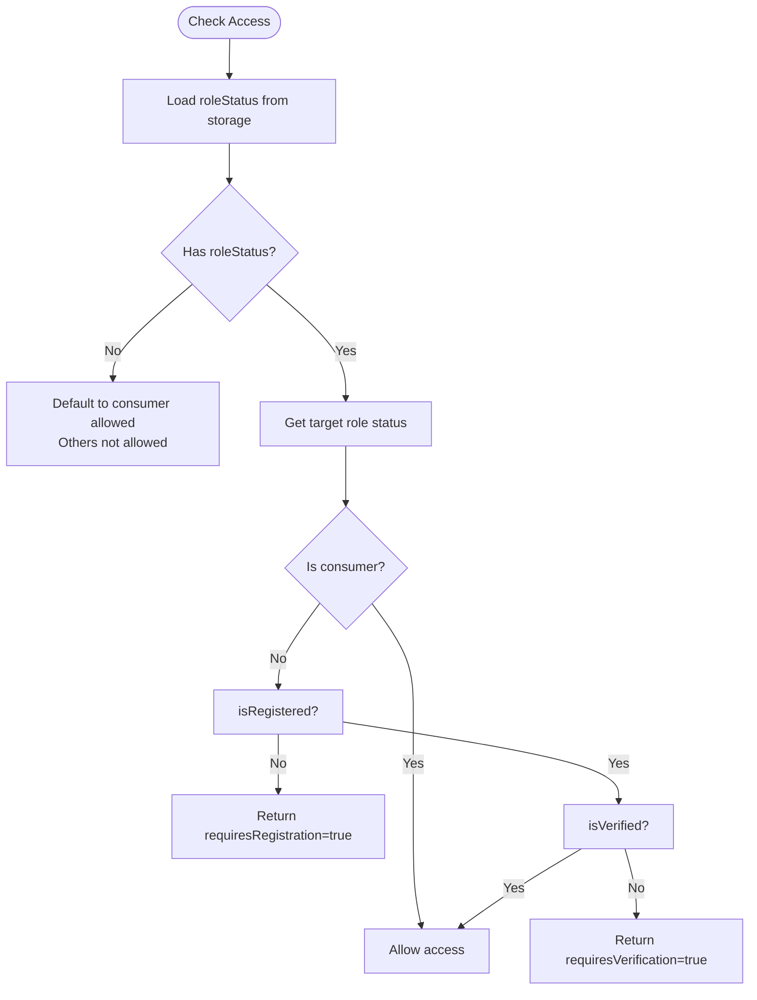
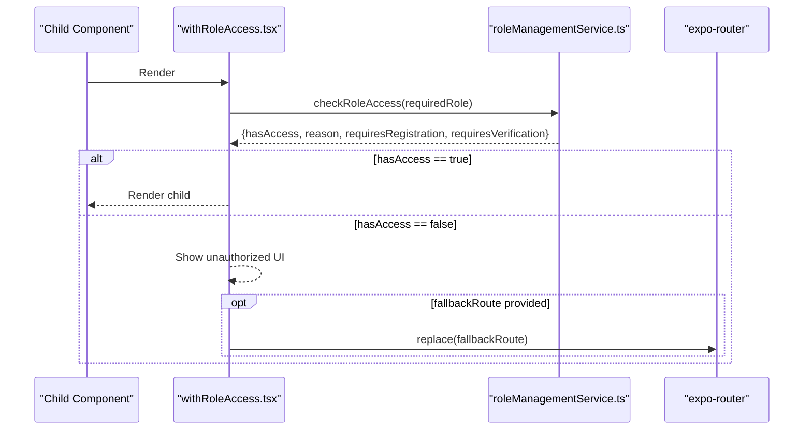
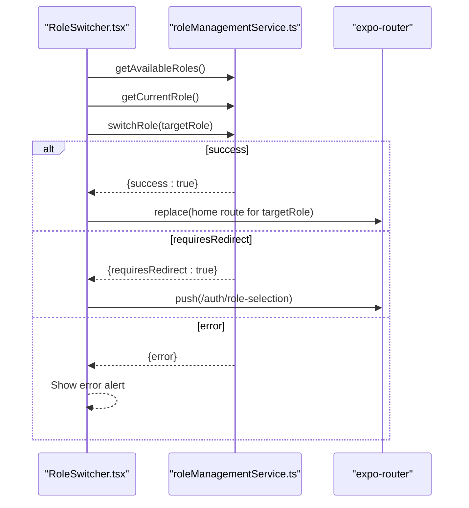
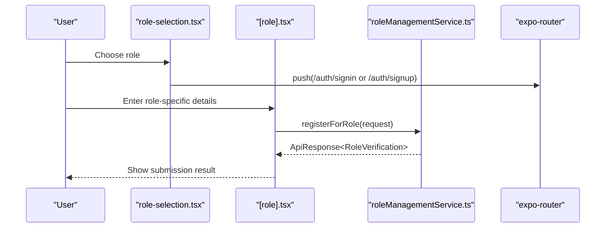
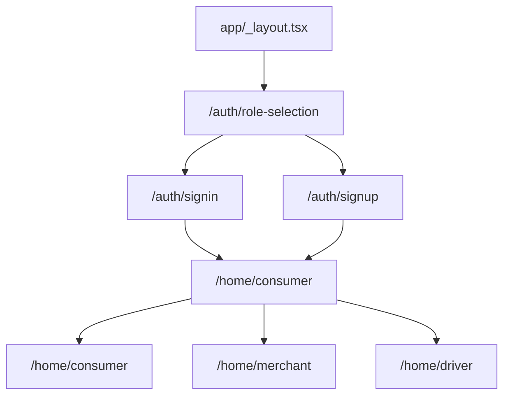
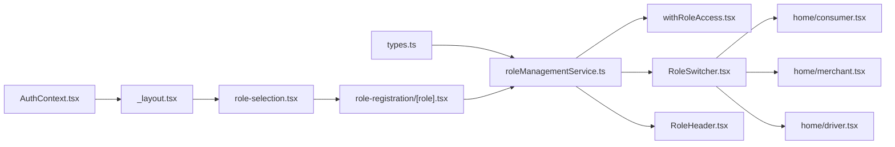

# User Roles and Permissions

<cite>
**Referenced Files in This Document**
- [roleManagementService.ts](file://services/roleManagementService.ts)
- [withRoleAccess.tsx](file://components/withRoleAccess.tsx)
- [RoleSwitcher.tsx](file://components/RoleSwitcher.tsx)
- [RoleHeader.tsx](file://components/RoleHeader.tsx)
- [role-selection.tsx](file://app/auth/role-selection.tsx)
- [[role].tsx](file://app/role-registration/[role].tsx)
- [types.ts](file://services/types.ts)
- [AuthContext.tsx](file://contexts/AuthContext.tsx)
- [_layout.tsx](file://app/_layout.tsx)
- [consumer.tsx](file://app/home/consumer.tsx)
- [merchant.tsx](file://app/home/merchant.tsx)
- [driver.tsx](file://app/home/driver.tsx)
- [completion.tsx](file://app/profile/completion.tsx)
</cite>

## Table of Contents
1. [Introduction](#introduction)
2. [Project Structure](#project-structure)
3. [Core Components](#core-components)
4. [Architecture Overview](#architecture-overview)
5. [Detailed Component Analysis](#detailed-component-analysis)
6. [Dependency Analysis](#dependency-analysis)
7. [Performance Considerations](#performance-considerations)
8. [Troubleshooting Guide](#troubleshooting-guide)
9. [Conclusion](#conclusion)

## Introduction
This document explains the Role-Based Access Control (RBAC) system in Brillprime-expo. It covers the three primary user roles—Consumer, Merchant, and Driver—detailing their capabilities and interface differences. It also describes how the business logic layer enforces permissions via roleManagementService.ts and how withRoleAccess.tsx restricts component rendering based on user roles. The document outlines the role selection and registration flow, including data collection specific to each role type, and illustrates how the RoleSwitcher component enables users to toggle between roles when authorized. Finally, it addresses role-specific routes in the app directory and navigation controlled by the active role, along with edge cases such as incomplete profile setup and role migration.

## Project Structure
The RBAC system spans several layers:
- Business logic: roleManagementService.ts manages role status, registration, verification, and role switching.
- UI enforcement: withRoleAccess.tsx wraps protected screens to enforce role-based access.
- UI controls: RoleSwitcher.tsx and RoleHeader.tsx provide role toggling and role display.
- Authentication and routing: AuthContext.tsx and app/_layout.tsx orchestrate authentication state and route redirection based on role and auth status.
- Registration and selection: app/auth/role-selection.tsx and app/role-registration/[role].tsx collect role-specific data and initiate registration.
- Role-specific homes: app/home/consumer.tsx, app/home/merchant.tsx, and app/home/driver.tsx define role-specific UIs and navigation.

**Diagram sources**
- [roleManagementService.ts](file://services/roleManagementService.ts#L1-L302)
- [withRoleAccess.tsx](file://components/withRoleAccess.tsx#L1-L195)
- [RoleSwitcher.tsx](file://components/RoleSwitcher.tsx#L1-L395)
- [RoleHeader.tsx](file://components/RoleHeader.tsx#L1-L163)
- [role-selection.tsx](file://app/auth/role-selection.tsx#L1-L200)
- [[role].tsx](file://app/role-registration/[role].tsx#L1-L387)
- [types.ts](file://services/types.ts#L1-L228)
- [AuthContext.tsx](file://contexts/AuthContext.tsx#L1-L149)
- [_layout.tsx](file://app/_layout.tsx#L1-L203)
- [consumer.tsx](file://app/home/consumer.tsx#L1-L200)
- [merchant.tsx](file://app/home/merchant.tsx#L1-L200)
- [driver.tsx](file://app/home/driver.tsx#L1-L200)

**Section sources**
- [roleManagementService.ts](file://services/roleManagementService.ts#L1-L302)
- [withRoleAccess.tsx](file://components/withRoleAccess.tsx#L1-L195)
- [RoleSwitcher.tsx](file://components/RoleSwitcher.tsx#L1-L395)
- [RoleHeader.tsx](file://components/RoleHeader.tsx#L1-L163)
- [role-selection.tsx](file://app/auth/role-selection.tsx#L1-L200)
- [[role].tsx](file://app/role-registration/[role].tsx#L1-L387)
- [types.ts](file://services/types.ts#L1-L228)
- [AuthContext.tsx](file://contexts/AuthContext.tsx#L1-L149)
- [_layout.tsx](file://app/_layout.tsx#L1-L203)
- [consumer.tsx](file://app/home/consumer.tsx#L1-L200)
- [merchant.tsx](file://app/home/merchant.tsx#L1-L200)
- [driver.tsx](file://app/home/driver.tsx#L1-L200)

## Core Components
- roleManagementService.ts
  - Manages role status in local storage, initializes defaults, checks access, registers roles, syncs status from backend, switches roles, and exposes helpers to check merchant/driver access.
- withRoleAccess.tsx
  - Higher-order component wrapper that checks role access before rendering a protected screen and optionally redirects to a fallback route.
- RoleSwitcher.tsx
  - Modal component that lists available roles, current role, and allows switching or initiating registration for unregistered roles.
- RoleHeader.tsx
  - Displays current role and triggers RoleSwitcher for quick role switching.
- role-selection.tsx
  - Role selection screen that saves the chosen role and proceeds to authentication.
- [role].tsx
  - Role registration screen collecting role-specific data and submitting registration requests.
- AuthContext.tsx and _layout.tsx
  - Orchestrate authentication state and redirect users to the appropriate home screen based on role and auth status.

**Section sources**
- [roleManagementService.ts](file://services/roleManagementService.ts#L1-L302)
- [withRoleAccess.tsx](file://components/withRoleAccess.tsx#L1-L195)
- [RoleSwitcher.tsx](file://components/RoleSwitcher.tsx#L1-L395)
- [RoleHeader.tsx](file://components/RoleHeader.tsx#L1-L163)
- [role-selection.tsx](file://app/auth/role-selection.tsx#L1-L200)
- [[role].tsx](file://app/role-registration/[role].tsx#L1-L387)
- [AuthContext.tsx](file://contexts/AuthContext.tsx#L1-L149)
- [_layout.tsx](file://app/_layout.tsx#L1-L203)

## Architecture Overview
The RBAC architecture enforces permissions at two layers:
- Business logic layer: roleManagementService.ts centralizes role status, access checks, and role transitions.
- UI enforcement layer: withRoleAccess.tsx and RoleSwitcher.tsx/RoleHeader.tsx provide runtime permission checks and role switching controls.

**Diagram sources**
- [withRoleAccess.tsx](file://components/withRoleAccess.tsx#L1-L195)
- [roleManagementService.ts](file://services/roleManagementService.ts#L122-L168)
- [RoleSwitcher.tsx](file://components/RoleSwitcher.tsx#L57-L126)
- [consumer.tsx](file://app/home/consumer.tsx#L180-L200)
- [merchant.tsx](file://app/home/merchant.tsx#L140-L170)
- [driver.tsx](file://app/home/driver.tsx#L360-L400)

**Section sources**
- [withRoleAccess.tsx](file://components/withRoleAccess.tsx#L1-L195)
- [roleManagementService.ts](file://services/roleManagementService.ts#L122-L168)
- [RoleSwitcher.tsx](file://components/RoleSwitcher.tsx#L57-L126)
- [consumer.tsx](file://app/home/consumer.tsx#L180-L200)
- [merchant.tsx](file://app/home/merchant.tsx#L140-L170)
- [driver.tsx](file://app/home/driver.tsx#L360-L400)

## Detailed Component Analysis

### Role Management Service
roleManagementService.ts encapsulates:
- Role status persistence and defaults
- Access checks for Consumer, Merchant, and Driver
- Role registration submission and status updates
- Role switching with verification gating
- Syncing role status from backend
- Helpers to check merchant/driver access

Key behaviors:
- Access checks return reasons and flags indicating whether registration or verification is required.
- Role switching validates registration and verification status before persisting the new role.
- Registration updates local role status to reflect isRegistered and verification status.

**Diagram sources**
- [roleManagementService.ts](file://services/roleManagementService.ts#L122-L168)

**Section sources**
- [roleManagementService.ts](file://services/roleManagementService.ts#L1-L302)
- [types.ts](file://services/types.ts#L1-L120)

### withRoleAccess.tsx
withRoleAccess.tsx is a higher-order component that:
- Performs an access check on mount using roleManagementService.checkRoleAccess.
- Renders a loading state while checking.
- On failure, displays an unauthorized message and offers actions such as navigating to role registration or showing verification status.
- Optionally redirects to a fallback route if configured.

**Diagram sources**
- [withRoleAccess.tsx](file://components/withRoleAccess.tsx#L1-L195)
- [roleManagementService.ts](file://services/roleManagementService.ts#L122-L168)

**Section sources**
- [withRoleAccess.tsx](file://components/withRoleAccess.tsx#L1-L195)
- [roleManagementService.ts](file://services/roleManagementService.ts#L122-L168)

### RoleSwitcher.tsx
RoleSwitcher.tsx:
- Loads available roles and current role from roleManagementService.
- Presents a modal allowing users to switch roles or register for unregistered roles.
- Handles role switching with verification gating and redirects to role selection when needed.
- Provides “register” buttons for roles not yet registered.

**Diagram sources**
- [RoleSwitcher.tsx](file://components/RoleSwitcher.tsx#L45-L126)
- [roleManagementService.ts](file://services/roleManagementService.ts#L74-L121)

**Section sources**
- [RoleSwitcher.tsx](file://components/RoleSwitcher.tsx#L1-L395)
- [roleManagementService.ts](file://services/roleManagementService.ts#L60-L121)

### RoleHeader.tsx
RoleHeader.tsx:
- Displays the current role and triggers RoleSwitcher.
- Uses roleManagementService to fetch current role and available roles count to conditionally show the switch affordance.

**Section sources**
- [RoleHeader.tsx](file://components/RoleHeader.tsx#L1-L163)
- [roleManagementService.ts](file://services/roleManagementService.ts#L60-L72)

### Role Selection and Registration Flow
- Role selection: app/auth/role-selection.tsx lets users pick Consumer, Merchant, or Driver. It persists the selected role and navigates to authentication.
- Registration: app/role-registration/[role].tsx collects role-specific data:
  - Merchant: business name/type/address/license number.
  - Driver: license number, vehicle make/model/year/license plate, and optional insurance.
- Submission: The screen submits a RoleRegistrationRequest to roleManagementService.registerForRole, which updates local role status to isRegistered and sets verification status accordingly.

**Diagram sources**
- [role-selection.tsx](file://app/auth/role-selection.tsx#L43-L81)
- [[role].tsx](file://app/role-registration/[role].tsx#L71-L130)
- [roleManagementService.ts](file://services/roleManagementService.ts#L170-L196)

**Section sources**
- [role-selection.tsx](file://app/auth/role-selection.tsx#L1-L200)
- [[role].tsx](file://app/role-registration/[role].tsx#L1-L387)
- [roleManagementService.ts](file://services/roleManagementService.ts#L170-L196)
- [types.ts](file://services/types.ts#L44-L58)

### Role-Specific Routes and Navigation
- Auth and onboarding: app/_layout.tsx orchestrates navigation based on onboarding completion, role selection, and authentication state.
- Role homes:
  - Consumer: app/home/consumer.tsx
  - Merchant: app/home/merchant.tsx
  - Driver: app/home/driver.tsx
- Role switching navigates to the appropriate home route depending on the selected role.

**Diagram sources**
- [_layout.tsx](file://app/_layout.tsx#L134-L169)
- [consumer.tsx](file://app/home/consumer.tsx#L180-L200)
- [merchant.tsx](file://app/home/merchant.tsx#L140-L170)
- [driver.tsx](file://app/home/driver.tsx#L360-L400)

**Section sources**
- [_layout.tsx](file://app/_layout.tsx#L134-L169)
- [consumer.tsx](file://app/home/consumer.tsx#L180-L200)
- [merchant.tsx](file://app/home/merchant.tsx#L140-L170)
- [driver.tsx](file://app/home/driver.tsx#L360-L400)

### Edge Cases and Role Migration
- Incomplete profile setup:
  - app/profile/completion.tsx guides users through required steps (personal info, addresses, payment methods). Until required steps are complete, users cannot finish profile setup and proceed to role homes.
- Role migration:
  - roleManagementService.initializeRoleStatus sets default statuses for roles and persists the current role. This supports scenarios where a user starts as Consumer and later registers as Merchant or Driver.
- Authentication gating:
  - AuthContext.tsx ensures that if a token exists but no role is stored, the user is forced to role selection. This prevents partial authentication states.

**Section sources**
- [completion.tsx](file://app/profile/completion.tsx#L1-L170)
- [roleManagementService.ts](file://services/roleManagementService.ts#L225-L256)
- [AuthContext.tsx](file://contexts/AuthContext.tsx#L37-L79)

## Dependency Analysis
The RBAC system exhibits clear separation of concerns:
- roleManagementService.ts depends on AsyncStorage and API client to manage role status and registration.
- withRoleAccess.tsx depends on roleManagementService and expo-router to enforce access and redirect.
- RoleSwitcher.tsx and RoleHeader.tsx depend on roleManagementService and expo-router to manage role switching and navigation.
- AuthContext.tsx and _layout.tsx depend on AsyncStorage and roleManagementService to orchestrate authentication and routing.

**Diagram sources**
- [types.ts](file://services/types.ts#L1-L120)
- [roleManagementService.ts](file://services/roleManagementService.ts#L1-L302)
- [withRoleAccess.tsx](file://components/withRoleAccess.tsx#L1-L195)
- [RoleSwitcher.tsx](file://components/RoleSwitcher.tsx#L1-L395)
- [RoleHeader.tsx](file://components/RoleHeader.tsx#L1-L163)
- [AuthContext.tsx](file://contexts/AuthContext.tsx#L1-L149)
- [_layout.tsx](file://app/_layout.tsx#L134-L169)
- [role-selection.tsx](file://app/auth/role-selection.tsx#L1-L200)
- [[role].tsx](file://app/role-registration/[role].tsx#L1-L387)
- [consumer.tsx](file://app/home/consumer.tsx#L180-L200)
- [merchant.tsx](file://app/home/merchant.tsx#L140-L170)
- [driver.tsx](file://app/home/driver.tsx#L360-L400)

**Section sources**
- [roleManagementService.ts](file://services/roleManagementService.ts#L1-L302)
- [withRoleAccess.tsx](file://components/withRoleAccess.tsx#L1-L195)
- [RoleSwitcher.tsx](file://components/RoleSwitcher.tsx#L1-L395)
- [RoleHeader.tsx](file://components/RoleHeader.tsx#L1-L163)
- [AuthContext.tsx](file://contexts/AuthContext.tsx#L1-L149)
- [_layout.tsx](file://app/_layout.tsx#L134-L169)
- [role-selection.tsx](file://app/auth/role-selection.tsx#L1-L200)
- [[role].tsx](file://app/role-registration/[role].tsx#L1-L387)
- [consumer.tsx](file://app/home/consumer.tsx#L180-L200)
- [merchant.tsx](file://app/home/merchant.tsx#L140-L170)
- [driver.tsx](file://app/home/driver.tsx#L360-L400)

## Performance Considerations
- Asynchronous role checks and role switching are performed with minimal UI blocking. Loading indicators are used in withRoleAccess.tsx and RoleSwitcher.tsx to keep the UI responsive.
- Role status is persisted locally to avoid repeated network calls for access decisions.
- Batched async operations (e.g., Promise.all for fetching available roles and current role) reduce latency in RoleSwitcher.tsx.

[No sources needed since this section provides general guidance]

## Troubleshooting Guide
Common issues and resolutions:
- Access denied with registration required:
  - Cause: Target role is not registered.
  - Resolution: Navigate to role registration for the target role and submit the form.
- Access denied with verification required:
  - Cause: Target role registration is pending or rejected.
  - Resolution: Wait for approval or re-submit documents if rejected.
- Role switch fails:
  - Cause: Requires registration or backend error.
  - Resolution: Use the RoleSwitcher modal to initiate registration or retry after resolving the error.
- Authentication state mismatch:
  - Cause: Token present without role stored.
  - Resolution: Force role selection to restore consistent state.

**Section sources**
- [withRoleAccess.tsx](file://components/withRoleAccess.tsx#L64-L108)
- [RoleSwitcher.tsx](file://components/RoleSwitcher.tsx#L57-L126)
- [roleManagementService.ts](file://services/roleManagementService.ts#L74-L121)
- [AuthContext.tsx](file://contexts/AuthContext.tsx#L37-L79)

## Conclusion
Brillprime-expo’s RBAC system cleanly separates business logic from UI enforcement. roleManagementService.ts centralizes role status, access checks, and role transitions, while withRoleAccess.tsx and RoleSwitcher.tsx provide robust runtime enforcement and user controls. The role selection and registration flow captures role-specific data and integrates with backend APIs to update role status. Role-specific homes and navigation ensure users land on the correct interface based on their active role. Edge cases like incomplete profiles and role migration are handled through initialization defaults and profile completion workflows.